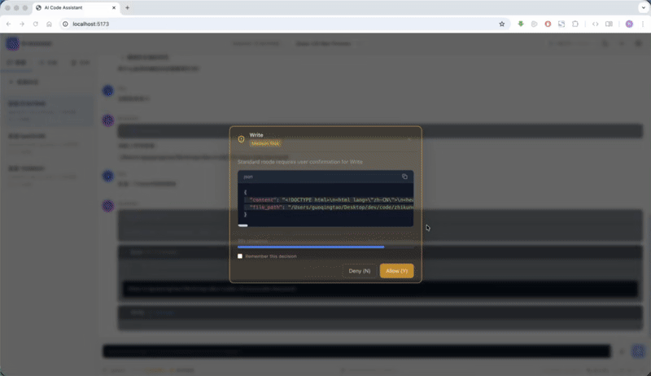

[🌐 English](docs/README_EN.md)

<div align="center">
  
  <h1>ZhikunCode</h1>
  <p><strong>开源 AI 编程助手 — 部署一次，浏览器全流程操控</strong></p>
  <p>多 Agent 协作 · Docker 自托管 · 国产大模型直连 · 深度安全架构</p>

  <p>
    <a href="#-快速开始">快速开始</a> ·
    <a href="#-特性亮点">核心特性</a> ·
    <a href="#-demo">在线演示</a> ·
    <a href="#-swe-bench-lite-评测">SWE-bench 评测</a> ·
    <a href="#-cli-工具">CLI 工具</a> ·
    <a href="#-skill技能系统">skill技能系统</a> ·
    <a href="#-插件系统">插件系统</a> ·
    <a href="#-可视化">可视化</a> ·
    <a href="#-记忆系统">记忆系统</a> ·
    <a href="#-竞品对比">竞品对比</a> ·
    <a href="docs/README_EN.md">English</a>
  </p>

  <p>
    <a href="https://opensource.org/licenses/MIT"></a>
    <a href="https://github.com/zhikunqingtao/zhikuncode"></a>
    <a href="https://github.com/zhikunqingtao/zhikuncode/stargazers"></a>
    <a href="https://github.com/zhikunqingtao/zhikuncode"></a>
    <a href="https://github.com/zhikunqingtao/zhikuncode"></a>
    <a href="https://github.com/zhikunqingtao/zhikuncode/actions/workflows/ci.yml"></a>
    <a href="https://zhikunqingtao.github.io/zhikuncode/swe-bench-report.html"></a>
  </p>
</div>

---

> **部署到服务器，打开浏览器就能用，手机上也行**

> 🏗️ **[查看完整系统架构图 →](https://zhikunqingtao.github.io/zhikuncode/ZhikunCode-Architecture.html)**  
> 三端分离 · 759 文件 · 115,783 行代码（含测试 147,395 行 / 893 文件）· 全景可视化

> 🏆 **[SWE-bench Lite 技术报告 →](https://zhikunqingtao.github.io/zhikuncode/swe-bench-report.html)**  
> 提交命名空间 `20260520_zhikuncode` · 官方 harness 评测 Resolve **139 / 300 (46.3%)** · Patch 生成率 280 / 300 (93.3%)

---

## ✨ 特性亮点

| | 特性 | 说明 |
|---|---|---|
| 🌐 | **浏览器全流程操控** | 部署一次，任何设备的浏览器即可完成全流程操作 —— 权限审批、方案协商、任务管控，手机上也能用，无需安装客户端 |
| 🤖 | **多 Agent 协作** | Team（固定分工）/ Swarm（动态协商）/ SubAgent（主从委派）三种协作模式，复杂任务自动分工 |
| 🔒 | **深度安全架构** | 8 层 Bash 沙箱(错误分类+输出截断+进程树管理) + 14 步权限管道 + 308 项安全测试覆盖（含 v9.3 新增 19 个 CWE-22 深度防御单测），命令执行前必过安全关卡 |
| 🇨🇳 | **国产大模型直连** | 千问 / DeepSeek / Moonshot 开箱即用，国内网络直连，无需科学上网 |
| 🐳 | **Docker 一键部署** | `docker compose up -d` 一条命令启动，数据存本地，完全私有 |
| ⚡ | **智能上下文管理** | 六层压缩级联（Snip / MicroCompact / ContextCollapse / AutoCompact / CollapseDrain / ReactiveCompact）+ 增量折叠（每10轮自动压缩）+ 413 两阶段恢复（CollapseDrain 激进压缩 → ReactiveCompact 反应式压缩）+ 精确 Token 计数（tiktoken 多模型支持）+ 自纠错循环（编译/测试失败自动诊断修复，最多3次）+ Token三级告警，无缝应对超长对话 |
| 📷 | **多模态图片对话** | 支持图片上传输入，模型自动识别图片内容并分析；**智能视觉模型路由**——当前模型不支持图片时，自动切换至同厂商视觉模型处理，处理完成后无缝切回原模型，遵循"同厂商优先 + 全局兜底"策略。支持的模型：qwen3.7-plus / kimi-k2.6 / kimi-k2.7-code / glm-5v-turbo / MiniMax-M3 / openai/gpt-5.5-pro / google/gemini-3.5-flash（单张≤5MB，数量上限因模型而异） |
| 🖼️ | **浏览器语义快照** | `/snap` 命令智能捕获网页完整状态（DOM 结构 + 交互元素），支持富交互页面语义提取，生成结构化 JSON 供 Agent 解析和回放验证 |
| 📊 | **实时活动追踪与审批** | Activity Panel 实时记录 AI 工具执行全流程，L1/L2/L3 三层展示体系，Signal 智能标记（auto_approve/review_recommended/needs_review），一键批量审批决策，SQLite 后端持久化，支持会话恢复 |
| 🧪 | **运行时验证框架** | VerifierFactory 三模态分发（browser/http_api/auto）+ 8 种 HTTP action handler + JSONPath 断言 + 证据链 SQLite 存储 + Feature Flag 双重门控 + 前端实时进度面板 |
| 🔍 | **RV-4 证据包可视化** | 验证产物 7 类证据（screenshot / command / console / test / video / har / diff）Tab 分栏展示，移动端订阅 STOMP `verify_attention` 通知一键审批/驳回，REST API `/api/evidence/*` 提供查询与 Blob 下载 |
| 🏆 | **SWE-bench Lite 实测** | 单模型 `qwen-3.6-max-preview` + 6 工具闭集（Read/Edit/Write/Bash/Grep/Glob），无网络、无 sub-agent；官方 harness 评测 **Resolve 46.3% (139/300)**、Patch 生成率 **93.3% (280/300)**，[技术报告 →](https://zhikunqingtao.github.io/zhikuncode/swe-bench-report.html) |

---

## 🎬 Demo

### 📱 手机开发前后端 TODO 应用完整演示

https://github.com/user-attachments/assets/bf1f1d3a-4a9b-4d91-af48-97a7d3dd7b8a

### 自动写代码下载小红书视频

https://github.com/user-attachments/assets/4b66261b-3258-44bd-82d3-6b2b3bbd4995


### 📱 项目分析和命令执行演示

https://github.com/user-attachments/assets/7b45c5d4-e540-4ffd-80d4-e11502477dba

### 文件操作


### 生成游戏


### 优化代码


### 多 Agent 协作开发前后端应用


### iPad 浏览器全流程操控


---

## ⚡ 快速开始

### 前置准备：获取 LLM API Key

本项目需要 LLM（大语言模型）API Key 才能运行。默认使用**阿里云千问（DashScope）**，国内网络直连。

**获取千问 API Key：**
1. 访问 [阿里云百炼平台 API Key 管理](https://bailian.console.aliyun.com/cn-beijing/?tab=model#/api-key)
2. 注册或登录阿里云账号
3. 创建 API Key，复制完整密钥（以 `sk-` 开头）

> 千问提供免费额度，足够个人开发使用。也可以使用 [DeepSeek](https://platform.deepseek.com/)、[Moonshot/Kimi](https://platform.moonshot.cn/) 等国内服务商，详见下方"支持的 LLM 服务商"。

### 方式一：Docker 部署（推荐）

只需 3 步，从零到可用：

```bash
# 1. 克隆仓库
git clone https://github.com/zhikunqingtao/zhikuncode.git
cd zhikuncode

# 2. 配置 API Key
cp .env.example .env
# 编辑 .env，填入你的 LLM API Key（默认使用千问/DashScope，国内直连）

# 3. 启动
docker compose up -d
```

> **首次构建说明：** 第一次运行会自动构建 Docker 镜像，需要下载依赖并编译，预计耗时 **15-30 分钟**（取决于网络速度）。后续启动只需几秒。可通过 `docker compose logs -f` 查看构建进度。

启动完成后，打开浏览器访问 **http://localhost:8080** 即可使用。

> **系统要求：** Docker 20.10+，Docker Compose V2，建议 4GB+ 内存。

### 方式二：本地开发

**前置条件：** JDK 21、Node.js 22+、Python 3.11~3.12（不支持 3.13+）

```bash
git clone https://github.com/zhikunqingtao/zhikuncode.git
cd zhikuncode

# 配置环境变量
cp .env.example .env
# 编辑 .env，填入你的 LLM API Key

# 一键启动三端服务
./start.sh
```

三端服务会同时启动：

| 服务 | 地址 | 说明 |
|------|------|------|
| **Backend** | `http://localhost:8080` | Java Spring Boot 后端，核心 API |
| **Python Service** | `http://localhost:8000` | FastAPI 服务，代码分析 |
| **Frontend** | `http://localhost:5173` | React 开发服务器 |

<details>
<summary><b>手动分别启动各服务</b></summary>

```bash
# 后端
cd backend && ./mvnw spring-boot:run -DskipTests

# Python 服务
cd python-service
python -m venv venv && source venv/bin/activate
pip install -r requirements.txt
uvicorn src.main:app --host 0.0.0.0 --port 8000

# 前端
cd frontend && npm install && npm run dev
```

</details>

> **RV-1 运行时验证依赖**：`jsonpath-ng`（JSONPath 断言引擎）、`httpx`（异步 HTTP 客户端），已包含在 `python-service/requirements.txt` 中。

### 支持的 LLM 服务商

ZhikunCode 支持**多 Provider 同时配置**（推荐）和单 Provider 两种模式。多 Provider 模式下可在前端自由切换模型：

**方式一：多 Provider 配置（推荐）**

在 `.env` 中为每个服务商配置独立的 API Key，前端可自由切换：

```bash
# DashScope（千问系列）
LLM_PROVIDER_DASHSCOPE_API_KEY=your-dashscope-key

# DeepSeek
LLM_PROVIDER_DEEPSEEK_API_KEY=your-deepseek-key

# Moonshot (Kimi)
LLM_PROVIDER_MOONSHOT_API_KEY=your-moonshot-key

# Zhipu (智谱 GLM)
LLM_PROVIDER_ZHIPU_API_KEY=your-zhipu-api-key-here

# MiniMax
LLM_PROVIDER_MINIMAX_API_KEY=your-minimax-api-key-here

# ZenMux (claude-opus-4.8 / claude-fable-5 / openai/gpt-5.5-pro / google/gemini-3.5-flash, 1M 上下文)
LLM_PROVIDER_ZENMUX_API_KEY=your-zenmux-api-key-here
```

**方式二：单 Provider 配置（向后兼容）**

如未配置多 Provider，系统自动回退到单 Provider 模式。在 `.env` 中配置 `LLM_BASE_URL` 和 `LLM_API_KEY` 即可切换：

| 服务商 | Base URL | 推荐模型 | 备注 |
|--------|----------|----------|------|
| **千问/DashScope** | `https://dashscope.aliyuncs.com/compatible-mode/v1` | qwen3.7-max | **默认**，国内直连 |
| **DeepSeek** | `https://api.deepseek.com/v1` | deepseek-v4-pro | 国内直连 |
| **Moonshot（Kimi）** | `https://api.moonshot.cn/v1` | kimi-k2.6 / kimi-k2.7-code | 国内直连；支持图片 |
| **Zhipu（智谱 GLM）** | `https://open.bigmodel.cn/api/paas/v4/chat/completions` | glm-5.2, glm-5v-turbo | 国内直连 |
| **MiniMax** | `https://api.minimax.chat/v1` | MiniMax-M3 | 百万上下文 |
| **ZenMux（多模型中转）** | `https://zenmux.ai/api/v1` | anthropic/claude-opus-4.8 / claude-fable-5 / openai/gpt-5.5-pro / google/gemini-3.5-flash | 1M 上下文 · 支持图片 |
| **OpenAI** | `https://api.openai.com/v1` | gpt-4o | 需要外网访问 |
| **本地 Ollama** | `http://localhost:11434/v1` | qwen2.5:latest | 完全离线 |

> 任何兼容 OpenAI API 格式的服务商都可以接入，只需配置对应的 Base URL 和 API Key。

### 可选：启用 DashScope 托管 MCP 服务

从最新版本起，为避免未配置阿里云百炼 Key 的用户遭遇启动日志刷屏，**默认不启用**以下托管在 `dashscope.aliyuncs.com` 上的 MCP 服务：

| MCP 服务 | 能力 | 对应工具 ID |
|---------|------|-------------|
| `Wan25Media` | 万相 2.5 图像生成 / 图生图 | `mcp_wan25_image_gen`、`mcp_wan25_image_edit` |
| `zhipu-websearch` | 智谱联网搜索 Pro | `mcp_web_search_pro` |

> ℹ️ 不启用这些 MCP 完全不影响核心对话、代码编辑、本地工具使用。

**如需使用**（需要阿里云百炼 API Key 且在控制台开通相应 MCP 能力）：

1. 在 `.env` 中配置 DashScope Key：
   ```bash
   LLM_PROVIDER_DASHSCOPE_API_KEY=sk-xxxxxxxx
   ```
2. 在 [`backend/src/main/resources/application.yml`](backend/src/main/resources/application.yml) 中取消 `zhipu-websearch` 配置块的注释。
3. 在 [`configuration/mcp/mcp_capability_registry.json`](configuration/mcp/mcp_capability_registry.json) 中把需要的条目 `enabled` 改为 `true`。
4. 通过 `./stop.sh && ./start.sh` 完整重启三端使配置生效。

---

## 🏆 SWE-bench Lite 评测

ZhikunCode 已完成 SWE-bench Lite（300 实例，pass@1）官方 harness 评测，**Resolve Rate 46.3% (139/300)**。所有评测产物（`all_preds.jsonl`、`results.json`、`metadata.yaml`、轨迹）已开源在 [`docs/swe-bench/20260520/`](docs/swe-bench/20260520/)，可第三方复现。

### 关键指标

| 指标 | 数值 | 出处 |
|---|---|---|
| Resolved Instances | **139 / 300 (46.3%)** | `docs/swe-bench/20260520/results/results.json` `resolved=139` |
| Patch 生成率 | **280 / 300 (93.3%)** | `all_preds.jsonl`（其中 20 条空 patch） |
| 主干模型 | `qwen-3.6-max-preview` | `docs/swe-bench/20260520/metadata.yaml` |
| 工具闭集 | Read / Edit / Write / Bash / Grep / Glob | [`swe-bench/swe_bench.py`](swe-bench/swe_bench.py) `ALLOWED_TOOLS` |
| 单实例预算 | 60 轮 / 900 秒 | [`swe_bench.py`](swe-bench/swe_bench.py) `solve_instance(max_turns=60, timeout=900)` |
| 并发 worker | 1 | `--workers` 默认值 |
| 网络 / Sub-agent | 均禁用 | 系统提示显式声明 |
| 提交命名空间 | `20260520_zhikuncode` | `metadata.yaml` |

### 仓库级表现（`results/resolved_by_repo.json`）

| Repository | Resolved / Total | Resolve Rate |
|---|---|---|
| mwaskom/seaborn | 3 / 4 | **75.0%** |
| django/django | 69 / 114 | **60.5%** |
| psf/requests | 3 / 6 | 50.0% |
| sympy/sympy | 38 / 77 | 49.4% |
| pytest-dev/pytest | 7 / 17 | 41.2% |
| pydata/xarray | 2 / 5 | 40.0% |
| astropy/astropy | 2 / 6 | 33.3% |
| pallets/flask | 1 / 3 | 33.3% |
| scikit-learn/scikit-learn | 6 / 23 | 26.1% |
| sphinx-doc/sphinx | 3 / 16 | 18.8% |
| matplotlib/matplotlib | 4 / 23 | 17.4% |
| pylint-dev/pylint | 1 / 6 | 16.7% |
| **Total** | **139 / 300** | **46.3%** |

### 工程亮点（每一项均可在源码定位）

- **Agent-Loop 显式四相位** ANALYZE→LOCATE→FIX→VERIFY，相位边界由系统提示硬约束（[swe_bench.py](swe-bench/swe_bench.py)）
- **六层上下文压缩级联** Snip / MicroCompact / ContextCollapse / AutoCompact / CollapseDrain / ReactiveCompact（[ContextCascade.java](backend/src/main/java/com/aicodeassistant/engine/ContextCascade.java)，源码注释中 Level 1.5 ContextCollapse 为渐进折叠中间层）
- **413 两阶段恢复** CollapseDrain → ReactiveCompact，保障 60 轮会话收敛于上下文窗口内
- **自纠错循环** 编译/测试失败结构化再提示，硬上限 3 次（[SelfCorrectionLoop.java](backend/src/main/java/com/aicodeassistant/engine/correction/SelfCorrectionLoop.java) `MAX_ATTEMPTS = 3`）

📄 完整方法学与可复现命令见技术报告：<https://zhikunqingtao.github.io/zhikuncode/swe-bench-report.html>

---

## 📊 竞品对比

### 功能对比

| 特性 | ZhikunCode | Aider | Cline | Cursor | Claude Code | Copilot |
|------|:---:|:---:|:---:|:---:|:---:|:---:|
| 开源免费 | ✅ | ✅ | ✅ | ❌ | ❌ | ❌ |
| Web UI | ✅ 全功能 | ⚠️ 实验浏览器 UI | ❌ | ⚠️ Web版 | ✅ | ⚠️ GitHub.com |
| Docker 一键自托管 | ✅ 完整 Web 服务 | ⚠️ CLI 容器化 | ❌ | ⚠️ 企业付费 | ❌ | ❌ |
| 国产大模型直连 | ✅ 原生支持 | ⚠️ 需配置兼容 API | ⚠️ 需配置兼容 API | ❌ | ❌ | ❌ |
| 多 Agent 协作 | ✅ Team/Swarm/Sub | ❌ | ✅ Kanban + CLI 并行 | ✅ Multi-Agents | ✅ Sub-Agents | ✅ /fleet + Agent Mode |
| 浏览器全流程操控¹ | ✅ | ❌ | ❌ | ❌ | ❌ | ❌ |
| 安全沙箱 | ✅ 8层 | ❌ | ❌ | ⚠️ 企业级 | ✅ OS级 | ⚠️ GitHub 权限策略 |
| MCP 工具扩展 | ✅ | ⚠️ 第三方 | ✅ | ✅ | ✅ | ✅ |
| CLI 终端工具 | ✅ aica + 35+ 斜杠命令 | ✅ CLI-first | ✅ CLI 2.0 | ✅ Cursor CLI | ✅ CLI-only | ✅ Copilot CLI |
| 可扩展skill技能系统 | ✅ Markdown 驱动 + 6 级来源 | ❌ | ❌ | ✅ Rules | ✅ Hooks | ❌ |
| 插件系统 | ✅ Java SPI 插件 + 沙箱隔离 + 热重载 | ❌ | ❌ | ✅ Plugins | ✅ Skills/Hooks | ✅ Plugins |
| 跨会话记忆 | ✅ 三层记忆 + BM25 搜索 | ❌ | ❌ | ✅ Rules | ✅ Memory | ❌ |
| 活动追踪与审批 | ✅ L1/L2/L3 三层 | ❌ | ❌ | ❌ | ✅ 权限管理 | ❌ |
| Activity 持久化 | ✅ SQLite + STOMP | ❌ | ❌ | ❌ | ⚠️ 内存级 | ❌ |
| 无需安装客户端 | ✅ | ❌ | ❌ | ⚠️ | ✅ | ❌ |

> ¹ **浏览器全流程操控**：部署后任意设备浏览器（包括手机）即可完整操控编码全流程——权限审批、方案协商、任务管控。这与 Cline/Cursor 的"AI 控制浏览器做自动化测试"是不同的概念。

### 安全特性对比

| 安全特性 | ZhikunCode | Aider | Cline | Claude Code |
|---------|:---:|:---:|:---:|:---:|
| 命令执行沙箱 | 8 层检查 | ❌ 用户审批 | ❌ 用户审批 | ✅ gVisor/Firecracker |
| 权限管道 | 14 步管线 | ❌ | 简单确认 | 权限管理系统 |
| 安全测试覆盖 | 308 项 | 未公开 | 未公开 | 未公开 |
| 敏感路径拦截 | ✅ | ❌ | ❌ | ❌ |
| 危险命令阻断 | ✅ | ❌ | ❌ | ✅ 部分 |
| 环境变量白名单 | ✅ | ❌ | ❌ | ❌ |

> **说明：** 以上对比基于各项目公开文档（截至 2026 年 4 月），AI 编程工具迭代迅速，如有不准确之处欢迎提 [Issue](https://github.com/zhikunqingtao/zhikuncode/issues) 指正。Cline CLI 2.0、Cursor 2.0+、Claude Code Desktop、GitHub Copilot /fleet 等均在快速迭代中。
>
> **最新动态（2026 年 4 月）：** Claude Code Desktop App 已发布（支持本地+云端混合执行）；Cursor 3.1 新增 Canvas 特性（交互式仪表盘+自定义 UI 组件）；各竞品最新版本号：Aider v0.86+、Cline v1.0.35+、Cursor 3.1+、Claude Code 2.1.119+、GitHub Copilot CLI 1.0.35+。

---

## 🏗️ 架构概览

ZhikunCode 采用三端分离架构，Java 后端负责核心编排，React 前端提供交互界面，Python 服务处理代码分析：

```
┌──────────────────┐      WebSocket / HTTP      ┌──────────────────────┐
│    Frontend       │ ◄────────────────────────► │      Backend          │
│  React 18 + TS    │                            │  Java 21 + Spring    │
│  Vite + Tailwind  │                            │  Boot 3.4            │
│  :5173 (dev)      │                            │  :8080               │
└──────────────────┘                            └──────────┬───────────┘
                                                           │ HTTP
                                                           ▼
                                                ┌──────────────────────┐
                                                │   Python Service      │
                                                │   FastAPI + Uvicorn   │
                                                │   :8000               │
                                                └──────────────────────┘
```

### 各层职责

| 层 | 技术栈 | 职责 |
|----|--------|------|
| **后端** | Java 21, Spring Boot 3.4.x, WebSocket, SQLite | 核心编排引擎、LLM API 路由、Agent 管理、工具执行（27 个内置工具 + MCP 动态扩展）、权限管道、会话持久化 |
| **前端** | React 18, TypeScript 5.6, Vite 5, TailwindCSS, Monaco Editor, xterm.js, Zustand | 对话式交互 UI、代码编辑器、内置终端、文件浏览器、设置面板、实时流式输出、Agent 协作可视化 |
| **Python 服务** | FastAPI, Uvicorn, Python 3.11+ | 代码分析、AST 解析、MCP 工具桥接 |

### Docker 部署架构

生产环境通过 Docker 单容器部署，三端服务打包在同一个镜像中：

```
┌─────────────────────────────────────────────────┐
│                Docker Container                  │
│  ┌───────────┐  ┌───────────┐  ┌──────────────┐ │
│  │  Backend   │  │  Python   │  │   Frontend   │ │
│  │  :8080     │  │  :8000    │  │  (静态文件)   │ │
│  └───────────┘  └───────────┘  └──────────────┘ │
│                                                  │
│  Volume: zhikun-data (SQLite + 会话数据)          │
│  Volume: workspace (用户项目代码)                  │
├──────────────────────────────────────────────────┤
│  Port: 8080 → 宿主机                              │
└──────────────────────────────────────────────────┘
```

### Agent Loop 查询循环

ZhikunCode 核心执行引擎 QueryEngine 通过 8 步循环驱动 Agent 决策与工具执行：

```
压缩级联 → 流式会话创建 → API调用(含API熔断+自适应重试+降级保护) → 响应收集 → 工具结果消费(4层优先级调度) → 6维终止评估 → 工具摘要注入 → 状态更新
```

**关键子系统：**

| 组件 | 职责 | 配置项 |
|------|------|--------|
| IncrementalCollapseManager | 每10轮触发一次增量上下文折叠 | `context.cascade.incremental-collapse.enabled` |
| ContextCascade | 六层压缩级联（Snip→MicroCompact→ContextCollapse→AutoCompact→CollapseDrain→ReactiveCompact） | `context.cascade.*` |
| MicroCompactService | 清除旧工具结果内容，降低上下文体积 | `features.flags.CACHED_MICROCOMPACT` |
| ModelTierService | 模型降级链管理，30分钟冷却期自动恢复 | `app.model.tier-chain` |

**413 两阶段恢复**：当 API 返回 413 (Payload Too Large) 时，自动执行两阶段恢复（源码 [ContextCascade.java](backend/src/main/java/com/aicodeassistant/engine/ContextCascade.java) `recoverFromPayloadTooLarge`）：
1. **Level 3** — CollapseDrain 激进压缩（contextWindow × 0.5 目标）
2. **Level 4** — ReactiveCompact 反应式压缩（仅保留 1 轮 + 极度压缩）

---

## 🔒 安全架构

安全是 ZhikunCode 的核心设计原则。每一条命令执行前，都要经过多层安全检查。

### 8 层 Bash 安全沙箱

所有 Shell 命令执行前，必须通过以下 8 层检查：

| 层级 | 检查内容 | 说明 |
|------|---------|------|
| **第 1 层** | 命令解析 | 解析命令结构，识别管道、重定向、子命令 |
| **第 2 层** | 黑名单过滤 | 三级拦截体系（ABSOLUTE_DENY/HIGH_RISK_ASK/AUDIT_LOG），阻断已知危险命令（`rm -rf /`、`mkfs`、`dd`、`format` 等），含 ReDoS 正则防护 |
| **第 3 层** | 路径遍历检测 | 防止 `../` 路径穿越攻击，阻断设备路径、UNC 路径 |
| **第 4 层** | 权限验证 | 14 步权限管道决策，敏感操作需用户审批 |
| **第 5 层** | 沙箱执行 | 破坏性命令强制在 Docker 沙箱中执行（只读文件系统 + 内存限制 + 网络隔离） |
| **第 6 层** | 参数净化 | 环境变量白名单、命令注入防护 |
| **第 7 层** | 输出校验 | 检测异常输出，敏感信息脱敏 |
| **第 8 层** | 审计日志 | 完整记录每次命令执行，可追溯 |

### 14 步权限管道

权限管道采用**短路返回**设计 —— 命中任何拦截规则立即返回，不继续执行：

```
请求进入
  │
  ├─ 1. Deny 规则检查 ──────────── 命中 → 拒绝
  ├─ 2. Ask 规则检查 ───────────── 命中 → 询问用户
  ├─ 3. 工具自身权限检查 ────────── 工具拒绝 → 阻断
  ├─ 4. 用户交互需求检查 ────────── 需要交互 → 询问
  ├─ 5. 内容级危险检测 ─────────── rm -rf、chmod 777、eval、sudo 等 → 强制询问
  ├─ 6. 写路径安全检查 ─────────── 危险目录、符号链接 → 阻断
  ├─ 7. 危险删除检测 ───────────── rm 危险目标 → 阻断
  ├─ 8. 环境变量检查 ───────────── 非白名单变量 → 阻断
  ├─ 9. Hook 注入检查 ──────────── PreToolUse Hook 可阻断
  ├─ 10. 分类器评估 ────────────── AI 风险评估（AUTO 模式）
  ├─ 11. 沙箱规则评估 ──────────── 沙箱内操作自动放行
  ├─ 12. 紧急杀开关 ────────────── 管理员可临时禁用 AUTO
  ├─ 13. AlwaysAllow 规则 ─────── 匹配白名单 → 放行
  └─ 14. 模式分支决策 ──────────── DEFAULT/PLAN/AUTO/BYPASS 等模式最终决策
```

### 受保护路径

以下路径即使在 bypass 模式下也需要用户确认：

- `.git` — Git 仓库数据
- `.env` — 环境变量和密钥
- `.ssh` — SSH 密钥
- `.gnupg` — GPG 密钥
- `.aws` — AWS 凭证

### 安全测试

- **308 项安全测试**覆盖全部安全路径
- 包含命令注入、路径穿越、权限绕过等攻击场景
- **v9.3 深度防御新增**：
  - **CWE-22 路径穿越**：`CoordinatorService.getScratchpadDir` sessionId 白名单（11 单测）+ `SwarmController.createSwarm` teamName 白名单（8 单测），即使上游 URI 拦截被绕过，白名单仍为最终落盘防线
  - **跨用户访问隔离（P2-A）**：`BrowserReplayController` 双层闸门 —— sessionId 格式校验返回 400 + principal 归属校验返回 403，MVP 匿名会话兼容

  **v9.3 安全防御汇总：**

  | 防御层级 | 位置 | 防护机制 | 单测数 |
  |---------|------|---------|-------|
  | P1-2 | `CoordinatorService.getScratchpadDir` | sessionId 白名单 `^[A-Za-z0-9_-]{1,128}$` | 11 |
  | E1 | `SwarmController.createSwarm` | teamName 白名单 `^[A-Za-z0-9_-]{1,64}$` | 8 |
  | P2-A | `BrowserReplayController` | sessionId 格式校验 (400) + principal 归属校验 (403) | — |

- 每次代码变更都会执行完整安全测试套件

### 🧪 质量验证

完整功能测试报告见 [ZhikunCode v9.4 全链路测试报告](docs/test-results/v9.3/ZhikunCode全链路测试报告.md)（2026-05-16）

**持续集成：**
- **GitHub Actions 自动化流水线**：每次提交自动执行后端编译验证、前端构建、Python 测试及 Docker 镜像构建

**测试覆盖（v9.4）：**
- **总量**：1948 用例 + 490 性能探针 + 7 安全探针 = **2445**（含 APOS E2E 全功能专项 123 用例：62 Phase 1 + 50 Phase 2 + 11 风险修复）
- **后端单元/集成测试**：1500 PASS / 0 failure / 0 error / 48 skipped（含 AI Coding 增强 238 单元测试），覆盖率 Inst 42.17% / Branch 30.44%
- **Python pytest**：47 PASS，覆盖率 25.66%
- **前端 vitest**：78 PASS / 16 skipped（94 total）
- **36 模块 REST/WS/LLM/Session 冒烟**：45/45 PASS（42 REST + 1 WS STOMP + 1 LLM 真推理 + 1 Session 持久化）
- **E2E 差异化链路**：Task 6 多 Agent 协作（CoordinatorEventBus）· Task 7 可视化自动路由（`/visualize` mermaid/json/text）· Task 8 浏览器语义快照 MVP（`/snap`）全链路 PASS
- **APOS Phase 1 E2E**：62 用例（9 模块，含 28 原始功能 + 34 支撑链路）100% PASS，覆盖 Activity 基础 UI / 数据流转 / 三层展示 / Signal 标记 / Feature Flag / 后端 API / 响应式 / 持久化，含 4 Bug 修复回归
- **APOS Phase 2 E2E**：5 模块 50 用例（变更影响全景 / Pipeline 视图与 DAG / 异常检测与告警 / 移动端响应式 / Phase 2 集成功能）48 PASS / 2 SKIP，通过率 96%
- **APOS 风险修复专项**：11 用例 100% PASS（工具调用 / 批量操作 / 并发竞态 / API 降级）
- **AI Coding 功能增强专项**：6 大模块（SelfCorrectionLoop / 精确Tokenizer / Skill预算安全 / BashTool动态超时 / GitDiffTracker / SearchStrategyRouter）33 用例 + 238 单元测试 + 7 集成测试 + Feature Flag 双向验证，100% PASS
- **功能完整性验证**：100% 覆盖 v1.0 规划功能

**测试框架详情：**

| 框架 | 层级 | 覆盖范围 | 数量 |
|------|------|---------|------|
| JUnit 5 + Mockito | 后端单元/集成测试 | 上下文/权限/技能/插件/LLM/MCP/记忆/并发/SSE/持久化/工具/Coordinator/Swarm/AI Coding 增强 等 | 1500 PASS |
| Vitest | 前端单元测试 | Store 生命周期/跨 Tab 同步/流式渲染/Immer 不可变性/路由边界 | 78 PASS |
| Playwright + 节点脚本 | 端到端 E2E | Coordinator WS 订阅 / 可视化 3 种 viewType / 浏览器快照 MVP / APOS Phase 1 全栈 / APOS Phase 2 全栈 | Task 6/7/8/APOS 全绿 |
| Pytest | Python 服务测试 | Token 估算/文件处理/浏览器自动化/语义快照/代码分析器 | 47 PASS |

**性能基线（v9.3，490 次真实请求采样）：**

| 指标 | p50 | p95 | p99 |
|-----|-----|-----|-----|
| REST API（14 端点混合） | 1.5ms | 2.3ms | 4.3ms |
| WS STOMP 握手 | 2.22ms | 4.58ms | 6.22ms |
| 浏览器语义快照（热路径） | 9.23ms | 12.20ms | 12.26ms |
| Swarm 创建 | 2.39ms | 4.90ms | 12.40ms |

**详细测试数据与证据：**
- v9.3 完整报告：[docs/test-results/v9.3/](docs/test-results/v9.3/)
- 分模块测试结果：[docs/test-results/](docs/test-results/)
- 前端 E2E 脚本：[frontend/e2e/](frontend/e2e/)
- E2E 截图证据：[docs/test-results/screenshots/](docs/test-results/screenshots/)（42 项）

<details>
<summary>📋 36个测试模块详细分类（点击展开）</summary>

| # | 模块 | 用例数 | 通过率 | 备注 |
|---|------|--------|--------|------|
| 1 | 环境准备与三端启动 | 7 | 100% | — |
| 2 | REST API 基础功能 | 33 | 100% | 逐端点验证 |
| 3 | WebSocket STOMP 通信 | 8 | 100% | — |
| 4 | Agent Loop 核心循环 | 9 | 100% | — |
| 5 | 工具系统与安全 | 10 | 100% | — |
| 6 | 权限治理与安全 | 6 | 100% | — |
| 7 | System Prompt 与 LLM | 7 | 100% | — |
| 8 | 记忆系统 | 7 | 86% | ★ 首次覆盖 |
| 9 | 技能系统 | 7 | 100% | ★ 首次覆盖 |
| 10 | 插件系统与 MCP | 11 | 100% | ★ 首次覆盖 |
| 11 | 多 Agent 协作 | 6 | 100% | — |
| 12 | Python 服务 | 15 | 100% | 1 BUG 已修复 |
| 13 | 前端 E2E 与 UI | 7 | 86% | 1 PARTIAL |
| 14 | 文件历史与补充 API | 11 | 100% | ★ 首次覆盖 |
| 15 | CLI 命令行工具 aica | 11 | 91% | 2 BUG 已修复 |
| 16 | 可视化功能 E2E | 19 | 100% | ★ 首次覆盖 |
| 17 | F3 代码复杂度分析 | 6 | 100% | ★ v1.0 新增 |
| 18 | F33 变更影响链路分析 | 6 | 100% | ★ v1.0 新增 |
| 19 | F25 API 契约可视化 | 6 | 100% | ★ v1.0 新增 |
| 20 | F35 代码→图表自动生成 | 25 | 100% | ★ v1.0 新增 |
| 21 | F40 代码路径追踪可视化 | 25 | 100% | ★ v1.0 新增 |
| 22 | 单元测试体系（v9.3 扩展） | 84 | 100% | E2E 模块级测试用例数（后端 JUnit 1500+ 已在别处统计） |
| 23 | APOS 基础 UI | 4 | 100% | ★ 首次覆盖 |
| 24 | APOS 数据流转 | 4 | 100% | ★ 首次覆盖 |
| 25 | APOS 三层展示 | 4 | 100% | ★ 首次覆盖 |
| 26 | APOS Signal与筛选 | 2 | 100% | ★ 首次覆盖 |
| 27 | APOS Feature Flag | 2 | 100% | ★ 首次覆盖 |
| 28 | APOS 后端API验证 | 1 | 100% | ★ 首次覆盖 |
| 29 | APOS 响应式+健康 | 3 | 100% | ★ 首次覆盖 |
| 30 | APOS Activity持久化 | 8 | 100% | ★ 首次覆盖 + 4 Bug 修复 |
| 31 | APOS 变更影响全景 | 6 | 100% | ★ Phase 2 新增 |
| 32 | APOS Pipeline视图与DAG | 12 | 92% | ★ Phase 2 新增 |
| 33 | APOS 异常检测与告警 | 10 | 100% | ★ Phase 2 新增，2 SKIP |
| 34 | APOS 移动端响应式 | 9 | 89% | ★ Phase 2 新增 |
| 35 | APOS Phase 2集成功能 | 13 | 100% | ★ Phase 2 新增 |
| 36 | AI Coding 功能增强 | 33 | 100% | ★ v9.4 新增（6子模块 + 238单元 + Feature Flag验证） |

</details>

---

## 🎯 skill技能系统

ZhikunCode 的skill技能系统（Skill System）是一个 **Markdown 驱动的可扩展工作流引擎**。每个技能就是一个 `.md` 文件，用 YAML frontmatter 定义元数据，用 Markdown 正文定义执行指令。

### 13 个内置技能

开箱即用，输入 `/技能名` 即可调用：

| 技能 | 命令 | 功能 |
|------|------|------|
| **智能提交** | `/commit` | 分析暂存区变更，按 Conventional Commits 格式生成 commit message |
| **代码审查** | `/review` | 审查未提交变更，按 P0/P1/P2 严重程度分类问题 |
| **智能修复** | `/fix` | 根据错误信息诊断根因，应用最小化修复并验证 |
| **智能测试** | `/test` | 为指定代码或近期变更生成/运行测试，覆盖边界情况 |
| **PR 助手** | `/pr` | 分析分支差异，生成结构化 PR 描述和审查说明 |
| **调试诊断** | `/debug` | 8步闭环诊断（复现→隔离→修复→验证→回归） |
| **代码验证** | `/verify` | Java/TypeScript/Python 三栈编译+测试验证 |
| **脱困诊断** | `/stuck` | 卡住时三路径评估，推荐最优破局策略 |
| **会话记忆** | `/remember` | 管理会话级上下文（决策/约束/偏好/笔记） |
| **架构分析** | `/software-architecture` | Clean Architecture + SOLID + 设计模式评估 |
| **数据摘要** | `/csv-data-summarizer` | CSV统计分析+可视化图表+Markdown报告 |
| **Prompt工程** | `/prompt-engineering` | 优化prompt结构、清晰度和有效性 |
| **测试驱动开发** | `/test-driven-development` | TDD红→绿→重构循环方法论指导 |

### 6 级加载源优先级

同名技能按优先级链覆盖，高优先级自动屏蔽低优先级：

```
managed > user > project > plugin > bundled > mcp
```

| 来源 | 目录 | 说明 | 状态 |
|------|------|------|------|
| **managed** | 策略管理目录 | 企业统一下发的技能 | 预留 |
| **user** | `~/.zhikun/skills/` | 用户全局自定义技能 | ✅ 已实现 |
| **project** | `.zhikun/skills/` | 项目级技能，随代码库分发 | ✅ 已实现 |
| **plugin** | 插件提供 | JAR 插件内嵌的技能 | 预留 |
| **bundled** | 内置 | 5 个开箱即用技能 | ✅ 已实现 |
| **mcp** | MCP 构建 | 通过 MCP 协议注册的技能 | 预留 |

### 自定义技能

在 `~/.zhikun/skills/` 或项目根目录 `.zhikun/skills/` 下创建 `.md` 文件：

```markdown
---
description: "将代码翻译为指定语言"
arguments:
  - language
---

# 翻译任务

将用户选中的代码翻译为 {{language}}，保持原有逻辑和注释风格。
```

调用方式：`/translate language=python` 或 `/translate python`

**支持的 frontmatter 字段：**

| 字段 | 类型 | 说明 |
|------|------|------|
| `description` | string | 技能描述 |
| `name` | string | 显示名称（覆盖文件名） |
| `arguments` | list | 参数定义列表 |
| `argument_hint` | string | 参数提示文本 |
| `when_to_use` | string | 模型自动调用的条件 |
| `allowed_tools` | list | 允许使用的工具白名单 |
| `context` | string | `inline`（默认，注入当前对话）或 `fork`（创建独立子代理） |
| `model` | string | 指定模型（`inherit` 使用父模型） |
| `version` | string | 技能版本号 |
| `disable_model_invocation` | boolean | 禁止模型自动调用（默认 false） |
| `user_invocable` | boolean | 用户可手动调用（默认 true） |
| `hooks` | object | 钩子配置（预留） |
| `effort` | string | 推理努力等级（low/medium/high） |
| `agent` | string | 关联代理名称（仅 fork 模式有效） |
| `paths` | list | 文件路径 glob 模式列表 |
| `shell` | string | Shell 类型（bash 或 powershell，默认 bash） |

> 技能文件支持热重载 — 保存后自动生效，无需重启服务。底层使用 Java NIO WatchService + 500ms 防抖机制监听文件变更。

**安全与预算控制：**
- **Token 预算限制**：单 Skill ≤5000 tokens / 会话总计 ≤25000 tokens，防止资源滥用
- **工具白名单**：Skill 只能调用 frontmatter 中 `allowed_tools` 声明的工具
- **注入防护**：Shell 注入三向量拦截（`$()` / 反引号 / 管道），参数长度限制 2000 字符
- **Fork 深度控制**：fork 模式 Skill 嵌套深度 ≤3 层，防止无限递归

---

## 🧩 插件系统

ZhikunCode 的插件系统通过标准 **Java SPI（ServiceLoader）** 机制发现和加载第三方 JAR 插件，提供四大桥接能力：命令注册、工具注册、钩子拦截、MCP 服务器集成。通过 `plugin.enabled` Feature Flag 控制启停。

### 四大桥接能力

| 桥接类型 | 说明 | 示例 |
|---------|------|------|
| **命令注册** | 插件可注册自定义斜杠命令，自动添加插件前缀 | `/myplugin:hello` |
| **工具注册** | 插件可提供自定义工具供 AI Agent 调用 | 自定义代码分析工具 |
| **钩子拦截** | 插件可在关键事件前后执行自定义逻辑 | 工具执行前安全审计 |
| **MCP 服务器** | 插件可注册 MCP 服务器扩展 AI 能力 | 连接外部数据源 |

### 安全特性

- **PluginClassLoader 沙箱隔离** — 插件通过包白名单访问宿主 API：核心 API 包（`com.aicodeassistant.plugin.*`、`tool.*`、`command.*`、`mcp.*`）、标准库（`java.*`、`javax.*`、`jdk.*`、`sun.*`、`org.slf4j.*`）、基础框架（`org.springframework.*`、`com.fasterxml.jackson.*`、`jakarta.*`）。未在白名单中的宿主类访问会抛出 `ClassNotFoundException`
- **钩子执行超时保护** — Virtual Thread + `CompletableFuture.orTimeout(5s)`，超时自动放行，防止插件阻塞主流程
- **JAR 文件验证** — 加载前校验文件存在性、JAR 格式合法性、大小限制（默认 50MB）、SPI 配置文件（`META-INF/services/`）完整性
- **API 版本兼容检查** — 插件声明 `minApiVersion` / `maxApiVersion`，宿主自动校验兼容性

### 热重载机制

支持运行时重新加载所有插件，无需重启服务：

- 使用 `ReentrantReadWriteLock` 保证热重载期间的并发安全
- 重载流程：卸载所有插件（注销命令/工具/钩子/MCP + 关闭 ClassLoader）→ 重新扫描加载
- 触发方式：`/reload-plugins` 斜杠命令 或 REST API

### 8 种钩子事件类型

插件可注册以下事件钩子，在关键节点执行自定义逻辑：

| 事件类型 | 触发时机 |
|---------|----------|
| `PreToolExecution` | 工具执行前 |
| `PostToolExecution` | 工具执行后 |
| `UserPromptSubmit` | 提示词提交时 |
| `SessionStart` | 会话开始 |
| `SessionEnd` | 会话结束 |
| `TaskCompleted` | 任务完成 |
| `Notification` | 通知事件 |
| `Stop` | 停止事件 |

### 插件开发指南

开发一个 ZhikunCode 插件只需四步：

**1. 实现 `PluginExtension` SPI 接口**

```java
public class MyPlugin implements PluginExtension {
    @Override public String name() { return "my-plugin"; }
    @Override public String version() { return "1.0.0"; }

    @Override
    public List<Command> getCommands() {
        return List.of(/* 自定义命令 */);
    }

    @Override
    public void onLoad(PluginContext ctx) {
        ctx.getLogger().info("Plugin loaded!");
    }
}
```

**2. 在 `META-INF/services/` 中注册 SPI**

```
# META-INF/services/com.aicodeassistant.plugin.PluginExtension
com.example.MyPlugin
```

**3. 将 JAR 放入 `~/.zhikun/plugins/` 目录**

**4. 重启服务或执行 `/reload-plugins` 热重载**

> `PluginExtension` 接口采用默认方法设计 — 最小实现仅需 `name()` 和 `version()`，其余能力（命令/工具/钩子/MCP）按需覆写。

---

## 🧠 记忆系统

ZhikunCode 内置三层记忆架构，让 AI 助手能够 **跨会话记住你的偏好、项目约定和工作流程**。

### 三层记忆架构

| 层级 | 文件 | 作用域 | 说明 |
|------|------|--------|------|
| **个人记忆** | `~/.ai-code-assistant/MEMORY.md` | 全局跨项目 | AI 自动记录用户偏好、常用模式、错误解决方案 |
| **项目记忆** | `zhikun.md` / `zhikun.local.md` | 当前项目 | 项目级编码约定、架构决策、构建流程 |
| **团队记忆** | `.zhikun/team-memories/*.md` | 团队共享 | 随代码库分发的团队规范和共享知识 |

### 记忆分类

基于认知心理学模型的设计分类（实现层面通过文件路径和元数据标签区分），记忆自动归类为四种类型：

| 分类 | 说明 | 示例 |
|------|------|------|
| **语义记忆**（semantic） | 项目知识、用户偏好、技术约定 | 「这个项目使用 JUnit 5 + AssertJ」 |
| **事件记忆**（episodic） | 具体操作历史、调试经过 | 「上次部署时端口冲突的解决方法」 |
| **程序记忆**（procedural） | 常用工作流、部署流程 | 「每次提交前先跑 `mvn test`」 |
| **团队记忆**（team） | 团队级共享知识和规范 | 「API 返回统一使用 Result 包装」 |

### 自动记忆与搜索

AI 在交互过程中通过内置的 MemoryTool 自动记录和检索记忆：

- **自动写入** — AI 发现重要信息时主动记录（用户偏好、项目规范等）
- **自动加载** — 每次会话启动时自动注入系统提示，无需手动操作
- **BM25 搜索** — 纯 Java 实现的 BM25 搜索引擎，支持中英文混合检索（Unigram + Bigram 中文分词）
- **来源追踪** — 支持记忆来源追踪（source 字段），区分 REST API 创建与 LLM 工具创建的记忆
- **LLM 重排** — 可选的 LLM 精排服务，BM25 粗筛后由大模型进行相关性精排

### 项目记忆文件

在项目根目录创建记忆文件，AI 会自动读取并遵循：

```markdown
# zhikun.md — 项目约定（随代码库提交）

## 编码规范
- Java 方法命名使用 camelCase
- 测试类以 Test 结尾

## 构建流程
- 提交前必须跑 `./mvnw test`
- Commit 采用 Conventional Commits 格式
```

```markdown
# zhikun.local.md — 本地配置（不提交，加入 .gitignore）

## 本地环境
- 我的 API Key 在 .env 文件中
- 本地数据库端口: 5432
```

> 项目记忆文件向上遍历 5 层目录加载，单文件上限 100KB。`zhikun.md` 随代码库提交用于团队共享，`zhikun.local.md` 用于个人本地配置。

### 安全保护

- 截断保护：个人记忆最多 200 行 / 25KB，防止系统提示 Token 爆炸
- 自动压缩：超出 50,000 字符时自动压缩，保留最新 70%
- 自动过期：90 天未访问的记忆自动清理
- 路径穿越防护：项目记忆写入时校验绝对路径和符号链接

---

## 💻 CLI 工具

除了 Web UI，ZhikunCode 还提供完整的命令行能力，覆盖三种场景：

### Python CLI（aica）— 终端 AI 编程

`aica` 是 ZhikunCode 的命令行客户端，设计为 UNIX 管道一等公民：

```bash
# 安装
cd python-service
pip install -e ".[cli]"

# 基础使用
aica "帮我重构这个函数"

# 管道输入 — 像 grep/sed 一样组合
cat src/main.py | aica "review this code"

# 结构化输出 + jq 处理
aica -f json "list all API endpoints" | jq '.result'

# 流式输出
aica -f stream-json "refactor this module"

# 继续上次对话
aica --continue "fix the bug we just discussed"
```

**核心特性：**

| 特性 | 说明 |
|------|------|
| 三种输出格式 | `text`（终端 Markdown 渲染）/ `json`（结构化）/ `stream-json`（SSE 流式） |
| 管道支持 | 自动读取 stdin，与 shell 管道无缝组合 |
| 权限模式 | `--permission-mode dont_ask/bypass/default` 控制安全策略（CLI 默认 `dont_ask`） |
| 会话管理 | `--continue` 继续上次会话，`--resume <id>` 恢复指定会话 |
| 模型选择 | `--model` 指定模型，`--effort` 控制推理深度 |
| 工具控制 | `--allowed-tools` / `--disallowed-tools` 白名单/黑名单 |
| 退出码 | 0=成功，1=通用错误，2=参数错误，3=连接错误，4=认证错误，130=Ctrl+C 中断 |

> `aica` 通过 HTTP/SSE 连接 ZhikunCode 后端，共享同一套 Agent 引擎、工具集和安全架构。适合 CI/CD 集成和脚本自动化场景。

### 35+ 斜杠命令 — Web UI 快捷操作

> 以下斜杠命令在 Web UI 中使用，`aica` CLI 通过自然语言 prompt 访问后端 Agent 引擎实现相同能力。

在 Web UI 中输入 `/` 或按 `Ctrl+K` 打开命令面板，支持模糊搜索和键盘导航：

| 类别 | 命令 | 说明 |
|------|------|------|
| **核心** | `/help` `/clear` `/exit` | 帮助、清除对话、退出 |
| **模型** | `/model` | 查看/切换 LLM 模型 |
| **诊断** | `/doctor` | 9 项系统诊断（Java/LLM/Git/JVM/Python/磁盘） |
| **压缩** | `/compact` | 手动触发上下文压缩，可附带指令（如 `/compact focus on API`） |
| **Git** | `/diff` `/commit` `/review` | 代码差异、生成 commit message、代码审查 |
| **配置** | `/config` `/permissions` | 查看配置、权限模式管理 |
| **会话** | `/session` `/resume` | 会话信息、恢复历史会话 |
| **成本** | `/cost` `/usage` | Token 用量、费用统计 |
| **MCP** | `/mcp-servers` `/mcp-tools` | MCP 服务管理 |
| **深度分析** | `/ultrareview` | AI 深度审查（架构+安全+性能+并发） |
| **浏览器** | `/snap` | 语义快照 —— 捕获当前页面 DOM 结构与交互元素，生成 JSON 格式快照 |
| **可视化** | `/visualize mermaid\|json\|text` | 自动路由推送 —— 流式渲染 Mermaid 图表、JSON 数据或纯文本可视化结果 |

> 命令输入错误时，系统会基于 Levenshtein 距离自动建议相似命令。

---

## 📱 浏览器全流程操控

这是 ZhikunCode 的核心差异化特性。与 Cursor、Cline 等需要安装桌面客户端或 IDE 插件的工具不同，ZhikunCode 是一个独立的 Web 应用 —— 部署一次，任何设备的浏览器都能用。

### 为什么这很重要？

| 场景 | 传统 AI 编程工具 | ZhikunCode |
|------|-----------------|------------|
| 通勤路上想审批一个权限请求 | ❌ 必须打开电脑 | ✅ 手机浏览器直接操作 |
| 同事想试用你的 AI 编程助手 | ❌ 需要安装 VS Code + 插件 | ✅ 发一个链接就行 |
| 部署到团队服务器多人共用 | ❌ 每人都要装客户端 | ✅ 浏览器打开就用 |
| iPad 上改代码 | ❌ 没有原生客户端 | ✅ Safari/Chrome 直接用 |

### 完整的浏览器操控能力

通过浏览器，你可以完成 AI 编程的全部流程：

- **对话式编程** — 输入自然语言需求，Agent 自动生成代码，实时流式输出
- **权限审批** — 每个敏感操作都会弹出审批请求，你可以 允许/拒绝/修改
- **方案协商** — Agent 提出方案后可以在浏览器中讨论、修改、确认
- **任务管控** — 查看任务进度、中断执行、重新分配
- **文件浏览** — 在浏览器中直接查看和导航项目文件树
- **Agent 协作可视化** — 多 Agent 模式下实时查看各 Agent 工作状态

### 实时通信

前后端通过 **STOMP over SockJS** 保持实时连接（自动协商 WebSocket → xhr-streaming → xhr-polling 降级）：

- **流式输出** — LLM 响应逐字输出，无需等待完成
- **权限冒泡** — 子 Agent 的权限请求实时推送到浏览器
- **状态同步** — Agent 工作状态变化即时反映在 UI 上
- **心跳保活** — 双向 10s 心跳检测，断线自动重连（指数退避 1s→10s）
- **消息保障** — 128KB 消息大小限制，1MB 发送缓冲，30s 发送超时

---

## 🤖 多 Agent 协作

ZhikunCode 提供三种 Agent 协作模式和五种类型化 Agent，适用于不同复杂度的任务。

### 五种内置 Agent 类型

基于 Java 21 sealed interface 实现编译期穷尽性检查，每种 Agent 有独立的工具集、模型偏好和系统提示：

| Agent 类型 | 用途 | 工具集 | 模型偏好 |
|-----------|------|--------|----------|
| **通用 (general-purpose)** | 完整实现能力 | 全部工具，无限制 | 继承父级 |
| **探索 (explore)** | 只读代码搜索 | 禁止 FileEdit/FileWrite | 轻量模型 (light) |
| **验证 (verification)** | 对抗性测试验证 | 禁止 FileEdit/FileWrite | 继承父级 |
| **规划 (plan)** | 分析与方案设计 | 禁止 FileEdit/FileWrite | 继承父级 |
| **引导 (guide)** | 文档与使用指南 | 仅 Glob/Grep/FileRead/WebFetch/WebSearch | 轻量模型 (light) |

> 所有子 Agent 均禁止调用 Agent/TeamCreate/TeamDelete 工具，从架构层面防止无限递归。

### Team 模式 — 固定分工

预定义角色的团队协作。每个 Agent 有明确的职责和工具集。

```
┌─────────────┐
│   Leader     │  任务分配与结果聚合
└──────┬──────┘
       │
  ┌────┴────┐
  ▼         ▼
┌──────┐ ┌──────┐
│Agent A│ │Agent B│  并行执行，独立工具集
│后端开发│ │前端开发│
└──────┘ └──────┘
```

- 适用场景：前后端分离开发、测试+开发协作
- 通过 `TeamMailbox` 进行 Agent 间异步消息传递（ConcurrentLinkedQueue）
- 通过 `SharedTaskList` 共享 FIFO 任务队列，支持任务认领与状态追踪
- `InProcessBackend` 使用 Virtual Thread 并发执行多个 Worker

### Swarm 模式 — 动态协商

基于 Java 21 虚拟线程的动态多 Worker 协作，由 Coordinator 编排四阶段工作流：

```
Research → Synthesis → Implementation → Verification
```

四阶段严格顺序不可跳过，每个阶段记录时间戳和结果摘要。`CoordinatorWorkflow` 管理完整的阶段生命周期。

- 适用场景：复杂重构、大规模代码迁移
- Worker 数量动态调整，无需预声明
- 每个 Worker 一个 Virtual Thread，30 分钟超时保护
- Worker 工具集通过 allowList/denyList 精确控制
- 权限冒泡到 UI（`LeaderPermissionBridge`），支持并发堆叠展示多个权限请求，每个请求独立 60 秒倒计时，支持单个或批量批准/拒绝操作，超时自动拒绝防止死锁
- 实时状态通过 STOMP WebSocket 推送到前端
- 活跃 Swarm 使用 Caffeine 缓存管理，4 小时 TTL 自动清理异常实例

### SubAgent 模式 — 主从委派

主 Agent 将子任务委派给独立的子 Agent 执行，支持三种隔离级别：

| 隔离模式 | 行为 | 适用场景 |
|---------|------|----------|
| **NONE** | 共享父 Agent 工作目录 | 轻量级子任务 |
| **WORKTREE** | 创建独立 Git Worktree，完成后自动合并或丢弃 | 需要隔离的实验性变更 |
| **Fork** | 继承父会话完整消息历史，复用 LLM KV cache | 需要完整上下文的延续任务 |

- 支持后台异步执行（`BackgroundAgentTracker`），通过 WebSocket 实时推送启动/完成/失败事件，用户可实时监控代理执行进度
- 单个 Agent 5 分钟超时，结果最大 100,000 字符截断保护

### 三层并发安全

`AgentConcurrencyController` 通过 Semaphore + 会话级计数器强制执行三层限制：

| 维度 | 限制 | 保护目标 |
|------|------|----------|
| 全局并发 | ≤ 30 个 Agent | 内存与 API 并发压力 |
| 会话并发 | ≤ 10 个 Agent/会话 | 交互式场景资源隔离 |
| 嵌套深度 | ≤ 3 层 | 防止无限递归 |

槽位通过 RAII 模式（`try-with-resources`）自动释放，确保异常路径不会泄漏资源。

### 模型别名路由

Agent 使用三级回退策略解析模型：用户参数 → Agent 类型默认 → 全局默认。通过 `application.yml` 中的 `agent.model-aliases` 配置别名映射（如 `light → qwen-plus`），避免硬编码模型名称，一处配置全局生效。

---

## 🧩 MCP 工具扩展

ZhikunCode 实现了标准的 [MCP（Model Context Protocol）](https://modelcontextprotocol.io/) 协议，支持通过 SSE 传输层连接外部 MCP 服务：

### 内置 MCP 工具

| 工具 | 说明 | 来源 |
|------|------|------|
| **万相 2.5 图像生成** | AI 绘画，输入文本生成图片 | DashScope MCP |
| **万相 2.5 图像编辑** | AI 图像编辑（图生图） | DashScope MCP |
| **网络搜索 Pro** | 联网搜索，返回网页摘要 | DashScope MCP |

### 自定义 MCP 工具

在 `configuration/mcp/mcp_capability_registry.json` 中注册新的 MCP 工具：

```json
{
  "id": "mcp_your_tool",
  "name": "你的工具名称",
  "toolName": "mcp_server_tool_name",
  "sseUrl": "https://your-mcp-server/sse",
  "domain": "your_domain",
  "category": "MCP_TOOL",
  "enabled": true
}
```

### MCP 协议能力增强

- **MCP Roots 安全边界**：声明工作区文件系统根，防止 MCP 服务器越界访问
- **MCP 长操作进度追踪**：实时显示 MCP 工具执行进度，支持用户取消
- **MCP Schema 智能压缩**：自动压缩大型工具参数描述，减少 LLM 上下文占用

---

## 🛠️ 内置工具集

ZhikunCode 内置 27 个工具 + MCP 动态扩展，覆盖开发全流程：

| 分类 | 工具 | 说明 |
|------|------|------|
| **文件操作** | FileRead、FileWrite、FileEdit、NotebookEdit | 读取、写入、编辑文件（原子写入+SHA-256冲突检测），支持 Jupyter Notebook |
| **代码搜索** | GrepTool、GlobTool、ToolSearch、LspTool、SnipTool | 正则搜索、文件匹配、工具搜索、LSP 语言服务（含调用层级分析）、代码片段、智能分层搜索（作用域感知 4 层优先级路由） |
| **命令执行** | BashTool、PowerShellTool、REPLTool | Shell 沙箱执行（动态超时分类 + 指数退避恢复）、Windows PowerShell、交互式 REPL 会话 |
| **Git 操作** | GitTool、Worktree | Git 命令执行、Worktree 管理 |
| **Web 工具** | WebSearch、WebFetch、WebBrowser | 网络搜索、网页抓取、浏览器自动化 |
| **Agent 协作** | AgentTool | 创建和管理子 Agent |
| **任务管理** | 任务创建/获取/列表/更新/停止/输出 | SharedTaskList 任务协作（6 个工具） |
| **交互** | AskUserQuestion、Brief、Sleep、TodoWrite | 用户提问、简报、等待、任务清单 |
| **定时任务** | CronCreate、CronList、CronDelete | 定时任务管理 |
| **计划模式** | EnterPlanMode、ExitPlanMode、VerifyPlan | 先规划后执行的工作流 |
| **配置** | ConfigTool、SendMessage、SyntheticOutput | 配置管理、消息发送、合成输出 |
| **监控** | MonitorTool、CtxInspect、TerminalCapture | 系统监控、上下文检查、终端输出捕获 |
| **验证** | VerifyJourneyTool、BrowserVerifier、HttpApiVerifier | 运行时验证工具集 — 浏览器端到端测试、HTTP API 断言链、混合模式自动切换 |
| **MCP 扩展** | MCP 工具适配器 | 连接外部 MCP 服务（动态注册） |

---

## 📈 可视化

ZhikunCode 内置 11 项可视化能力，让 AI 编程过程中的数据和状态一目了然：

| 功能 | 说明 |
|------|------|
| **Mermaid 图表渲染** | AI 回复中的 mermaid 代码块自动渲染为交互式矢量图，支持复制 SVG / 下载 PNG |
| **API 序列图** | 自动从会话中提取工具调用记录，生成 Mermaid 序列图，支持过滤和详情查看 |
| **Agent DAG** | 实时展示多 Agent 协作的任务依赖图，基于 React Flow，支持 TB/LR 布局切换 |
| **Git 时间线** | 可视化 Git 提交历史，支持 Diff 查看和 Blame 视图，commit 类型自动着色 |
| **工具进度可视化** | 工具执行过程显示进度条、ETA 预估和迷你日志查看器 |
| **文件树导航** | 侧边栏项目文件树，支持搜索过滤、虚拟滚动、文件类型图标 |
| **代码复杂度 Treemap** | 基于 recharts 的交互式矩形面积图，面积映射代码行数(LOC)，颜色映射风险等级(A-E)，支持钻取导航、语言/风险过滤、统计卡片，Python radon + tree-sitter 多语言分析 |
| **变更影响链路** | 基于 @xyflow/react 的 DAG 可视化，展示代码变更的影响传播路径，LibCST 精准解析 Python 调用图，BFS 逐层传播分析，节点类型/置信度/影响层级一目了然 |
| **API 契约可视化** | 自动合并 Java + Python 双端 OpenAPI 规范，端点列表按 Tag 分组、HTTP 方法颜色编码、Schema 递归展示，支持 All/Java/Python 数据源切换 |
| **代码→图表自动生成** | 输入代码文件路径自动生成 Mermaid 时序图/流程图，Python LibCST + tree-sitter 多语言解析，调用链 BFS 遍历自动识别 Controller/Service/Repository 参与者，五维置信度评分(0-1)，Monaco Editor 实时编辑源码，SVG 复制 / PNG 下载导出，支持 1-5 级遍历深度控制 |
| **代码路径追踪可视化** | 基于 @xyflow/react 的代码调用路径追踪可视化，Python CodePathTracer 正向 BFS 追踪 + 六层分层标注（Controller/Service/Repository/Database/External/Utility），dagre TB 布局算法自动排列节点，自定义 LayerNode 按层级着色，MiniMap 全局导览 + LayerStatsBar 层级统计，支持 API 端点扫描、参数追踪、节点点击详情、maxDepth 深度控制，通过侧边栏"代码路径" Tab 进入 |
| **运行时验证进度面板** | JourneyVerifyPanel — 实时显示验证步骤执行状态（waiting/executing/passed/failed）、STOMP 推送进度、证据链关联 |
| **RV-4 证据包查看器** | EvidenceBundleView — 7 类证据（screenshot / command / console / test / video / har / diff）按类型分 Tab 展示；MobileApprovalSheet 订阅 STOMP `verify_attention` 通知（`/user/queue/messages`），移动端底部弹层支持一键审批/驳回；REST API：`GET /api/evidence/{bundleId}`、`GET /api/evidence/session/{sessionId}`、`GET /api/evidence/blob/{sha256}` |
| **Activity Panel 活动面板** | 三层卡片展示（L1 紧凑 → L2 展开 → L3 Portal），实时显示工具执行状态、Signal 风险标记、审批决策状态 |

> **v9.3 新增**：`/visualize` 命令通过 VisualizationAutoRouter 自动推送三种格式（mermaid / json / text），WS STOMP `/app/command` 端到端延迟 p50 < 3ms。

---

## ⚙️ 配置说明

### 环境变量

环境变量通过 `.env` 文件管理。复制 `.env.example` 后按需修改：

**多 Provider 配置（推荐）：**

| 变量 | 必填 | 默认值 | 说明 |
|------|:---:|--------|------|
| `LLM_PROVIDER_DASHSCOPE_API_KEY` | — | — | 千问/DashScope API Key |
| `LLM_PROVIDER_DEEPSEEK_API_KEY` | — | — | DeepSeek API Key |
| `LLM_PROVIDER_MOONSHOT_API_KEY` | — | — | Moonshot/Kimi API Key |
| `LLM_DEFAULT_MODEL` | — | qwen3.7-max | 默认模型（未显式选择时使用） |

> 多 Provider 模式下至少配置一个 Provider 的 API Key 即可。前端支持自由切换已配置的 Provider。

**单 Provider 配置（向后兼容）：**

| 变量 | 必填 | 默认值 | 说明 |
|------|:---:|--------|------|
| `LLM_API_KEY` | ✅ | — | LLM 服务商的 API Key |
| `LLM_BASE_URL` | — | DashScope | LLM API 地址 |
| `LLM_DEFAULT_MODEL` | — | qwen3.7-max | 默认模型 |
| `LLM_MODELS` | — | 千问系列 | 可用模型列表（逗号分隔） |

> 如 `LLM_PROVIDER_*` 均为空，系统自动回退到单 Provider 模式。

**通用配置：**

| 变量 | 必填 | 默认值 | 说明 |
|------|:---:|--------|------|
| `ZHIKUN_PORT` | — | 8080 | Docker 映射的宿主机端口 |
| `SPRING_PROFILES_ACTIVE` | — | production | Spring 配置文件 |
| `JAVA_OPTS` | — | -Xms256m -Xmx1024m | JVM 参数 |
| `WORKSPACE_PATH` | — | ./workspace | 挂载到容器的工作目录 |
| `ALLOW_PRIVATE_NETWORK` | — | true（Docker） | Docker 环境下允许私有网段免认证访问 |
| `LOG_DIR` | — | /app/log | 容器内日志目录 |
| `MCP_REGISTRY_PATH` | — | 自动配置 | MCP 能力注册表文件路径 |

**高级配置：**

| 变量 | 必填 | 默认值 | 说明 |
|------|:---:|--------|------|
| `ZHIKUN_COORDINATOR_MODE` | — | 0 | Feature flag，启用协调器模式（0=关闭，1=开启） |
| `LLM_PROVIDER_DASHSCOPE_MODELS` | — | qwen3.7-max,qwen3.6-plus | DashScope 可用模型列表（逗号分隔） |
| `LLM_PROVIDER_DEEPSEEK_MODELS` | — | deepseek-v4-pro,deepseek-v4-flash | DeepSeek 可用模型列表（逗号分隔） |
| `LLM_PROVIDER_MOONSHOT_MODELS` | — | kimi-k2.6,moonshot-v1-128k | Moonshot 可用模型列表（逗号分隔） |

**上下文管理配置（application.yml）：**

| 配置项 | 默认值 | 说明 |
|--------|--------|------|
| `context.cascade.incremental-collapse.enabled` | true | 启用增量折叠 |
| `context.cascade.incremental-collapse.segment-turns` | 10 | 折叠触发间隔（轮数） |
| `context.cascade.incremental-collapse.session-timeout-minutes` | 30 | 会话超时时间 |
| `features.flags.CACHED_MICROCOMPACT` | true | 启用微压缩服务 |
| `features.flags.TOKEN_BUDGET` | false | Token 预算控制（默认关闭，需要时手动开启） |
| `features.flags.SELF_CORRECTION_LOOP` | false | 执行失败自动诊断修复循环（编译错误/测试失败，最多重试3次） |
| `features.flags.PRECISE_TOKENIZER` | false | 精确 Token 计数（调用 Python tiktoken，替代字符估算） |
| `features.flags.GIT_DIFF_TRACKER` | false | Git 变更追踪与编辑历史聚合 |
| `features.flags.SEARCH_STRATEGY_ROUTER` | false | 作用域感知分层搜索策略路由 |
| `RUNTIME_VERIFICATION` | true | 启用运行时验证框架（开启后前端显示验证进度面板，需同时配合 BROWSER_AUTOMATION 或 HTTP_API 能力域） |

### Docker 资源限制

默认资源配置（可在 `docker-compose.yml` 中调整）：

| 配置项 | 默认值 |
|--------|--------|
| 内存上限 | 4GB |
| 内存预留 | 1GB |
| 健康检查间隔 | 30s |
| 启动等待时间 | 60s |

> **注意：** 首次构建镜像期间需要更多内存（Maven 编译 + npm build）。如果构建失败，请在 Docker Desktop 设置中增加内存分配至 6GB 以上。运行时容器内存上限为 4GB（可在 docker-compose.yml 中调整）。

---

## ❓ FAQ

<details>
<summary><b>Q1：支持哪些大模型？</b></summary>

支持所有兼容 OpenAI API 格式的模型，包括：

- **千问 / DashScope**（国内直连，默认推荐）
- **DeepSeek**（国内直连）
- **Moonshot / Kimi**（国内直连）
- **OpenAI GPT-4o / GPT-4**（需外网访问）
- **Anthropic Claude**（通过 OpenAI 兼容 API）
- **本地模型**（通过 Ollama、vLLM 等）

只要是兼容 OpenAI API 格式的服务商，配置好 `LLM_BASE_URL` 和 `LLM_API_KEY` 就能用。

</details>

<details>
<summary><b>Q2：Docker 部署需要什么配置？</b></summary>

**最低要求：**
- Docker 20.10+
- Docker Compose V2
- 4GB+ 可用内存
- 网络能访问 LLM API 端点（用千问的话国内网络就行）

**部署只需 3 步：**
```bash
git clone https://github.com/zhikunqingtao/zhikuncode.git && cd zhikuncode
cp .env.example .env  # 编辑填入 API Key
docker compose up -d  # 启动
```

打开 `http://localhost:8080` 即可使用。

</details>

<details>
<summary><b>Q3：数据存在哪里？安全吗？</b></summary>

**所有数据存在本地**，不会发送到任何第三方服务器：

- **会话数据** — SQLite 数据库，存储在 Docker Volume `zhikun-data` 中
- **项目代码** — 通过 Volume 挂载你本地的项目目录
- **API Key** — 只存在你的 `.env` 文件和运行中的容器环境变量中

ZhikunCode 不运行任何遥测服务。API Key 直连你配置的 LLM 服务商，中间不经过任何代理或中转服务器。

</details>

<details>
<summary><b>Q4：支持内网 / 离线部署吗？</b></summary>

**支持。** Docker 部署后完全在内网运行。

- **使用国产模型（千问/DeepSeek）：** 国内网络直连，无需科学上网
- **完全离线：** 搭配 Ollama 运行本地模型，`LLM_BASE_URL=http://host.docker.internal:11434/v1`
- **企业内网：** 只需确保服务器能访问 LLM API 端点即可

</details>

<details>
<summary><b>Q5：多 Agent 协作怎么用？</b></summary>

ZhikunCode 提供三种协作模式：

- **Team** — 固定分工：创建团队后，每个 Agent 按角色分工并行执行
- **Swarm** — 动态协商：自动拆解任务，Worker 动态分配，四阶段工作流
- **SubAgent** — 主从委派：主 Agent 将子任务委派给子 Agent，支持隔离执行

在对话中直接描述需求即可触发，例如：
> "重构这个项目的用户认证模块，一个 Agent 负责后端 API，一个负责前端页面"

Agent 会自动选择合适的协作模式。

</details>

<details>
<summary><b>Q6：和 VS Code 插件（Copilot/Cline）冲突吗？</b></summary>

**不冲突。** ZhikunCode 是独立的 Web 应用，不依赖任何 IDE，不需要安装插件。

你可以同时使用：
- **VS Code + Copilot** —— 做行级代码补全
- **ZhikunCode** —— 做对话式 Agent 编程、复杂任务编排

两者互补，不冲突。

</details>

<details>
<summary><b>Q7：怎么贡献代码？</b></summary>

欢迎贡献！详细流程见 [CONTRIBUTING.md](CONTRIBUTING.md)。

简单步骤：
1. Fork 仓库
2. 创建功能分支 (`git checkout -b feature/your-feature`)
3. 提交代码
4. 创建 Pull Request

推荐从标记为 `good first issue` 的 Issue 开始。

**开发环境需要：** JDK 21、Node.js 22+、Python 3.11~3.12、Maven 3.9+

</details>

<details>
<summary><b>Q8：为什么选择 Java + React + Python 三端架构？</b></summary>

每种技术选型都有明确的理由：

- **Java 21 + Spring Boot（后端）：**
  - 强类型 + 成熟的企业级生态，代码可维护性强
  - Spring WebSocket 原生支持实时通信
  - Virtual Thread（虚拟线程）天然适合多 Agent 并发执行
  - 企业 IT 团队容易接受和部署

- **React 18 + TypeScript（前端）：**
  - 组件化开发，状态管理成熟（Zustand）
  - TypeScript 提供类型安全
  - Vite 构建速度快，开发体验好
  - TailwindCSS 实现高效的 UI 开发

- **Python FastAPI（分析服务）：**
  - Python 生态在代码分析、AST 解析方面成熟
  - FastAPI 异步性能好
  - 作为独立服务，不影响主后端的稳定性

</details>

<details>
<summary><b>Q9：Docker 部署遇到问题怎么排查？</b></summary>

**容器启动后显示 unhealthy：**

```bash
# 查看容器状态
docker ps -a

# 查看启动日志（Java 启动通常需要 30-60 秒）
docker logs zhikuncode

# 查看健康检查详情
docker inspect --format='json .State.Health' zhikuncode | python3 -m json.tool
```

**常见启动失败原因：**
- `LLM_API_KEY is not configured` — 未配置 API Key，请检查 .env 文件
- `Unable to access jarfile` — 镜像构建不完整，尝试 `docker compose up --build`
- 内存不足 — 默认需要 4GB，可在 docker-compose.yml 中调整 `deploy.resources.limits.memory`

**查看运行时日志：**
```bash
# 实时跟踪日志
docker logs -f zhikuncode

# 进入容器查看日志文件
docker exec -it zhikuncode ls -la /app/log/
docker exec -it zhikuncode tail -100 /app/log/app.log
```

**关于 `ALLOW_PRIVATE_NETWORK`：**

此变量控制是否允许 Docker 桥接网络内的请求免认证访问。在 Docker 环境中默认为 `true`，因为容器网络本身已提供隔离。如需更严格的安全策略（如多租户环境），可设置为 `false`，此时所有非 localhost 请求都需要 Bearer Token 认证。

**调整 JVM 内存：**

在 `.env` 中设置：
```bash
JAVA_OPTS=-Xms512m -Xmx2048m --enable-preview
```

</details>

<details>
<summary><b>Q10：8080 端口被占用怎么办？</b></summary>

修改 `.env` 文件中的端口配置：

```bash
ZHIKUN_PORT=9090  # 改为任意未被占用的端口
```

然后重新启动：
```bash
docker compose down
docker compose up -d
```

访问 `http://localhost:9090` 即可。

</details>

---

## 🤝 贡献

我们欢迎任何形式的贡献 —— Bug 修复、新功能、文档改进都可以。

详见 [CONTRIBUTING.md](CONTRIBUTING.md)。

---

## 📄 开源协议

本项目使用 [MIT License](LICENSE) 开源协议。

---

## 📬 联系

- **邮箱：** alizhikun@gmail.com
- **GitHub Issues：** [提交问题](https://github.com/zhikunqingtao/zhikuncode/issues)

---

## ⭐ Star History

如果这个项目对你有帮助，欢迎点个 Star ⭐

<div align="center">
  <a href="https://star-history.com/#zhikunqingtao/zhikuncode&Date">
    
  </a>
</div>

---

<div align="center">
  <p>用 ❤️ 和 AI 构建</p>
</div>
