# Claude Code 源码深度架构分析

> 基于 @anthropic-ai/claude-code v2.1.88 源码（51 万行 TypeScript，1902 个文件）

---

## 一、项目全景与设计哲学

### 1.1 代码规模

| 模块 | 行数 | 占比 | 核心职责 |
|------|------|------|----------|
| utils | 180,472 | 35.2% | 权限、bash 安全、消息处理、git、MCP 等基础设施 |
| components | 81,546 | 15.9% | React 终端 UI 组件（权限对话框、diff、消息渲染） |
| services | 53,680 | 10.5% | API 调用、压缩、MCP 客户端、分析、OAuth |
| tools | 50,828 | 9.9% | 40+ 工具实现（Bash、FileEdit、Agent、MCP 等） |
| commands | 26,428 | 5.2% | 90+ 斜杠命令（/compact、/model、/mcp 等） |
| ink | 19,842 | 3.9% | 自研 Ink Fork（React 终端渲染引擎） |
| hooks | 19,204 | 3.7% | React hooks（权限处理、IDE 集成、语音等） |
| bridge | 12,613 | 2.5% | 远程控制（本地机器作为 bridge 环境） |
| cli | 12,353 | 2.4% | CLI 参数解析、后台会话管理 |

### 1.2 架构鸟瞰

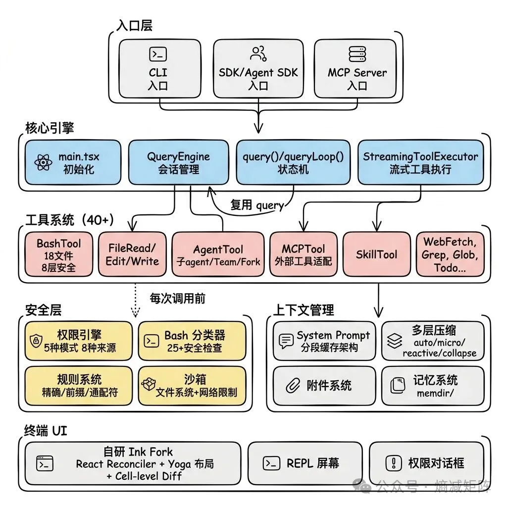

### 1.3 五条设计原则

通读 51 万行代码后提炼的贯穿全局的设计原则：

1. **工具即能力边界**：agent 能做什么完全由工具集决定，没有后门。读文件要用 FileReadTool，写文件要用 FileEditTool，执行命令要用 BashTool。新增能力 = 新增工具。

2. **Fail-closed 安全默认**：所有安全相关的默认值都是最保守的——工具默认不可并行（isConcurrencySafe: false）、默认非只读（isReadOnly: false）、权限默认需要确认。

3. **Context Engineering > Prompt Engineering**：不是写一段 prompt 告诉模型"你是谁"，而是在每轮对话中精心组装完整的上下文环境——分段缓存、动态注入、多层压缩。

4. **可组合性**：子 agent 复用主 agent 的 query() 函数，MCP 工具复用内部权限检查，Team 复用 Subagent 的执行引擎。

5. **编译时消除 > 运行时判断**：通过 Bun 的 feature() 宏在构建时移除未启用的功能代码，未启用的功能在 bundle 中完全不存在。

---

## 二、Agent Loop：系统的心脏

**文件**：src/QueryEngine.ts（1295 行）、src/query.ts（1729 行）、src/services/tools/StreamingToolExecutor.ts（530 行）、src/services/tools/toolExecution.ts（1745 行）

### 2.1 两层循环模型

Claude Code 的 Agent Loop 不是一个简单的 while 循环，而是一个有 7 种恢复路径和 10 种终止条件的隐式状态机，分为两层：

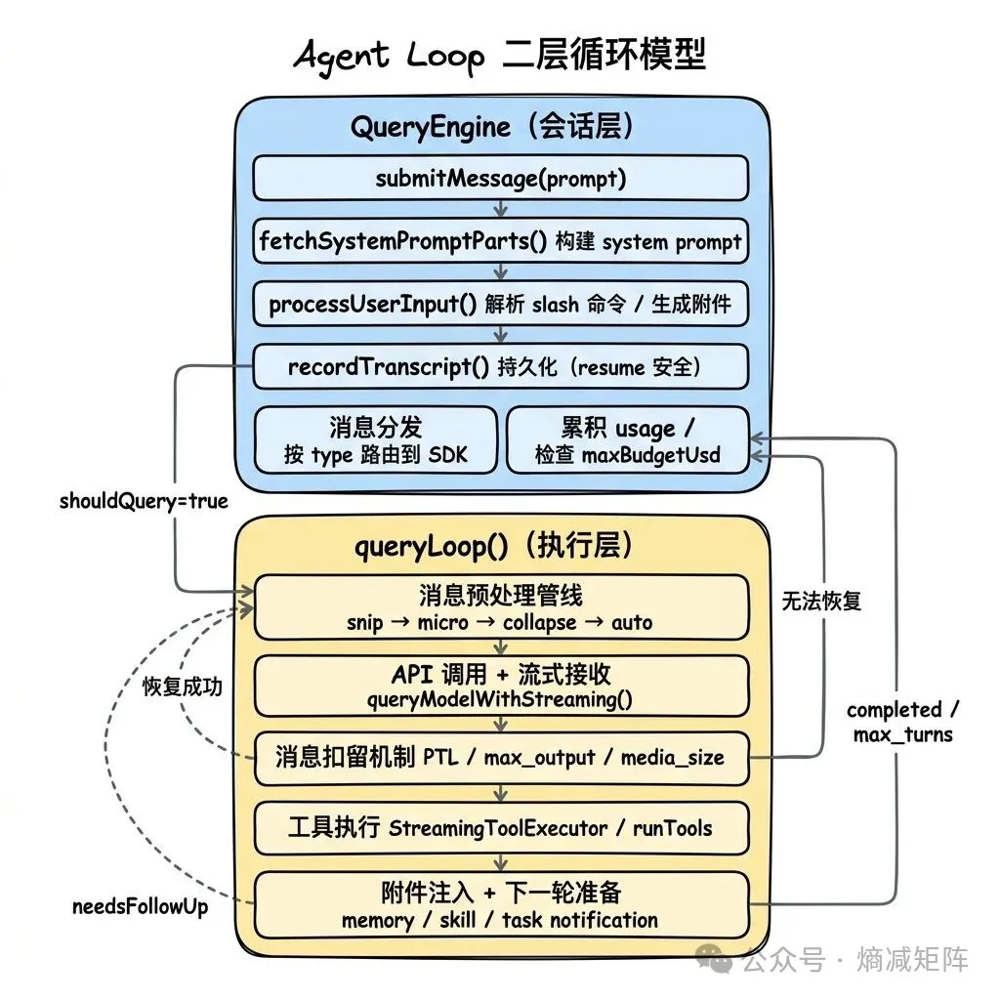

**为什么分两层？** 关注点分离。QueryEngine 处理"会话管理"——多轮状态、transcript 持久化、SDK 协议适配、usage 累积。queryLoop 处理"单轮执行"——API 调用、工具执行、错误恢复。两者通过 AsyncGenerator 连接：queryLoop yield 消息，QueryEngine 消费并转发。

**为什么用 AsyncGenerator？** 三个原因：
1. **背压**：调用方按需消费，不会被消息洪水淹没
2. **中断语义**：generator 的 .return() 级联关闭所有嵌套 generator，取消操作自然传播
3. **流式组合**：子 agent 的 runAgent() 也是 AsyncGenerator，可以直接嵌套在父 agent 的 query 流中

### 2.2 queryLoop 的状态机设计

queryLoop 是一个 while(true) 循环，每次迭代代表一次"API 调用 + 工具执行"。循环的退出由两种类型决定：
- **Terminal**：循环结束，返回终止原因
- **Continue**：循环继续，通过 state = next; continue 跳到下一次迭代

这不是显式状态机（没有 enum），而是通过 State 结构体追踪：

```typescript
// src/query.ts:204-217（精简）
type State = {
  messages: Message[]
  toolUseContext: ToolUseContext
  autoCompactTracking: AutoCompactTrackingState | undefined
  maxOutputTokensRecoveryCount: number
  hasAttemptedReactiveCompact: boolean
  pendingToolUseSummary: Promise<ToolUseSummaryMessage | null> | undefined
  turnCount: number
  transition: Continue | undefined  // 上一次迭代为什么 continue
}
```

设计动机在注释中说明（query.ts:266-268）：用一个完整的 State 赋值替代多个独立变量赋值，确保每个 continue 站点都显式声明所有状态，避免遗漏。

**完整的状态转换图**：

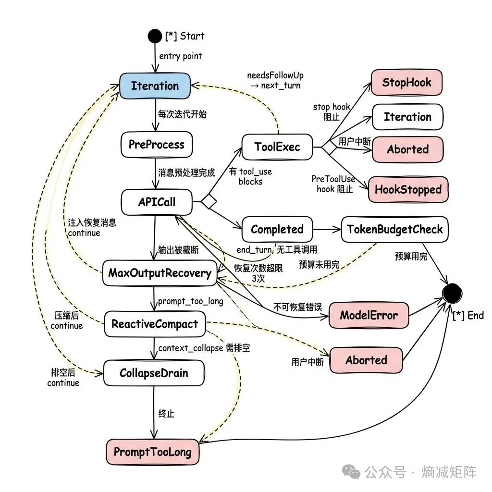

### 2.3 消息预处理管线：从轻到重

每次 API 调用前，消息要经过一条多阶段处理管线。这条管线的设计遵循"从轻到重"原则——先做廉价的本地操作，再做需要 API 调用的重操作：

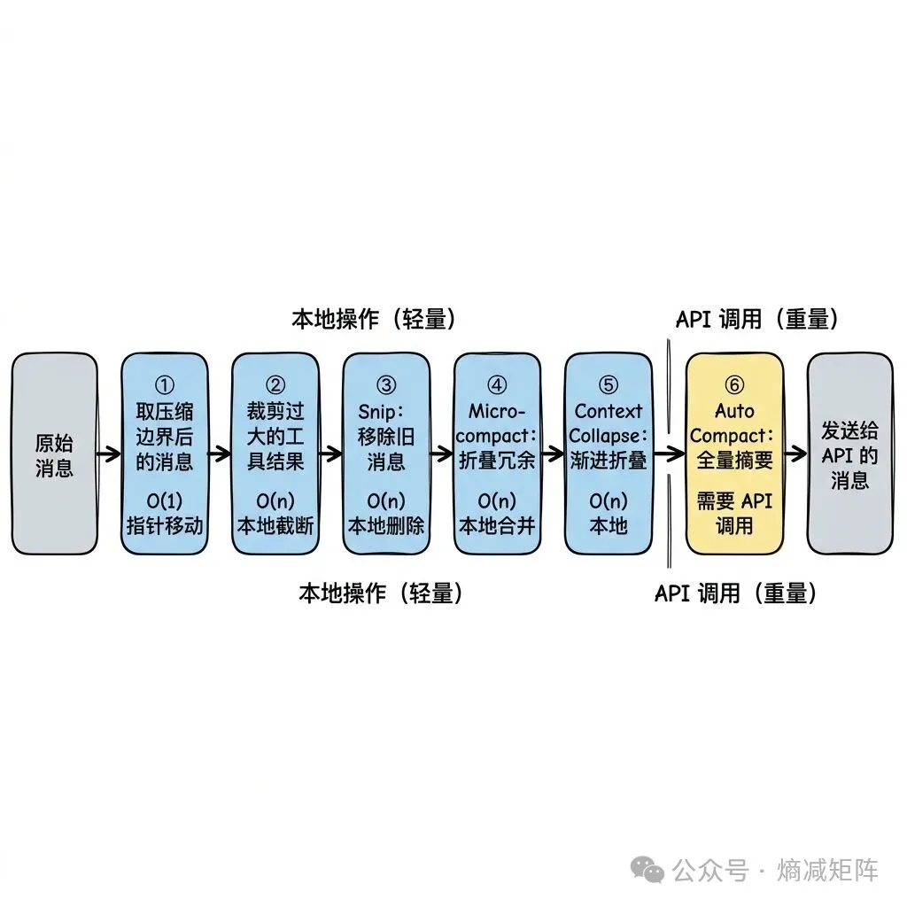

**为什么不直接用 AutoCompact？** 因为 AutoCompact 需要一次完整的 API 调用来生成摘要，成本高且会摧毁细粒度上下文。如果前面的轻量操作已经释放了足够空间，AutoCompact 就不需要触发。Context Collapse 在 AutoCompact 之前运行，正是为了尽可能保留更多原始上下文。

**AutoCompact 的阈值计算**：有效上下文窗口 = 模型上下文窗口 - max(max_output_tokens, 20000)，触发阈值 = 有效上下文窗口 - 13000。对于 200k 上下文的模型，大约在 167k tokens 时触发。

一个重要的工程细节：AutoCompact 有断路器机制——连续失败 3 次后停止重试。代码注释引用了真实数据："1,279 sessions had 50+ consecutive failures (up to 3,272), wasting ~250K API calls/day globally"。这说明在大规模部署中，即使是小概率的异常路径也会造成巨大的资源浪费。

### 2.4 流式工具执行器：并发控制的精髓

当模型返回多个工具调用时（比如同时读取 3 个文件），如何执行？Claude Code 提供了两种模式：

- **批量执行**：等 API 流式接收完全结束，然后按顺序执行所有工具。简单可靠，但延迟高——第一个 Read 要等最后一个 tool_use block 接收完才能开始。
- **流式执行（StreamingToolExecutor）**：API 流式接收期间，每收到一个 tool_use block 就立即开始执行。这是 Claude Code 的默认模式，也是性能优化的关键。

流式执行器的并发控制模型值得深入理解：

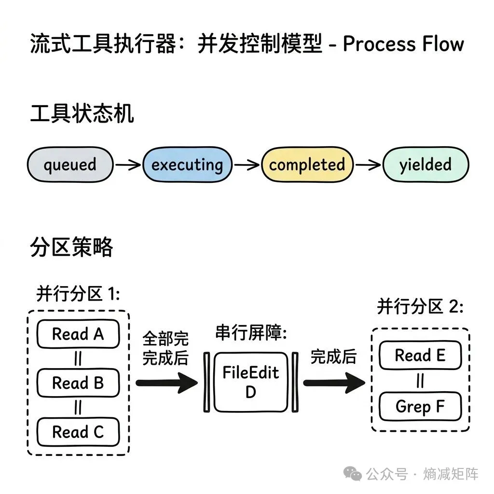

**核心规则**：每个工具通过 isConcurrencySafe(input) 声明自己是否可以并行执行。连续的并发安全工具组成一个"并行分区"，遇到非并发安全工具就开始新分区。分区间串行执行，分区内并行执行。

**为什么 FileRead 是并发安全的而 FileEdit 不是？** 因为两个并行的 FileEdit 可能编辑同一个文件的不同位置，导致行号偏移和冲突。FileRead 只读不写，天然无冲突。

一个防御性设计：如果 isConcurrencySafe 的调用抛出异常（比如输入解析失败），默认视为不安全。这是 fail-closed 原则的体现——宁可串行执行降低性能，也不冒并发冲突的风险。

### 2.5 消息扣留机制：保护 SDK 消费者

并非所有从 API 收到的消息都立即传递给调用方。三类消息会被"扣留"：

1. **prompt-too-long 错误**：被 reactiveCompact 扣留，尝试压缩后重试
2. **media-size 错误**：尝试剥离过大的图片后重试
3. **max_output_tokens 错误**：等待恢复循环决定是否能继续

扣留的动机是一个关键的 API 契约考量：SDK 消费者（如 desktop app、cowork）看到 error 字段就会终止会话。但 queryLoop 内部可能还有恢复路径——如果过早暴露中间错误，恢复循环还在运行但已经没人在听了。

### 2.6 Token Budget：让模型"做完"复杂任务

当模型自然停止（end_turn）但 token 预算未用完时，系统会注入一条 nudge 消息让模型继续工作。这解决了一个实际问题：复杂任务（如大规模重构）可能需要模型输出超过默认 max_output_tokens 的内容。

递减收益检测防止无限循环：如果连续 3 次检查每次增量都 < 500 tokens，说明模型已经没有实质性工作要做了，停止继续。子 agent 不参与 token budget（避免子 agent 无限运行），只有主线程 agent 可以使用。

---

## 三、工具系统：Agent 的手与脚

**文件**：src/Tool.ts（792 行）、src/tools.ts（389 行）、src/tools/（40+ 工具目录，~50,000 行）

Agent Loop 决定"做什么"，工具系统决定"怎么做"。Claude Code 的核心设计信条是：agent 能做什么，完全由它拥有的工具集决定。系统中没有任何"后门"让 agent 绕过工具直接操作环境。这个约束带来三个好处：可审计性（每个操作都有记录）、可控性（权限系统只需拦截工具调用这一个入口）、可扩展性（新增能力 = 新增工具）。

### 3.1 Tool 接口：六个功能组

Tool 类型是一个包含 30+ 方法的泛型接口，可以分为六个功能组：

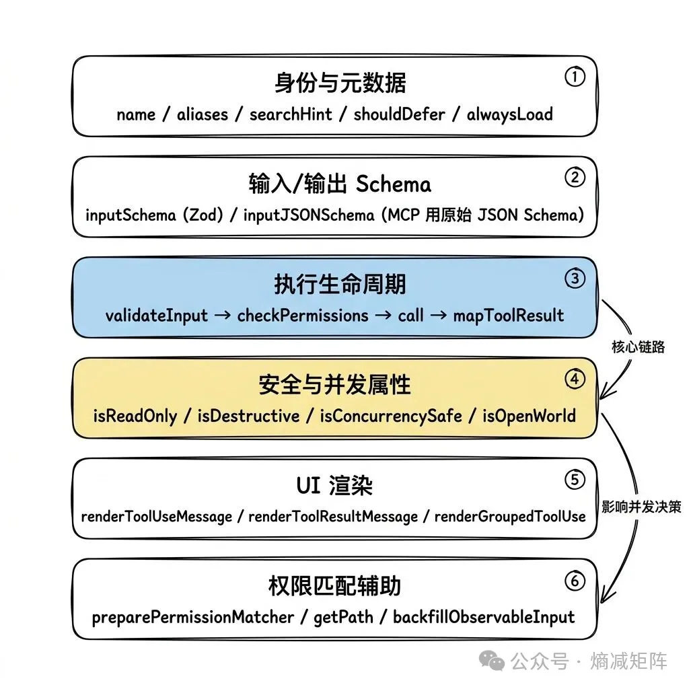

每个工具通过 buildTool 工厂函数构建，该函数提供安全默认值。关键的默认值设计：

| 属性 | 默认值 | 设计动机 |
|------|--------|----------|
| isConcurrencySafe | false | 假设不能并行，防止并发冲突 |
| isReadOnly | false | 假设会写入，触发更严格的权限检查 |
| isDestructive | false | 不假设破坏性，避免过度警告 |
| checkPermissions | allow | 默认放行，由外层权限系统兜底 |

这组默认值体现了一个微妙的平衡：并发和只读属性 fail-closed（保守），权限检查 fail-open（宽松）。原因是并发冲突和误写是工具内部问题，必须自己负责；而权限判断有外层的多层防御体系兜底。

### 3.2 ToolUseContext：工具的运行时环境

每个工具的 call() 方法接收一个 ToolUseContext 对象，包含 40+ 个字段。为什么工具需要这么多上下文？因为工具不是纯函数：

| 上下文字段 | 用途 | 为什么不能省略 |
|------------|------|----------------|
| readFileState | 文件读取状态缓存 | FileEditTool 需要验证"不能编辑未读过的文件" |
| abortController | 取消信号 | BashTool 的长时间命令需要支持用户中断 |
| setToolJSX | UI 渲染回调 | BashTool 需要渲染实时进度条 |
| agentId | 子 agent 标识 | 区分主线程和子 agent，影响权限和 CWD |
| contentReplacementState | token 预算控制 | 防止工具结果消耗过多上下文窗口 |
| updateFileHistoryState | 文件历史 | 支持 /rewind 命令撤销文件修改 |

ToolResult 的返回值中有一个精妙的 contextModifier 字段：某些工具执行后需要修改后续工具的上下文（比如切换工作目录），但又不能直接修改全局状态。contextModifier 提供了一个受控的方式来做这件事，且只对非并发安全的工具生效——并发执行的工具不能互相修改上下文。

### 3.3 工具注册：三种加载策略

工具注册中心（src/tools.ts）根据当前环境组装可用工具集，采用三种加载策略：

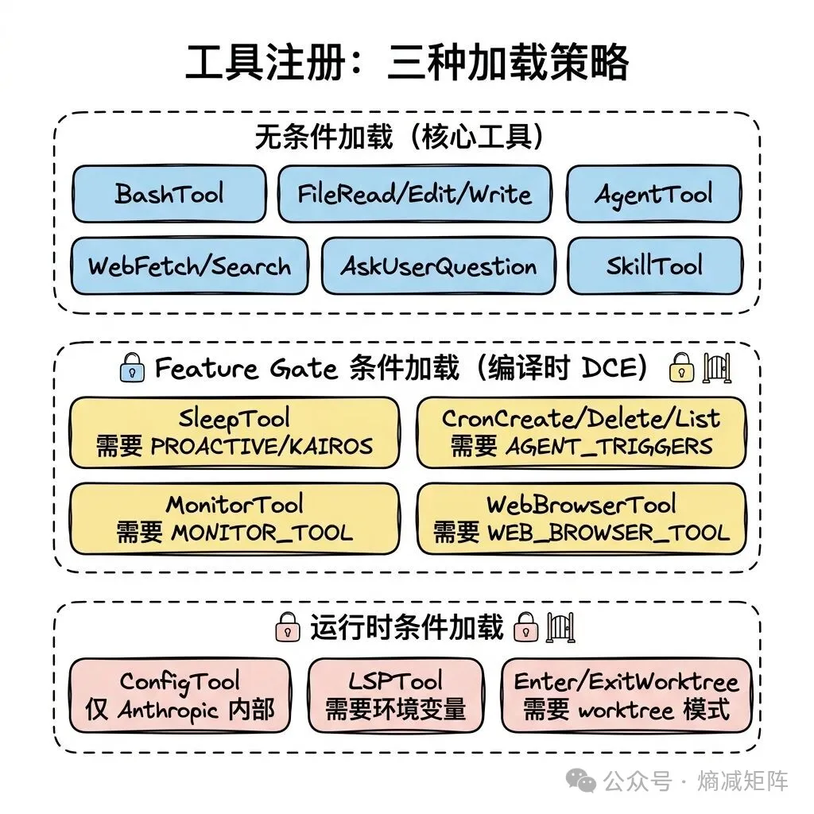

Feature gate 使用 Bun 的 feature() 宏实现编译时死代码消除（DCE）。当 feature flag 为 false 时，整个 require() 分支在构建时被完全移除——不仅不执行，连代码都不会出现在最终 bundle 中。这解释了为什么用 require() 而不是 import：动态 require 可以被条件包裹，静态 import 不行。

工具集的最终组装（assembleToolPool）将内建工具和 MCP 工具合并时，采用分区排序——内建工具在前按名称排序，MCP 工具在后按名称排序，两组之间不混合。原因是服务端的 prompt cache 策略在最后一个内建工具之后放置缓存断点，如果 MCP 工具插入到内建工具之间会导致缓存失效。

### 3.4 BashTool 深度解析：18 个文件的安全堡垒

BashTool 是整个工具系统中最复杂的单一工具（18 个文件），复杂性来自一个根本矛盾：shell 命令的表达力几乎无限，但安全约束必须严格。

**BashTool 8 层安全检查**：

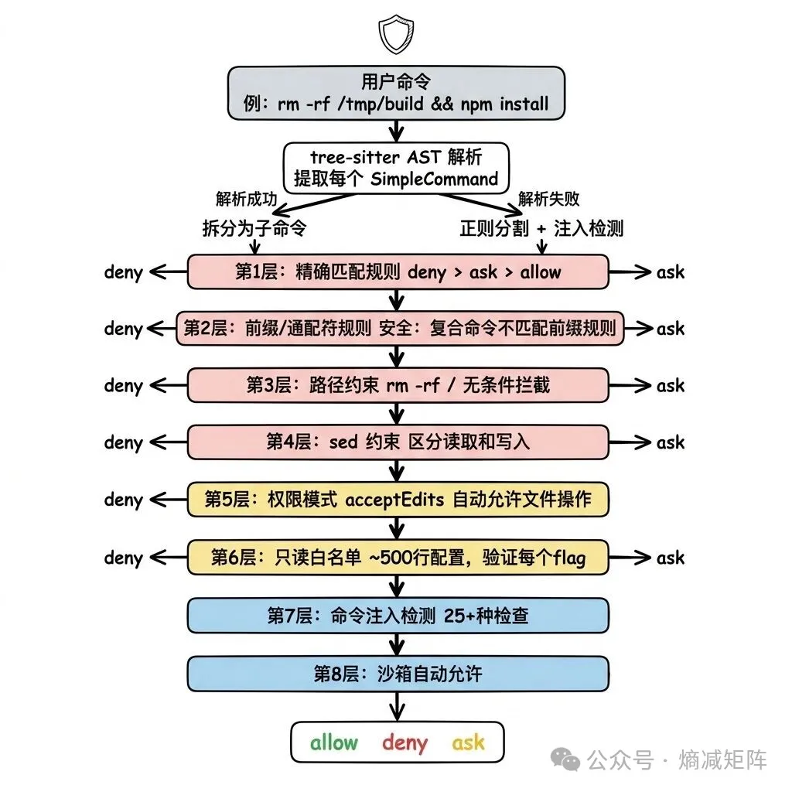

几个值得学习的安全设计：

- **复合命令隔离**：Bash(cd:*) 前缀规则不会匹配 `cd /path && python3 evil.py`。系统先用 tree-sitter 解析 AST，提取每个 SimpleCommand，对每个子命令独立运行权限检查。任何子命令被 deny，整个命令被 deny。子命令数量上限 50，超过直接要求用户确认——防止 ReDoS 和事件循环饥饿。

- **只读白名单的 flag 级验证**：不只检查命令名，还验证每个 flag 的值类型。比如 `xargs -I` 和 `-i` 看起来相似，但 `-i` 的 GNU 实现有可选参数语义，可以被利用执行任意命令。白名单为每个 flag 定义了允许的值类型（'none'、'number'、'string'、特定值），精确到这个级别才能防止 flag 注入。

- **命令注入检测（bashSecurity.ts）**：25+ 种检查，覆盖命令替换（$()、反引号）、进程替换（<()）、参数替换（${}）、Zsh 特有危险命令（zmodload、syswrite）、控制字符、Unicode 空白字符等。

- **沙箱机制**：通过 SandboxManager 限制文件系统读写路径、网络访问主机、Unix socket。沙箱内的命令即使没有匹配任何 allow 规则也可以执行，但 deny/ask 规则仍然优先——沙箱是"安全网"而非"免死金牌"。

### 3.5 FileEditTool：搜索-替换的安全设计

FileEditTool 实现了"搜索-替换"模式的文件编辑。核心约束：old_string 必须在文件中唯一匹配。如果有多处匹配，编辑失败并要求提供更多上下文。这个约束看似严格，但避免了"编辑了错误位置"的灾难性错误。

另一个安全不变量：不能编辑未读过的文件。readFileState 缓存跟踪哪些文件被 FileReadTool 读取过，如果模型试图编辑未读文件，系统拒绝并提示先读取。这防止了模型"凭记忆"编辑文件——它必须先看到文件的当前状态。

---

## 四、权限体系：系统的免疫系统

**文件**：src/utils/permissions/（24 个文件）、src/hooks/toolPermission/（5 个文件）、src/components/permissions/（50+ 个文件）

工具系统定义了 agent 能做什么，权限体系定义了 agent 被允许做什么。这是整个系统中最关键的信任机制——它必须在"让 AI 高效工作"和"防止 AI 搞砸一切"之间找到平衡。

### 4.1 权限模式：信任的刻度盘

权限模式是用户对 AI 信任程度的全局声明。系统定义了一个从"完全不信任"到"完全信任"的连续谱：

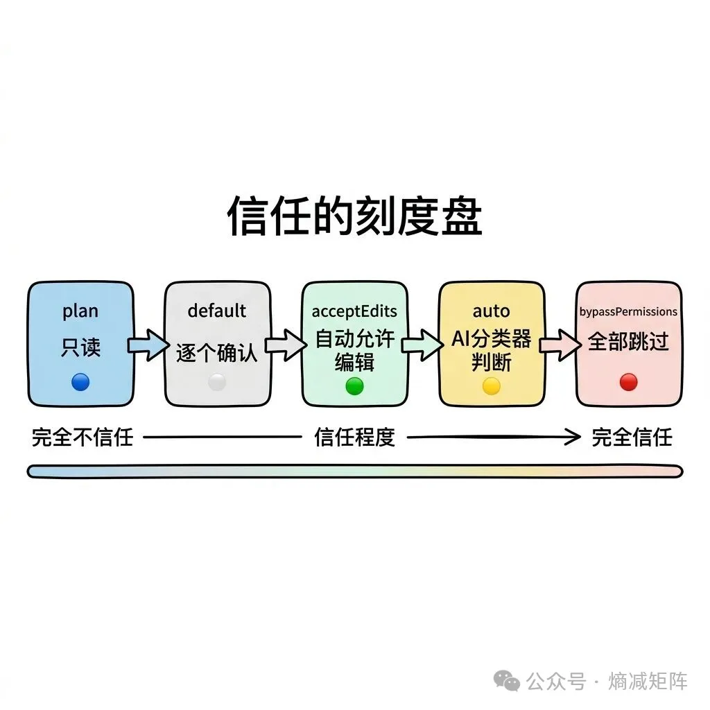

| 模式 | 行为 | 适用场景 |
|------|------|----------|
| plan | AI 只能规划，不能执行任何写操作 | 探索性分析、代码审查 |
| default | 每个工具调用都需要用户确认 | 日常开发（默认） |
| acceptEdits | 工作目录内的文件编辑自动允许，其他操作仍需确认 | 信任 AI 的重构能力 |
| auto | AI 分类器自动判断操作安全性 | 高信任场景（仅内部用户） |
| bypassPermissions | 跳过所有权限检查（除硬编码安全检查） | 紧急修复、受控环境 |
| dontAsk | 将所有 'ask' 转为 'deny'，AI 自主运行但遇到需确认的操作直接跳过 | 完全自动化的 CI/CD |

**为什么不是简单的开/关？** 因为不同场景需要不同的信任级别。这个谱系让用户可以精确控制自己的舒适区。

**远程熔断**：即使用户选择了 bypassPermissions，系统仍保留远程禁用的能力。bypassPermissionsKillswitch.ts 通过 Statsig 特性门控实现"紧急刹车"——当发现严重安全漏洞时，Anthropic 可以远程降级所有用户的 bypass 模式。auto 模式也有类似的 autoModeCircuitBroken 熔断器。

### 4.2 权限判断主流程：多层评估管线

每次 AI 要调用工具时，系统执行一个严格有序的评估管线。以 `rm -rf /` 为例追踪完整流程：

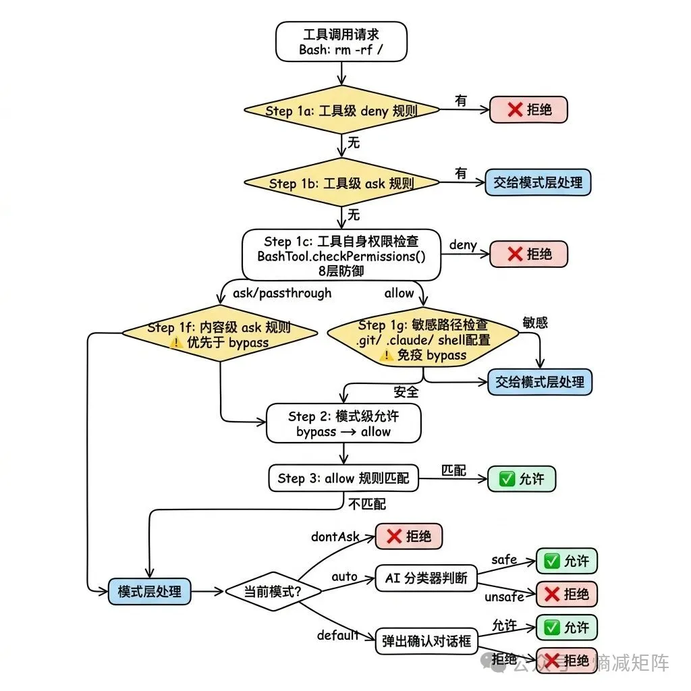

几个关键的设计决策值得深入理解：

- **用户显式 ask 规则优先于 bypass 模式（Step 1f）**：如果用户配置了 `ask: ["Bash(npm publish:*)"]`，即使在 bypassPermissions 模式下也会弹出确认。设计哲学是"用户的显式意图永远优先"——bypass 是"我信任 AI 的一般判断"，但 ask 规则是"这个特定操作我要亲自确认"。

- **敏感路径免疫 bypass（Step 1g）**：对 .git/、.claude/、.vscode/、shell 配置文件（.bashrc、.zshrc）的写入，即使在 bypass 模式下也必须确认。这是硬编码的安全底线，不可被任何模式覆盖。原因很直接：这些文件的修改可能影响整个开发环境的安全性。

- **拒绝追踪与熔断**：auto 模式下，如果分类器连续拒绝 3 次或总共拒绝 20 次，系统从自动拒绝降级为弹出确认对话框。这防止了 AI 陷入"尝试-被拒-换个方式再试-又被拒"的死循环。在 headless 模式下，达到限制直接抛出 AbortError 终止整个 agent。

### 4.3 规则系统：精细化控制

每条权限规则由三个维度定义：

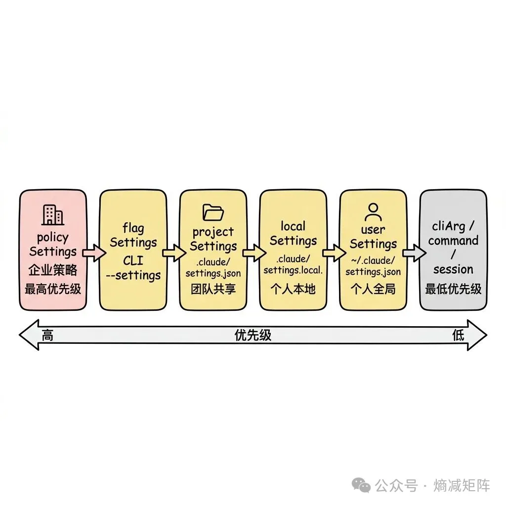

企业管理员可以通过 policySettings 强制覆盖任何规则。当 allowManagedPermissionRulesOnly 为 true 时，只加载 policySettings 的规则——这是企业级的"锁定"模式。

**Shell 规则匹配的三种模式**：精确匹配（npm install）、前缀匹配（npm:*，遗留语法）、通配符匹配（git commit *）。通配符匹配将模式转换为正则表达式，有一个巧妙的细节：当模式以 `*`（空格+通配符）结尾且只有一个通配符时，尾部变为可选的，使得 `git *` 同时匹配 `git add` 和裸 `git`。

规则遮蔽检测（shadowedRuleDetection.ts）解决了一个用户体验问题：当用户同时配置了矛盾的规则时，某些规则可能永远不会生效。比如同时有 `deny: ["Bash"]` 和 `allow: ["Bash(ls:*)"]`，后者永远不会生效因为 deny 在管线中先于 allow 检查。系统会在 UI 中显示警告帮助用户修复。

### 4.4 权限在多 Agent 场景下的传递

权限系统为不同的 agent 模式提供了三种处理器（src/hooks/toolPermission/handlers/）：

| 处理器 | 场景 | 行为 |
|--------|------|------|
| interactiveHandler | 标准交互模式 | 弹出 UI 对话框让用户决定 |
| coordinatorHandler | Coordinator 模式 | 先运行自动化检查（分类器、hooks），再决定是否需要用户确认 |
| swarmWorkerHandler | Swarm worker 模式 | 通过 Leader Permission Bridge 将权限请求冒泡到 leader |

异步 agent 无法显示 UI，设置 shouldAvoidPermissionPrompts: true。遇到需要确认的操作时，先尝试 PermissionRequest hooks，如果没有 hook 做出决定，自动拒绝。bubble 模式是例外——它将权限提示冒泡到父终端，让用户在父 agent 的界面中确认子 agent 的操作。

---

## 五、多 Agent 协作：蜂群智能

**文件**：src/tools/AgentTool/（20 个文件）、src/utils/swarm/（22 个文件）、src/coordinator/、src/tasks/（12 个文件）

当一个任务太复杂——比如"重构这个模块并写测试"——单个 agent 可能需要在阅读代码、修改文件、运行测试之间反复切换，上下文窗口很快就会被填满。多 Agent 协作通过任务分解和并行执行来解决这个问题。

### 5.1 三层协作架构

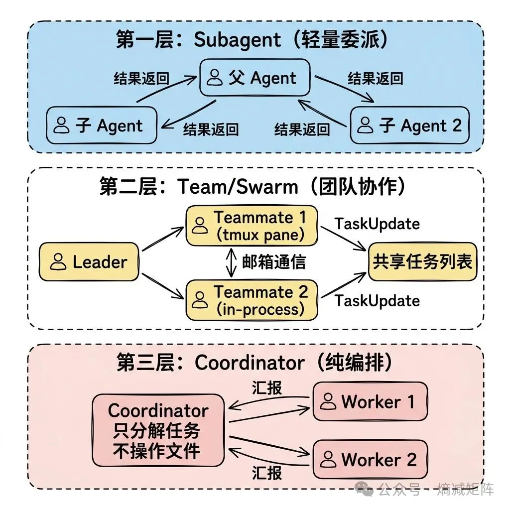

三层的设计边界：

- **Subagent**：最轻量，父 agent 同步/异步派生子 agent，适合"帮我搜索一下"这类简单委派
- **Team/Swarm**：成员之间可以互相通信，有 leader/teammate 角色分工，适合"前端和后端同时开发"
- **Coordinator**：纯编排模式，coordinator 不直接操作文件，所有实际工作由 worker 完成，适合大规模并行任务

### 5.2 AgentTool：统一入口的路由设计

所有多 agent 协作都通过同一个工具触发——AgentTool。这个设计降低了模型的认知负担：它只需要学会使用一个工具，通过参数组合触发不同的协作模式。

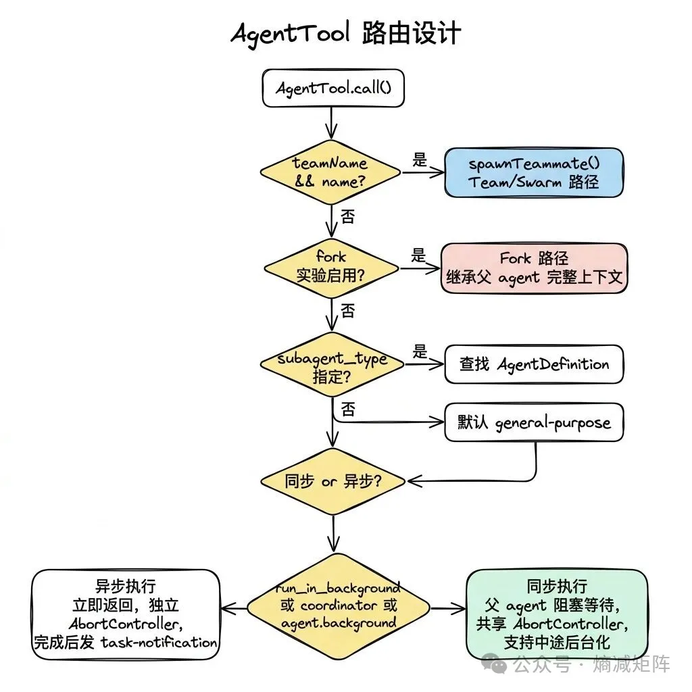

### 5.3 Agent 定义体系：三层联合类型

Agent 的类型定义是一个三层联合类型：内置 agent（BuiltInAgentDefinition）、用户自定义 agent（CustomAgentDefinition）、插件 agent（PluginAgentDefinition）。

每个 agent 定义包含：类型标识符、使用场景描述（注入到 AgentTool 的 prompt 中）、工具白名单/黑名单、系统 prompt 生成函数、模型选择、权限模式覆盖、持久记忆范围、隔离模式、生命周期钩子、专属 MCP 服务器。

**优先级覆盖机制**：built-in < plugin < userSettings < projectSettings < flagSettings < policySettings。同名 agent 按此优先级覆盖，企业管理员可以通过 policySettings 强制覆盖任何 agent 的行为。

### 5.4 内置 Agent 类型的设计哲学

| Agent | 模型 | 工具限制 | 关键设计决策 |
|-------|------|----------|--------------|
| general-purpose | 默认子 agent 模型 | 全部工具 | 万能工人，无特殊限制 |
| Explore | haiku（外部）/ inherit（内部） | 只读，禁止 Edit/Write/Agent | 用最便宜的模型做搜索，每周 3400 万次调用 |
| Plan | inherit | 只读，禁止 Edit/Write/Agent | 架构设计，不需要执行能力 |
| verification | inherit | 只读（项目目录），可写 /tmp | 独立验证，总是异步运行 |

**Explore 的 token 优化**值得学习：省略 CLAUDE.md（搜索 agent 不需要 commit/PR/lint 规则）和 gitStatus（只读 agent 不需要 git 状态），注释提到这两个优化"saves ~5-15 Gtok/week across 34M+ Explore spawns"。在大规模部署中，每次节省几千 token 的累积效果巨大。

**Verification agent 的"反自我欺骗"设计**：它的 system prompt 是最长的 agent prompt 之一（~120 行），明确列出 LLM 常见的验证逃避模式——"代码看起来正确"、"测试已经通过了"——并要求每个检查必须有实际执行的命令和输出。background: true 标记意味着它总是异步运行，不阻塞主 agent。这是对 LLM 已知弱点的工程化对策。

### 5.5 子 agent 的执行引擎

runAgent() 是子 agent 的核心执行函数，也是一个 AsyncGenerator。关键设计：子 agent 复用主 agent 的 query() 函数——同一个 agent loop，只是上下文不同。这是可组合性的极致体现。

**权限模式覆盖的安全规则**：agent 可以定义自己的 permissionMode，但有一个重要约束——bypassPermissions、acceptEdits、auto 模式的父 agent 不会被子 agent 降级。也就是说，如果父 agent 在 bypass 模式下，子 agent 不能把自己设为 default 模式来"假装更安全"。

**工具过滤的三层逻辑**：

1. 全局禁止列表（ALL_AGENT_DISALLOWED_TOOLS）——所有 agent 都不能用的工具
2. 自定义 agent 禁止列表（CUSTOM_AGENT_DISALLOWED_TOOLS）——非内置 agent 不能用的工具
3. 异步 agent 白名单（ASYNC_AGENT_ALLOWED_TOOLS）——异步 agent 只能用白名单中的工具

MCP 工具始终放行（tool.name.startsWith('mcp__') → true），因为它们是外部能力扩展，不应被 agent 类型限制。

清理阶段的 8 项清理操作（MCP 断开、session hooks 清除、prompt cache 清理、文件状态缓存释放、Perfetto 追踪注销、transcript 映射清除、孤儿 todo 清除、后台 bash 终止）说明了子 agent 的资源占用——每个子 agent 都是一个完整的执行环境，需要精确的生命周期管理。

### 5.6 Fork Subagent：Prompt Cache 优化的极致

Fork 是实验性功能，代表了一种全新的子 agent 模式：继承父 agent 的完整对话历史和系统 prompt，只需要一个简短的指令。

核心优化目标是最大化 prompt cache 命中率。消息构建策略：保留父 agent 的完整 assistant message（所有 tool_use blocks），为每个 tool_use 生成相同的占位 tool_result，在最后追加一个 per-child 的指令文本块。结果：只有最后一个文本块因 child 而异，前面的所有内容字节相同。多个 fork 并行启动时共享同一个 prompt cache 前缀。

**防递归设计**：fork 子 agent 保留了 Agent 工具（为了 cache-identical 工具定义），但在 call() 时通过两重检查阻止递归 fork——querySource 检查（compaction-resistant）和消息扫描 `<fork-boilerplate>` 标签（fallback）。

指令格式的设计非常讲究：大写 "STOP. READ THIS FIRST." 确保 LLM 注意到身份切换；明确说"你的 system prompt 说'默认 fork'，忽略它"——因为 fork 子 agent 继承了父 agent 的 system prompt，其中包含 fork 指导。

### 5.7 Team/Swarm：两种后端的权衡

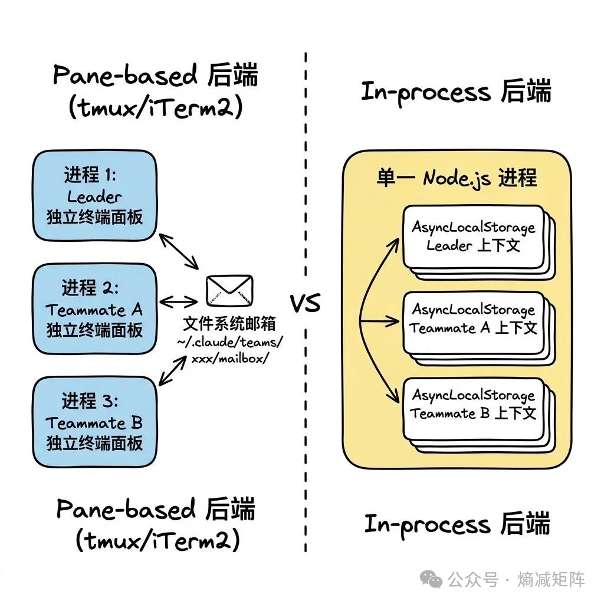

| 维度 | Pane-based | In-process |
|------|------------|------------|
| 隔离性 | 强（独立进程） | 弱（共享进程） |
| 资源开销 | 高（每个 teammate 一个 Node.js 进程） | 低 |
| 用户可见性 | 高（每个 agent 有独立终端面板） | 低 |
| 崩溃影响 | 隔离（一个崩溃不影响其他） | 级联（可能影响所有 teammate） |
| 适用场景 | 交互式开发 | SDK/headless 模式 |

**后端选择逻辑**：已在 tmux 内 → TmuxBackend；在 iTerm2 内 → ITermBackend；都不在 + tmux 可用 → TmuxBackend（外部会话）；都不可用 → 抛错提示安装 tmux。SDK 模式强制使用 In-process。

通信机制统一为 TeammateExecutor 接口：spawn()、sendMessage()、terminate()、kill()、isActive()。无论底层是文件系统邮箱还是内存通信，上层代码不需要关心。

### 5.8 进程内 Teammate 运行器：最复杂的协作引擎

src/utils/swarm/inProcessRunner.ts（~1400 行）是进程内 teammate 的执行引擎，也是 Swarm 系统中最复杂的文件。

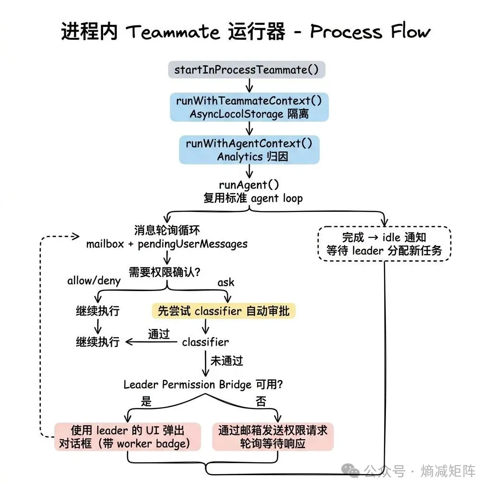

进程内 teammate 的权限处理是整个系统中最精巧的部分。createInProcessCanUseTool() 创建了一个自定义的权限检查函数，实现了三级降级策略：

1. 标准 hasPermissionsToUseTool() 检查——如果结果是 allow 或 deny，直接返回
2. 如果结果是 ask，先尝试 classifier 自动审批（对 bash 命令）
3. 优先路径：通过 leaderPermissionBridge 使用 leader 的 UI 弹出对话框，带 worker badge 标识
4. 降级路径：通过邮箱发送权限请求，轮询等待响应

Leader Permission Bridge 是一个模块级别的桥接器——REPL 注册其 setToolUseConfirmQueue 和 setToolPermissionContext 函数，进程内 teammate 通过这些函数直接使用 leader 的 UI 来显示权限对话框。当 teammate 的权限请求被批准时，权限更新写回 leader 的共享上下文，但 preserveMode: true 防止 worker 的权限模式泄漏回 coordinator。

**Idle 生命周期**：Teammate 完成当前任务后不会退出，而是进入 idle 状态，通过 Stop hook 发送 idle 通知给 leader，等待分配新任务。这避免了频繁的进程创建/销毁开销。idle 通知中包含最近的 peer DM 摘要，让 leader 了解 teammate 之间的协作状态。

**内存防护**：TEAMMATE_MESSAGES_UI_CAP = 50 限制了 AppState 中存储的消息数量。注释提到一个"鲸鱼会话"在 2 分钟内启动了 292 个 agent，达到 36.8GB 内存。消息上限是对这种极端场景的防御。

### 5.9 Teammate 通信：邮箱系统与消息路由

Teammate 之间通过文件系统邮箱通信，路径为 `~/.claude/teams/<teamName>/mailbox/<agentName>/`。SendMessageTool 是通信的统一入口，支持多种路由目标：

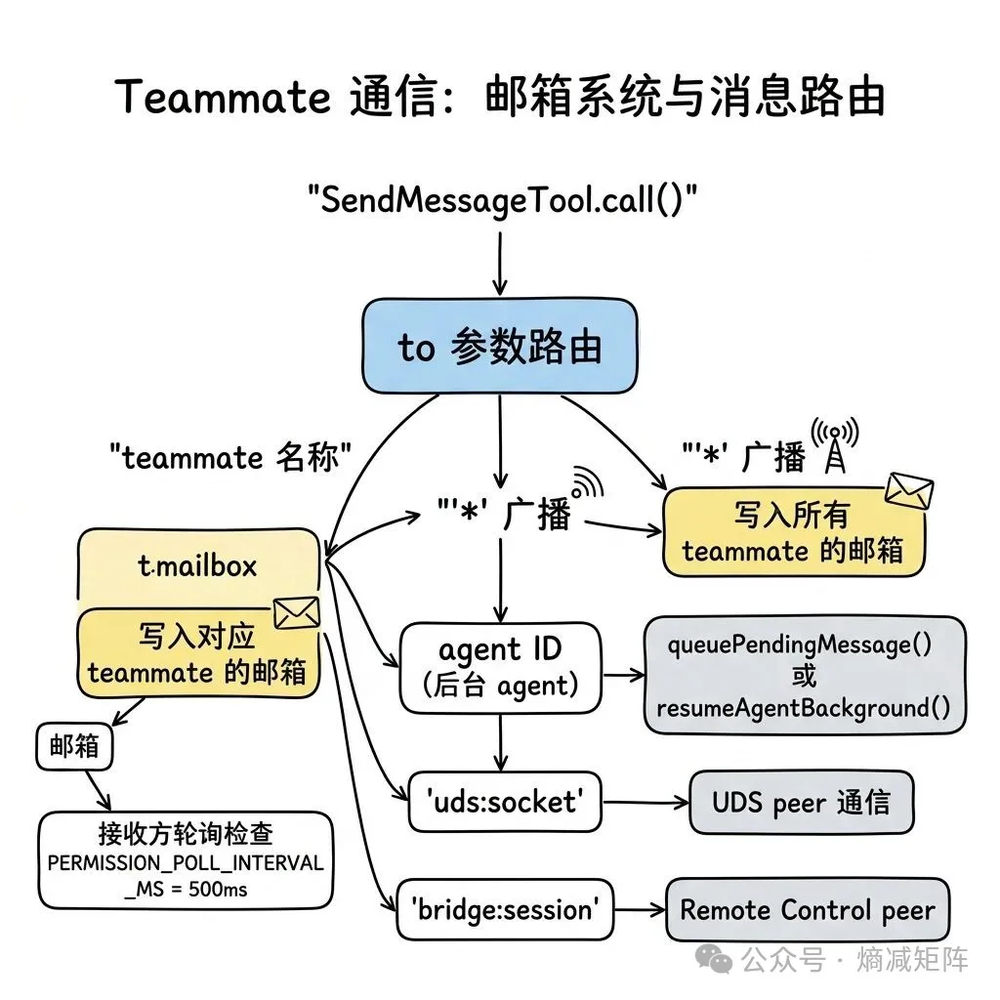

消息支持两种格式：纯文本（日常通信）和结构化消息（shutdown_request、shutdown_response、plan_approval_request 等协议消息）。结构化消息用于 leader 和 teammate 之间的生命周期管理——leader 发送 shutdown_request，teammate 回复 shutdown_response 确认后退出。

### 5.10 Coordinator 模式：纯编排者的设计

Coordinator 模式（src/coordinator/coordinatorMode.ts）是多 agent 协作的最高层抽象。与 Subagent 和 Team 不同，Coordinator 自己不操作文件——它只有 ~6 个工具（TeamCreate、TeamDelete、SendMessage、Agent、TaskStop、SyntheticOutput），没有 Bash、Read、Write、Edit。

Coordinator 的系统 prompt（~260 行）定义了一个四阶段工作流：Research → Synthesis → Implementation → Verification。其中最关键的设计原则是**"永远不要委派理解"**：

```typescript
// Anti-pattern（坏）
Agent({ prompt: "Based on your findings, fix the auth bug" })

// Good（好）
Agent({ prompt: "Fix the null pointer in src/auth/validate.ts:42. The user field on Session is undefined when sessions expire..." })
```

这个原则的深层原因：worker 从零开始，没有 coordinator 的对话上下文。如果 coordinator 不综合研究结果就直接转发，worker 会缺乏关键信息。Coordinator 的核心价值就是综合——把多个 worker 的发现融合成精确的执行指令。

**Scratchpad 共享存储**：Coordinator 模式下有一个跨 worker 共享的 scratchpad 目录，worker 可以在这个目录中自由读写不需要权限审批。这解决了 worker 之间需要传递中间结果的问题。

**Coordinator 与 Fork 互斥**：Coordinator 已经是纯编排者，它不读文件、不写代码。Fork 的设计是"继承上下文的分身"，但 Coordinator 没有执行上下文可以继承——fork 一个 Coordinator 只会得到另一个编排者，没有意义。

### 5.11 Task 系统：异步工作的基础设施

所有异步工作（shell 命令、agent、teammate、记忆整理）都注册到 AppState.tasks，通过统一的 Task 接口管理。

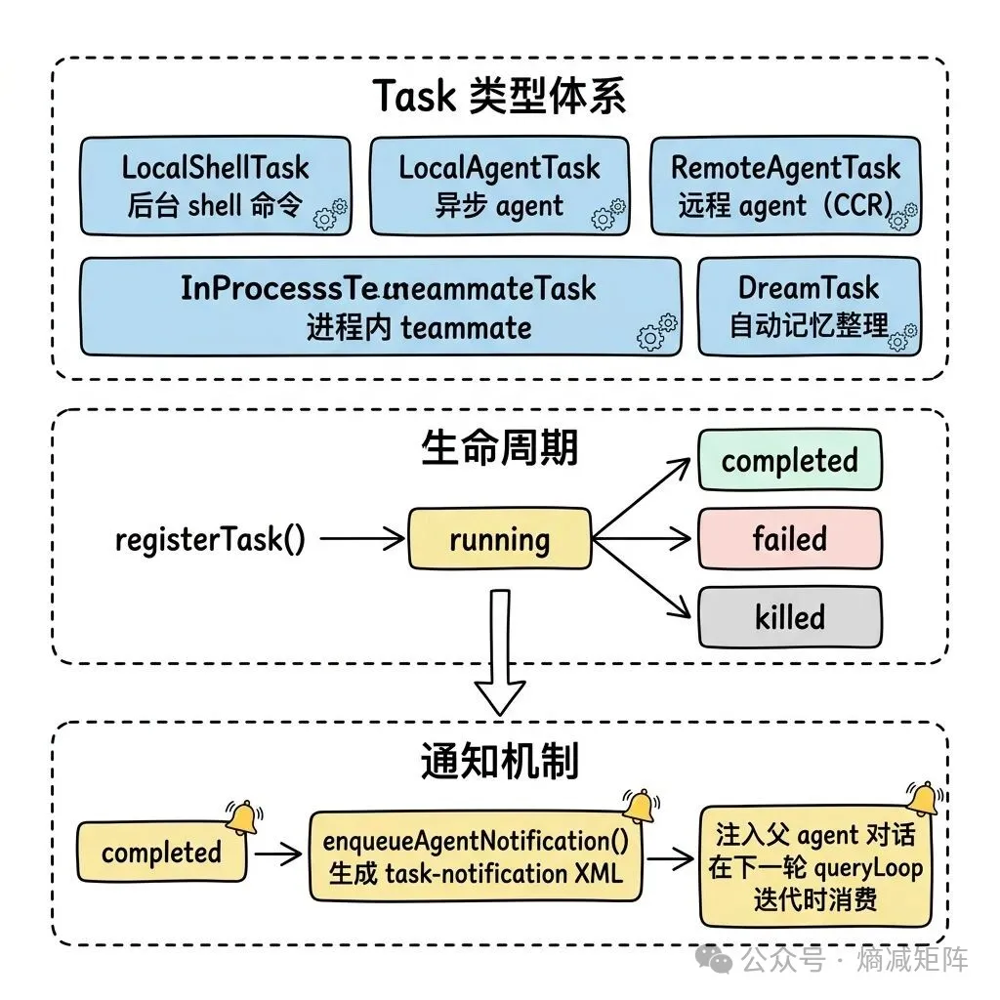

LocalAgentTask 的进度追踪维度：工具调用次数、token 消耗（input + output）、最近 5 个工具调用的描述。进度信息实时写入 AppState，UI 层显示。

InProcessTeammateTask 有两个 AbortController：abortController 杀死整个 teammate，currentWorkAbortController 只取消当前轮次的工作但 teammate 继续存活。这个区分让 leader 可以"打断"teammate 的当前任务而不需要重新创建它。

DreamTask（自动记忆整理）是一个特殊的后台任务——系统在空闲时自动运行子 agent，回顾最近的会话并整理记忆文件。它的 kill() 方法会回滚锁的 mtime，让下次会话可以重试被中断的整理。

### 5.12 权限在多 Agent 场景下的完整传递链

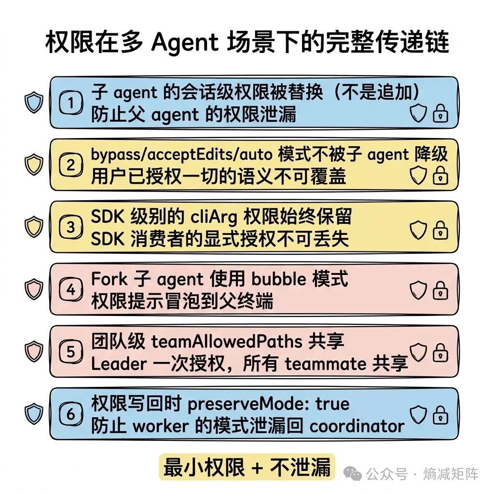

这六条规则共同实现了"最小权限 + 不泄漏"的原则：每个 agent 只拥有完成任务所需的最小权限，权限变更不会意外传播到其他 agent。

---

## 六、System Prompt 工程：Context Engineering 的极致实践

**文件**：src/constants/prompts.ts（914 行）、src/constants/systemPromptSections.ts（68 行）、src/context.ts（189 行）、src/services/compact/（~4000 行）

Claude Code 的 prompt 工程不是"写一段文本告诉模型你是谁"，而是一个精密的动态组装系统。核心理念是 Context Engineering——在每一轮对话中精心组装完整的上下文环境，让模型在有限的 token 窗口内始终拥有做出正确决策所需的全部信息。

### 6.1 分段缓存架构：Prompt 级别的 Memoization

System prompt 不是一个巨大的字符串，而是一个 string[] 数组，每个元素是一个独立的"段落"。这个设计的核心动机是 prompt cache——Anthropic API 支持对 system prompt 的前缀进行缓存，避免每轮对话都重新处理相同的内容。

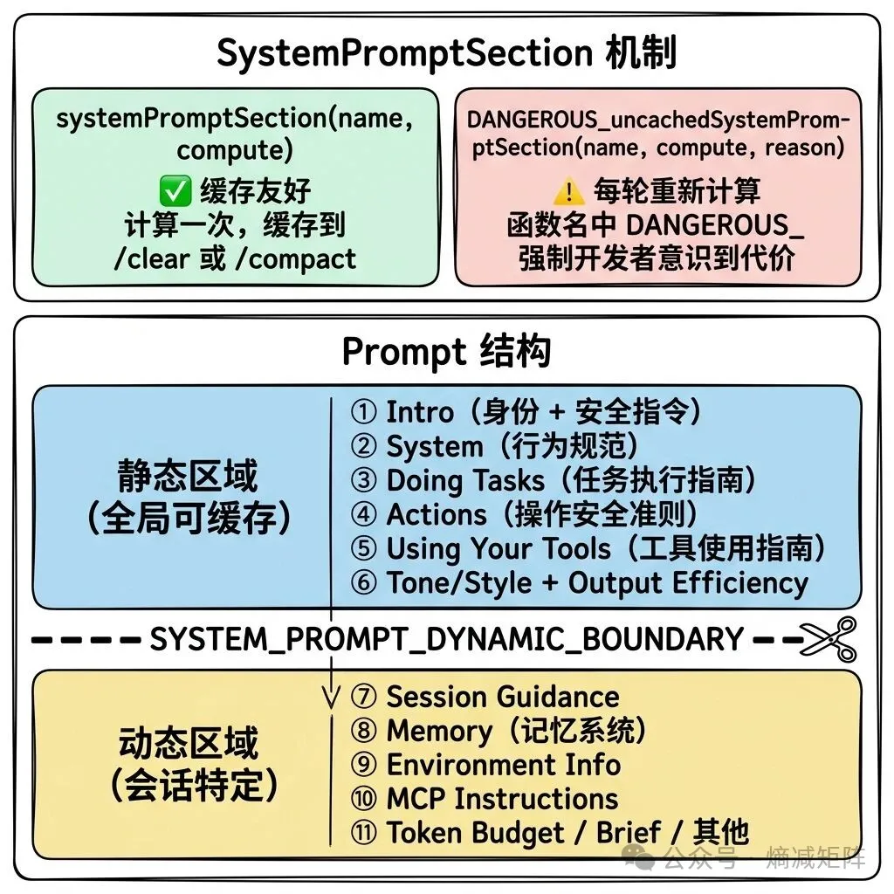

SYSTEM_PROMPT_DYNAMIC_BOUNDARY 标记将 prompt 分为两个缓存域：边界之前的静态区域使用 scope: 'global' 级别的缓存（跨所有用户共享），边界之后的动态区域不能跨用户缓存。在大规模部署中，全局缓存意味着所有用户的第一轮对话都能命中同一份缓存的静态 prompt 前缀——直接降低 API 成本和首次响应延迟。

DANGEROUS_uncachedSystemPromptSection 的命名是刻意的——它强制开发者在每次使用时提供 _reason 参数解释为什么必须破坏缓存。这是一种"代码即文档"的设计：函数签名本身就是一个审查机制。

### 6.2 静态区域：agent 的"宪法"

静态区域定义了 agent 的核心行为规范，几个值得深入理解的设计决策：

- **最小化原则（Doing Tasks 段落）**：多条规则反复强调"不要过度"——不要添加未被要求的功能、不要为假设的未来需求设计、不要创建一次性的抽象。原文："Three similar lines of code is better than a premature abstraction." 这不是风格偏好，而是对 LLM 已知行为模式的工程化对策——模型倾向于"过度工程化"，需要明确的约束来抑制。

- **授权不具有传递性（Actions 段）**："A user approving an action once does NOT mean that they approve it in all contexts." 这防止了模型从一次批准中过度泛化——用户允许了一次 git push 不意味着以后所有 git push 都自动允许。

- **内部/外部差异化**：Anthropic 内部用户看到额外的指令，包括更严格的注释规范（"Default to writing no comments"）和诚实报告要求。注释提到这是针对内部评估中发现的 29-30% 虚假声明率（Capybara v8）的对策。

- **工具使用优先级（Using Your Tools 段落）**：指导模型优先使用专用工具而非 Bash——Read 代替 cat、Edit 代替 sed、Glob 代替 find。这不仅是用户体验考虑（专用工具的输出更容易审查），也是安全考虑（专用工具有内置的权限检查，Bash 的权限检查要复杂得多）。

### 6.3 动态区域：会话特定的上下文注入

- **CLAUDE.md 注入（src/context.ts）**：系统从项目目录向上遍历，收集所有层级的 CLAUDE.md 文件，合并后注入到 userContext 中。--bare 模式跳过自动发现，但仍尊重 --add-dir 显式指定的目录——"bare 意味着跳过我没要求的东西，不是忽略我要求的东西"。

- **Git 状态注入**：系统在会话开始时并行获取 5 项 git 信息（当前分支、主分支、status、最近 5 条 commit、用户名），注入到 systemContext 中。status 输出超过 2000 字符时截断，并提示模型用 BashTool 获取完整信息。这是一个"给模型足够的上下文做初始判断，但不浪费 token 在可能不需要的细节上"的设计。

- **MCP 指令增量注入**：每个连接的 MCP 服务器可以提供 instructions 字段。isMcpInstructionsDeltaEnabled 控制是否只在 MCP 服务器变化时重新注入（增量模式），避免每轮都重复相同的指令。

### 6.4 上下文管理：多层压缩策略

随着对话越来越长，上下文窗口成为稀缺资源。Claude Code 实现了四层压缩策略，从轻到重：

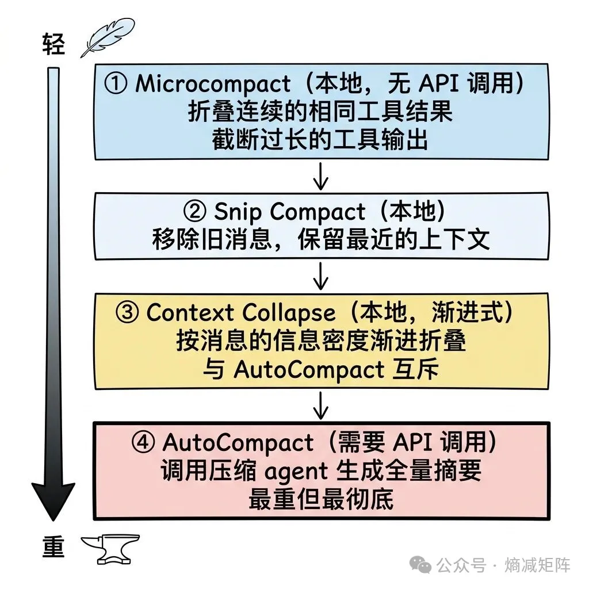

AutoCompact 的摘要 prompt 是一个精心设计的指令，要求保留 9 类信息：用户请求和意图、关键技术概念、文件和代码片段、错误和修复过程、问题解决过程、所有用户消息（原文强调"ALL user messages that are not tool results"）、待办任务、当前工作、下一步。

特别值得注意的是"所有用户消息"这个要求——这是对 LLM 压缩时容易丢失用户反馈的工程化对策。如果压缩后丢失了"用户说不要用 Redux"这条消息，模型可能在后续对话中又引入 Redux。

压缩后的重建阶段也很关键：系统会重新注入最多 5 个关键文件的内容（每个最多 5000 tokens）和 skill 指令（最多 25000 tokens）。这确保了压缩后模型仍然能"看到"最重要的文件，而不是只有一个抽象的摘要。

**Context Collapse 与 AutoCompact 的互斥设计**：当 Context Collapse 启用时，proactive AutoCompact 被抑制。原因是 AutoCompact 的"全量摘要"会摧毁 Collapse 保留的细粒度上下文。Collapse 是渐进式的——它按消息的重要性逐步折叠，保留更多原始信息。两者不能同时工作，系统选择更精细的策略。

---

## 七、终端 UI：自研 React 终端渲染引擎

**文件**：src/ink/（20,000 行，90 个文件）、src/state/（~1,190 行）、src/screens/

Claude Code 的终端界面是一个完整的 React 应用——用 `<Box>` 和 `<Text>` 描述界面，框架负责计算布局、生成 ANSI 序列、diff 优化输出。项目使用的是 Ink 的深度 fork，重建了几乎所有核心子系统。

### 7.1 渲染管线：五个阶段

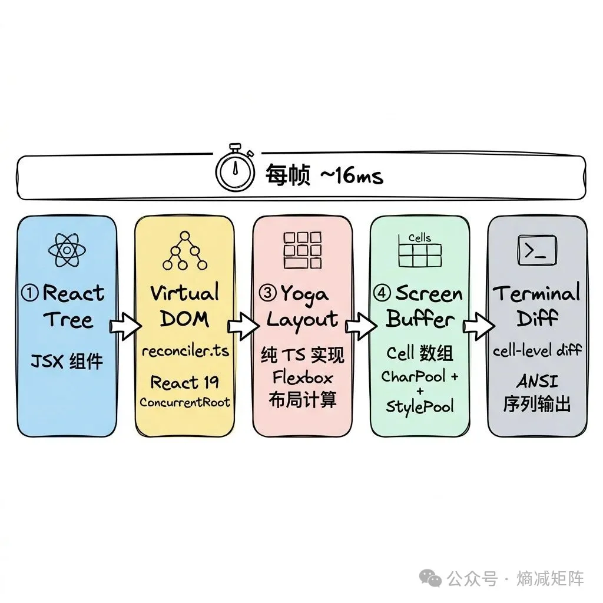

- **React Reconciler（reconciler.ts）**：使用 react-reconciler 创建自定义 React renderer，将 React 元素映射到终端 DOM 节点。`<Box>` → ink-box（有 Yoga 节点），`<Text>` → ink-text（有 Yoga 节点 + 文本测量函数），嵌套 Text → ink-virtual-text（无 Yoga 节点，纯样式容器）。使用 ConcurrentRoot 模式支持 React 19 并发特性。

- **纯 TS Yoga 布局**：原版 Ink 使用 WASM Yoga，Claude Code 用纯 TypeScript 重写。优势：无 WASM 加载延迟（原版需要 await loadYoga()）、无线性内存增长问题、调试更容易。通过 LayoutNode 抽象层与具体实现解耦——如果未来需要替换 Yoga，只需提供新的 LayoutNode 实现。

- **Screen Buffer 的三个对象池**：
  - CharPool：字符串驻留池。ASCII 字符走 Int32Array 快速路径（O(1) 索引），非 ASCII 走 Map。Cell 存储 charId（整数）而非字符串，blit 时直接拷贝 ID
  - StylePool：ANSI 样式驻留池。transition(fromId, toId) 方法缓存样式转换字符串——两个样式之间的 diff 只计算一次，后续帧直接查表
  - HyperlinkPool：OSC 8 超链接驻留池

三个池每 5 分钟重置一次，防止长会话中无限增长。重置时通过 migrateScreenPools 将活跃 cell 的引用迁移到新池。

### 7.2 关键优化技术

- **Blit 优化**：如果一个节点的 dirty 标记为 false 且位置/尺寸未变，直接从上一帧的 Screen 复制该区域的 cell，跳过整个子树的遍历。这使得稳态帧（spinner 旋转、时钟更新）的渲染成本与变化区域成正比，而非整个屏幕。

- **DECSTBM 硬件滚动**：当 ScrollBox 的 scrollTop 变化时，用终端硬件滚动（CSI top;bot r + CSI n S）代替重写整个滚动区域。先在 prev.screen 上模拟 shift，这样 diff 循环只发现滚入的新行。

- **同步更新**：在支持 DEC 2026 的终端上，整个输出包裹在 BSU/ESU（Begin/End Synchronized Update）中，确保原子更新——终端在收到 ESU 前不会渲染中间状态，消除闪烁。

- **Double Buffering**：维护 frontFrame（当前显示）和 backFrame（下一帧渲染目标），每帧渲染后交换。帧调度通过 lodash throttle 实现，间隔 16ms（60fps），leading + trailing 模式。

- **行缓存**：writeLineToScreen 通过 charCache 缓存每行的解析结果——大多数行在帧间不变，命中缓存后直接读取预计算的 styleId、width、hyperlink，跳过 ANSI 解析。

### 7.3 事件系统

事件系统对标浏览器的 capture/bubble 模型。Dispatcher 类与 React 的调度器集成——键盘/点击事件获得 DiscreteEventPriority（立即处理），resize/scroll 获得 ContinuousEventPriority（可以被合并）。

支持的事件类型：键盘输入（KeyboardEvent）、鼠标点击（ClickEvent）、焦点变化（FocusEvent）、终端焦点（TerminalFocusEvent）、终端 resize（TerminalEvent）。焦点管理通过 focus.ts 实现 tab 导航和焦点陷阱。

### 7.4 状态管理

src/state/ 实现了一个轻量级的状态管理系统。AppState 使用 DeepImmutable 品牌类型确保不可变性，包含 50+ 个字段。Store 提供简单的 getState() / setState() / subscribe() 接口，通过 React Context 注入组件树。

没有使用 Redux/Zustand——对于终端应用，一个简单的 immutable store + React Context 已经足够。onChangeAppState 处理状态变更的副作用（如权限模式切换时的 UI 更新）。

---

## 八、MCP 集成：标准化的外部工具接入

**文件**：src/services/mcp/（核心 client.ts 3348 行、config.ts 1578 行）、src/tools/MCPTool/

### 8.1 四层架构

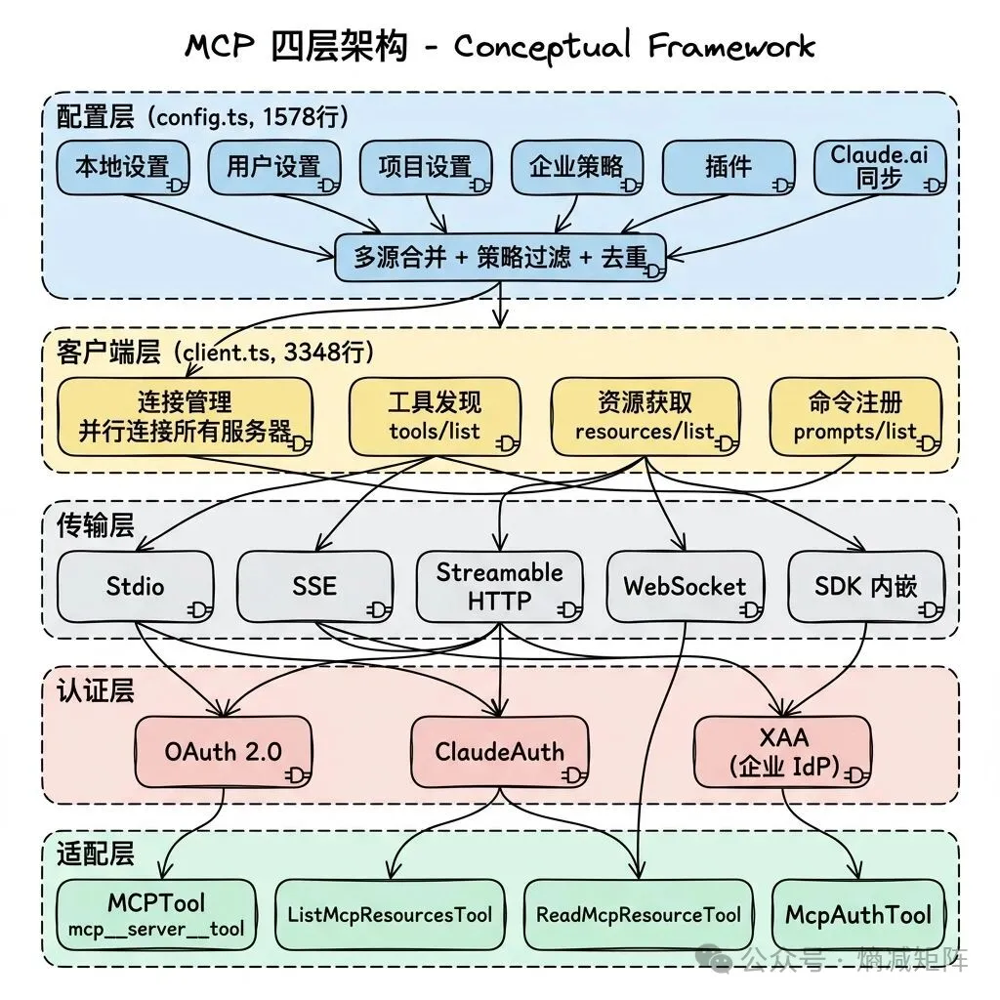

### 8.2 关键设计决策

- **多源配置合并**：MCP 服务器配置从 6 个来源合并。企业策略可以通过 allowlist/denylist 限制哪些 MCP 服务器可用。dedupClaudeAiMcpServers 处理 Claude.ai 同步的服务器与本地配置的去重——同名服务器优先使用本地配置。

- **工具适配**：每个 MCP 服务器的工具被转换为内部 Tool 对象，名称格式 `mcp__<serverName>__<toolName>`。适配器处理类型转换（MCP 的 JSON Schema → 内部的 Zod schema）、权限集成（复用内部权限检查）、错误处理（MCP 协议错误 → 用户友好的错误消息）。

- **动态刷新**：工具发现结果缓存在 AppState.mcp 中，通过 refreshTools() 在 agent loop 的每轮迭代中更新。这让新连接的 MCP 服务器在下一轮可用，无需重启会话。

- **认证流程**：McpAuthTool 让模型可以在对话中触发认证流程——当 MCP 服务器返回认证错误时，模型可以调用 McpAuthTool 引导用户完成 OAuth 流程，然后重试原始操作。

---

## 九、设计启发与反思

### 9.1 值得学习的设计模式

- **AsyncGenerator 作为核心抽象**：整个 agent loop、子 agent 执行、工具执行都基于 AsyncGenerator。这个选择带来了背压控制、自然的取消语义、流式组合能力。如果你在构建 agent 系统，AsyncGenerator 比回调或 Promise 链更适合作为消息流的核心抽象。

- **Fail-closed 安全默认**：所有安全相关的默认值都是最保守的。新工具忘记声明 isConcurrencySafe 不会导致并发 bug，忘记声明 isReadOnly 不会导致权限绕过。这个原则值得在任何涉及安全的系统中采用。

- **编译时消除 vs 运行时判断**：feature() 宏让同一份代码库同时服务内部和外部用户，未启用的功能在 bundle 中完全不存在。这比运行时 if-else 更安全（不可能意外启用）、更高效（减少 bundle 大小）、更易审计（grep 就能找到所有 feature gate）。

- **Prompt Cache 感知的架构设计**：从 system prompt 的分段缓存、到工具集的分区排序、到 fork subagent 的消息构建——整个系统的多个层次都在为 prompt cache 命中率优化。这说明在大规模 LLM 应用中，cache 不是事后优化，而是需要从架构层面考虑的一等公民。

- **压缩 prompt 的"反遗忘"设计**：要求保留"所有用户消息"和"直接引用最近对话"，这是对 LLM 压缩时容易丢失细节的工程化对策。如果你在构建长对话系统，压缩策略的设计需要考虑 LLM 的信息丢失倾向。

### 9.2 值得商榷的地方

- **全局状态的广泛使用**：bootstrap/state.ts 包含 200+ 个字段的全局状态对象，注释中有 "DO NOT ADD MORE STATE HERE" 的警告。这说明团队意识到了问题但还没有找到更好的替代方案。对于一个 51 万行的项目，依赖注入或模块化状态管理可能更可维护。

- **权限系统的认知负担**：8 种来源、5 种模式、3 种匹配模式、多层评估管线——对用户来说理解和配置这个系统有一定门槛。不过考虑到安全性的重要性，这种复杂度可能是必要的代价。规则遮蔽检测是缓解这个问题的一个好尝试。

- **BashTool 的复杂度集中**：18 个文件、8 层安全检查、~500 行只读白名单——BashTool 承担了过多的安全职责。一个可能的改进方向是将安全检查抽象为独立的"安全策略引擎"，让 BashTool 只负责命令执行，安全判断由策略引擎统一处理。

### 9.3 如果重新设计

1. **声明式权限策略**：当前的权限系统是命令式的（代码中的 if-else 链）。一个声明式的策略引擎（类似 OPA/Rego）可能更容易理解、审计和扩展。

2. **渐进式上下文管理**：当前的压缩是"全量摘要"或"不压缩"的二选一。一个更精细的方案是按消息的"信息密度"渐进式淘汰——最近的消息保留原文，较早的消息保留摘要，更早的只保留关键事实。Context Collapse 功能似乎正在朝这个方向发展。

3. **工具结果的结构化存储**：当前工具结果以文本形式存储在消息中，压缩时容易丢失结构。如果用结构化格式存储，压缩 agent 可以更精确地保留关键信息。

4. **模块化构建**：将工具系统、权限系统、UI 层拆分为独立的包，通过依赖注入组合。Claude Agent SDK 已经在朝这个方向发展——"我们把 Claude Code 的 agent loop、system prompt、工具、权限系统拆出来，打包成 SDK"。

---

## 附录：关键文件索引

| 模块 | 核心文件 | 行数 |
|------|----------|------|
| Agent Loop | src/QueryEngine.ts, src/query.ts | 3,024 |
| 工具编排 | src/services/tools/StreamingToolExecutor.ts, toolExecution.ts | 2,275 |
| 工具抽象 | src/Tool.ts, src/tools.ts | 1,181 |
| BashTool | src/tools/BashTool/ (18 files) | ~5,000 |
| 权限核心 | src/utils/permissions/permissions.ts | ~1,400 |
| 权限规则 | src/utils/permissions/ (24 files) | ~5,000 |
| AgentTool | src/tools/AgentTool/ (20 files) | ~6,000 |
| Swarm | src/utils/swarm/ (22 files) | ~5,000 |
| System Prompt | src/constants/prompts.ts | 914 |
| 压缩 | src/services/compact/ (11 files) | 3,960 |
| Ink 渲染引擎 | src/ink/ (90 files) | 19,842 |
| MCP 客户端 | src/services/mcp/client.ts | 3,348 |
| MCP 配置 | src/services/mcp/config.ts | 1,578 |
| 全局状态 | src/bootstrap/state.ts | ~800 |
| 应用状态 | src/state/AppStateStore.ts | ~400 |
