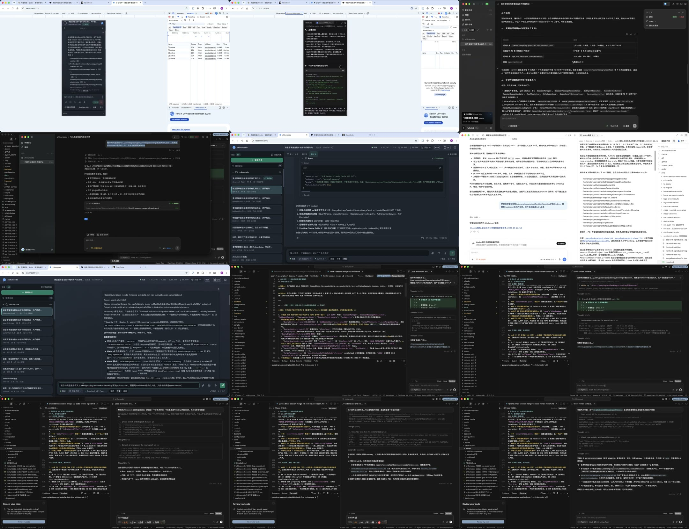
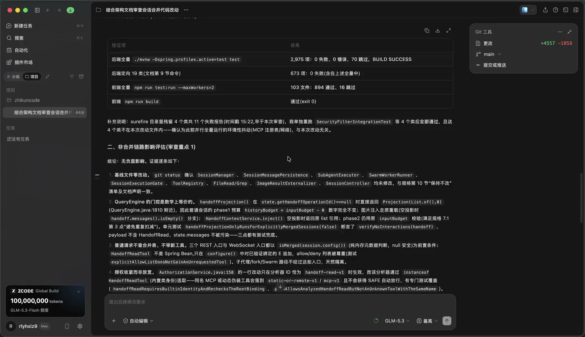
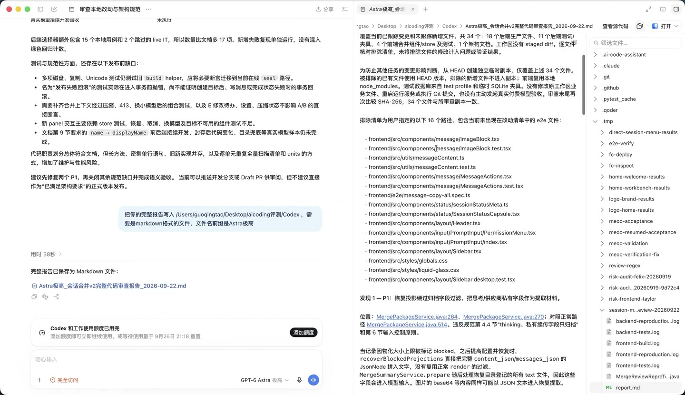
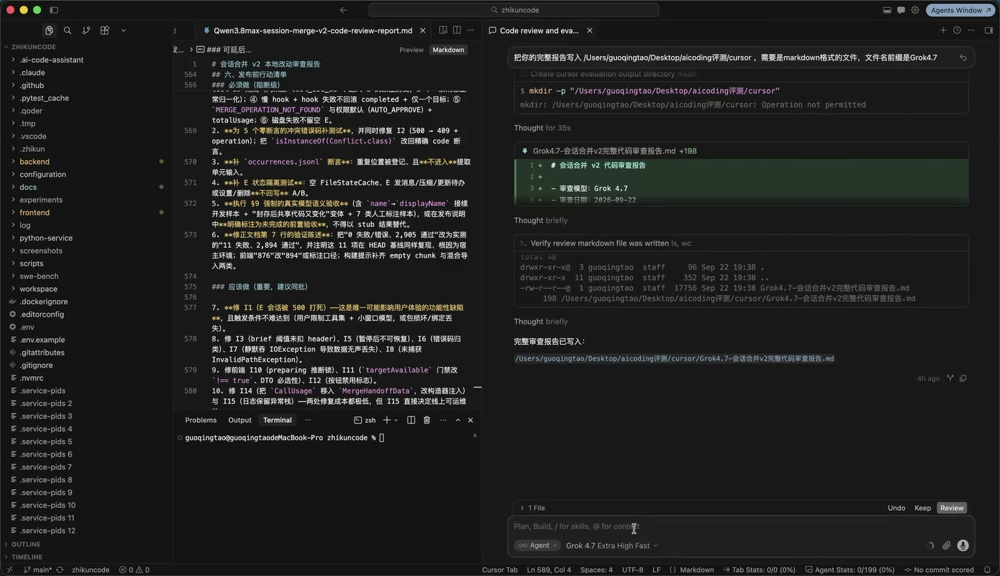

# 视频证据附录：仅作过程佐证，不计分

本附录针对用户指定的 [钉钉录屏_2026-09-22_233604.mp4](../钉钉录屏_2026-09-22_233604.mp4)。`ffprobe` 确认视频长度 **36 分 12.3 秒（2172.3 秒）**，1440×830、10 fps、H.264；该容器列出一个视频流，没有音频流。源文件 SHA-256、三张原始抽样帧及分段概览图 SHA-256 见 [video/index.json](video/index.json)，原材料版本见 [manifest.json](manifest.json)。同目录另一段 2026-09-23 视频不在本附录取证范围。

本次评审合计核看 **12 格、每 3 分钟一格的分段概览，以及下面 3 个明确时间点的原分辨率静态帧**，未逐帧审阅整段视频，也没有对未呈现的交互或后台执行作推断。分段概览用于定位：以 `fps=1/180,scale=720:-1,tile=3x4` 抽样拼接，其采样中点约为 90、270、450…2070 秒，不能当作精确时间证据。三个明确时间点的帧来自源视频既有抽取结果，原样复制，未裁剪或生成替代画面；表内时间码为源视频播放位置。页面内容用于证明“当时可见什么”，不能替代源码与合成复现。

| 证据 | 时间 | 画面可直接支持的事实 | 不支持的推断 |
|---|---|---|---|
| V01 | 07:30 | ZCode 页面，左下可见 ZCODE，模型选择栏显示 GLM-5.3 与“最高”；中间是审查结论及测试结果文字，与 R17 的内容对应。 | 报告内的“测试全绿”是助手当时的陈述，本帧不是测试日志；侧栏时间、额度卡片不是实测审查耗时或本任务 token 成本。 |
| V02 | 16:30 | Codex 页面底栏显示 GPT-6 Astra、极高；用户要求将**完整报告保存为 Markdown**，其后显示“用时 38 秒”及已保存链接；右侧打开 Astra 极高报告，与 R01 对应。 | **38 秒对应此处保存报告的后续回合，不能作为整次代码审查耗时。** 不证明底层模型身份、隐藏推理预算或先前审查起止时刻。 |
| V03 | 25:30 | Cursor 页面右侧可见把报告写入 cursor 目录的要求、一次 `mkdir` 权限拒绝记录、Grok 4.7 报告文件新增及随后文件存在/198 行的验证文字；底栏显示 Grok 4.7 Extra High Fast，与 R11 文件相对应。 | 左侧编辑器打开的是 Qwen3.8max 报告，不能把其内容算到 Grok；该帧不证明这次操作的完整耗时，也不证明一次权限拒绝影响最终代码审查质量。 |

## 分段定位概览

## 抽样帧

### V01：07:30，ZCode 页面

### V02：16:30，Codex 保存 Astra 报告的回合

### V03：25:30，Cursor 保存 Grok 报告的回合

## 是否值得计入评分

**值得保留作补充证据，不应计入本次报告质量分。** 画面可以补充工具入口、可见模型标签、报告保存过程和上下文；三家呈现的阶段不相同，其他参评者也没有同等完整的取样。界面美观、保存耗时、操作次数、窗口显示的信息量若直接加减分，会引入任务阶段和展示方式偏差。

页面标签仅记为**可见标签**，不是供应商签名、调用追踪或底层模型认证。未从视频推导“17 家同提示词、同预算、同上下文、同时长”，不以页面上的自评、旧排名或测试数字当作独立正确性证据。所有报告同按冻结规则和代码核验计分；缺少某家的画面不扣分。
