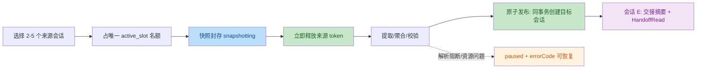
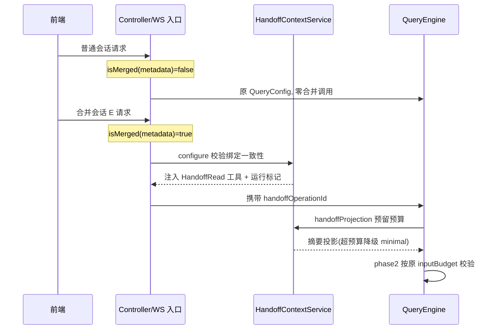

# 会话合并 v2 代码审查报告

- **审查模型**：Qwen3.8-Max（TraeCode）
- **审查日期**：2026-09-22
- **审查对象**：工作区 `/Users/guoqingtao/Desktop/dev/code/zhikuncode` 全部未提交改动
- **审查基准**：`docs/session-merge-architecture-v2.md`（620 行架构规范，未跟踪新文件，属本次改动一部分）
- **排除范围**（按用户要求忽略）：`ImageBlock.tsx`、`ImageBlock.test.tsx`、`messageContent.ts`、`messageContent.test.ts`、`MessageActions.tsx`、`MessageActions.test.tsx`、`message-copy-all.spec.ts`、`sessionStatusMeta.ts`、`SessionStatusCapsule.tsx`、`Header.tsx`、`PermissionMenu.tsx`、`PromptInput/index.tsx`、`Sidebar.tsx`、`globals.css`、`liquid-glass.css`、`Sidebar.desktop.test.tsx`
- **验证方法**：全量证据收集 + 2 个独立子代理交叉验证全部候选问题；分歧项由主审对照规范原文裁决

---

## 一、审查范围与意图总结

**范围**：工作区全部未提交改动——后端 14 个现有文件修改 + 6 个新增文件、前端合并 store/panel、V026 数据库迁移、19 个测试文件。

**意图**：实现会话合并 v2 协议——将 2~5 个来源会话经"封存快照 → 结构化分片提取/聚合 → 校验 → 原子发布"合并为新会话 E；封存即释放来源；持久化单元进度与 run_epoch 围栏保证恢复/取消安全；E 通过交接摘要 + 只读 HandoffRead 工具按需读取原文；普通请求链路零合并开销。

---

## 二、改动概览

### 业务生命周期

### 运行时入口隔离（技术流程）

---

## 三、对非合并分支的影响评估

**结论：未发现对普通/fork/Swarm 主链路的破坏，隔离证据链完整。**

| 隔离点 | 证据 |
|---|---|
| 投影零开销 | `QueryEngine.java` L1811 `handoffProjection` 在 `handoffOperationId==null` 时直接返回空投影；`QueryEngineUnitTest` 以 `verifyNoInteractions(handoff)` 证明普通请求不触碰任何合并服务 |
| 入口门控 | 3 个 REST 入口 + WS 路径均以 `isMerged(session.config())` 前置判断；普通会话 metadata 无 `sessionMergeOperationId`，`configure` 原样返回同一 QueryConfig 实例（`HandoffContextServiceTest.ordinaryRequestRetainsTheExactConfiguration` 断言 `isSameAs`） |
| 工具池隔离 | `HandoffReadTool` 无 `@Component` 注解（测试显式断言），不进入全局工具注册表/schema/token 计算 |
| 图片注入 | `ImageRefInjector` 新重载默认谓词恒为 false，仅 E 请求传真实绑定谓词 |
| 迁移安全 | V026 事务内重建表、逐列复制旧行，旧行 `protocol=1/active_slot=NULL` 保留，旧 preparing→failed/LEGACY_INTERRUPTED；`V026ExtendSessionMergesTest` 覆盖再执行幂等/CHECK/唯一名额/FK |
| 基线文件 | 规范第 10 节要求"保持不改"的 SessionManager、SessionMessagePersistence、SubAgentExecutor、SwarmWorkerRunner、SessionExecutionGate、ToolRegistry 均不在改动列表（git status 核实） |
| 预算不双扣 | phase1 扣 `reservedTokens`、phase2 仍用原 `inputBudget`；普通会话投影为空、预留为 0，行为与改动前完全一致 |

**需知悉的既定设计**：前端新增每 5 秒节流一次的 `GET /api/session-merges/active` 后台轮询（所有页面，无操作时返回 204）。这是规范要求的重启续跑能力，开销极小，属可接受项。

**经核验属规范要求的既定设计（非问题）**：

1. `project()` 在预算极小/包不可读时抛 `IllegalStateException` 使 E 请求报错——规范 7.1/7.3 明确要求"连最小入口都放不下时返回正常容量错误""包损坏报明确错误"，且异常被 QueryEngine 捕获转为会话错误消息（非 500）。
2. 前端 `control()` 的 inflight 串行在 while 退出至赋值间无 await 插入点，JS 单线程下无竞态，后端另有 epoch 围栏兜底。

---

## 四、发现的问题

以下问题经 2 个独立子代理交叉验证，分歧项由主审对照规范原文裁决（问题 2 两位验证者结论相反；规范第 19 行"必须保留"项明确重复合并"**不依赖旧包存活**"，第 216 行仅要求收录"**现存**旧包"且"不回填不存在的原文"，第 25 行规定仅"已经存在但损坏"的资料才暂停——故缺失旧包阻塞属违反规范，予以纳入）。

| 编号 | 严重度 | 问题标题 | 建议 | 代码位置 |
|---|---|---|---|---|
| 1 | major | **合并会话 E 每 turn 重复执行昂贵投影**：`project()` 每轮被调 3 次（L779/L844 经 `prepareCompactionContext` 各一次 + L841 直调），反应式压缩路径（L1933/L1973）还会追加；每次均执行 DB 绑定查询 + 整包哈希校验 + brief 文件读取，无任何请求级缓存 | 在 `QueryLoopState` 或请求作用域内缓存投影结果（同一 turn 预算参数相同时复用），或将 `prepareCompactionContext` 两次调用合并为一次投影计算 | `backend/src/main/java/com/aicodeassistant/engine/QueryEngine.java` L779-L844；`HandoffContextService.java` L62-L79 |
| 2 | major | **缺失 legacy v1 包被记为阻塞缺口导致永久暂停**：`importPrevious` 对缺失旧包记 `gap(...,true)`（blocking），转暂停后恢复时 `validateSnapshot` 重读同一 blockedReason 必然再次暂停，不可自愈。违反规范"不依赖旧包存活"（第 19 行）与"仅收录现存旧包、说明去重局限"（第 216 行）——旧包可随目标删除被合法清理（第 187 行），阻塞会使此类来源永远无法再合并 | 将 `legacy_package_missing` 降为非阻塞缺口（`gap(...,false)`），以来源现有 DB 消息 + 新消息继续合并，并在结果警告中说明无法跨包精确去重；补充对应测试用例 | `backend/src/main/java/com/aicodeassistant/session/merge/MergePackageService.java` L606-L611 |
| 3 | minor | **取消路径误打"Merge paused"日志**：cancel 使工作线程抛 `MERGE_INTERRUPTED`（L176），catch 块（L218-219）对取消同样打 "Merge paused" warn。数据库状态正确（cancel 已原子置 cancelled 且后续 pause UPDATE 命中 0 行），仅日志误导排障 | 在 catch 中区分 `MERGE_INTERRUPTED` 与取消语义，按实际终态输出日志文案 | `backend/src/main/java/com/aicodeassistant/session/merge/SessionMergeService.java` L218-L219 |
| 4 | minor | **自建仓储实例绕过 Spring 容器**：`MergeProgressRepository` 带 `@Repository` 注解，但 `SessionMergeService` 构造函数 `new` 自建实例，容器内存在双实例；与 `HandoffContextService`/`HandoffReadService` 的注入方式不一致。因共享同一 JdbcTemplate 且仓储无状态，功能等价、无事务风险，仅一致性问题 | 改为构造函数注入 `MergeProgressRepository` Bean，删除自建实例 | `backend/src/main/java/com/aicodeassistant/session/merge/SessionMergeService.java` L72 |
| 5 | minor | **`validatedTerminal` Set 缺少完整清理**（1/2 验证者确认，附注纳入）：终态操作 ID 只增，仅 `openDialog` 时 delete。因 active_slot 唯一且页面重载即清空，实际条目极少、影响可忽略 | 可在记录被 `removeSaved` 时同步 delete，或保持现状并加注释说明生命周期 | `frontend/src/store/sessionMergeStore.ts` L115 |

---

## 五、测试覆盖与发布标准评估

### 覆盖情况

规范第 9 节测试矩阵基本全覆盖：

- 迁移安全（6 场景：旧行保留/再执行幂等/CHECK 约束/唯一 active 名额/重复 target 回滚/外键）
- 封存后来源释放与消息排除
- 普通请求零调用隔离（`verifyNoInteractions` 强断言）
- 跨包/路径穿越/symlink 拒绝、损坏目录
- 预算超限、游标连续性、跨分片搜索与代理对、15 秒超时
- 单元恢复不重做、取消围栏迟到响应、发布失败回滚、重启续跑、绑定失效
- 同名工具冒充走 generic 分析器、PLAN 模式授权放行
- 前端进度/暂停/恢复/取消 UI
- 4183 字节/13370 输出的极端记录合成回归

新增测试约 19 个文件，断言密度高，与规范条款逐条对应。

### 发布标准结论

**代码质量与测试覆盖达到提交 GitHub 的标准**；隔离设计经单测强断言（`verifyNoInteractions`/`isSameAs`/非 Bean 断言）保障，非合并链路无破坏。

**两点必须在发布说明中明示**：

1. **真实模型语义验收尚未执行**（文档自述缺口）——摘要/提取/聚合的模型调用在测试中均为 mock，`MergeSummaryService.call()` 的真实行为（含 4183 字节分片回归）未经真实模型验证；
2. **建议先修复问题 1（E 会话性能）与问题 2（违反"必须保留"级规范条款）再推送**，问题 3-5 可随后跟进。

---

## 六、最终判定

| 维度 | 结论 |
|---|---|
| 非合并分支影响 | **无负面影响或破坏**，隔离证据链完整（零调用隔离 + 入口门控 + 工具池隔离 + 迁移无损 + 基线文件零改动） |
| 代码质量 | 与规范逐条对应，架构实现完整；无 critical 级缺陷，无数据丢失或安全漏洞 |
| 测试覆盖 | 规范第 9 节矩阵全覆盖，约 19 个新增测试文件 |
| 发现问题 | 2 major + 3 minor（详见第四节），经双子代理交叉验证 |
| 发布建议 | 改动可以提交；建议以"修复问题 1、2 + 发布说明注明模型验收缺口"作为推送前置条件；若接受带已知缺陷推送，则当前状态不构成阻断 |
