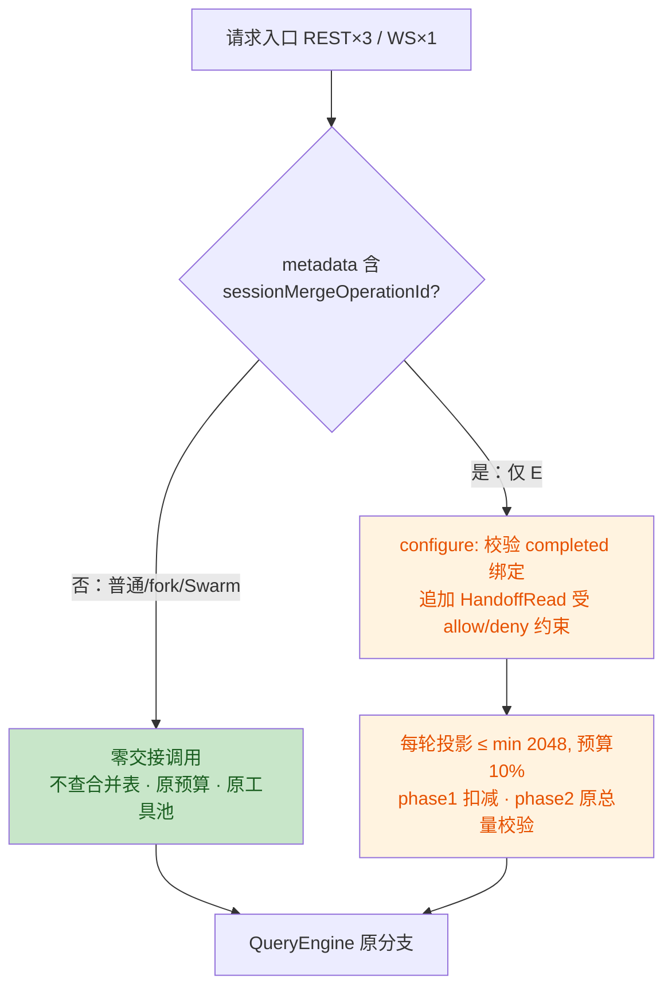

# 会话合并 v2 本地改动审查报告

> 审查模型：Kimi-K3 · 审查日期：2026-09-22 · 基线：`b98e187`（本地未提交改动）
> 架构依据：`docs/session-merge-architecture-v2.md`

## 审查范围

**纳入审查**：
- 后端修改 12 个文件：`AuthorizationService`、`OperationAnalyzerRegistry`、`QueryController`、`SessionMergeController`、`ImageRefInjector`、`QueryEngine`、`QueryLoopState`、`MergePackageService`、`MergeSummaryService`、`MergeTextBudget`、`SessionMergeService`、`WebSocketController`
- 后端新增 6 个文件：`V026_ExtendSessionMerges`、`HandoffContextService`、`HandoffReadService`、`MergeHandoffData`、`MergeProgressRepository`、`HandoffReadTool`
- 后端测试：`V026ExtendSessionMergesTest`、`MergeProgressRepositoryTest`、`HandoffContextServiceTest`、`HandoffReadServiceTest`（新增），`MergePackageServiceTest`、`MergeSummaryServiceTest`、`SessionMergeServiceTest`、`QueryEngineUnitTest`、`OperationAnalyzerRegistryTest`、`AuthorizationServiceProjectFileScopeTest`、`MergeFixture`（修改）
- 前端：`sessionMergeStore.ts`、`SessionMergePanel.tsx` 及对应测试

**按要求排除**：`ImageBlock`、`MessageActions`、`messageContent`、`PermissionMenu`、`PromptInput`、`Header`、`Sidebar`、`globals.css`、`liquid-glass.css`、`SessionStatusCapsule`、`sessionStatusMeta`、`message-copy-all.spec.ts` 等 16 个 UI/消息复制相关文件。

**改动意图**：将会话合并从"一次性整包摘要"重构为 v2 架构——独立快照封存 → 串行分片提取/有界聚合 → 校验 → 原子发布，并新增持久进度、暂停/恢复/取消、运行时 HandoffRead 只读工具与每轮交接上下文入口。本地统计：约 +2565/-1058 行。

## 变更流程概览

```mermaid
flowchart LR
    A[POST /api/sessions/merge<br>幂等键+2~5来源] --> B[gate 锁定来源树<br>唯一 active_slot 占名额]
    B --> C[seal: 分页复制原文/产物<br>清单+哈希 → ATOMIC rename]
    C --> D[立即释放来源锁]
    D --> E[串行分片提取<br>单元级持久化/拆分/3次重试]
    E --> F[有界聚合 → brief + 详情]
    F --> G[校验 ready/哈希 → 短事务发布 E]
    G --> H[E 每轮请求注入有界入口<br>HandoffRead 按需读原文]
    style C fill:#bbdefb,color:#0d47a1
    style D fill:#c8e6c9,color:#1a5e20
    style E fill:#bbdefb,color:#0d47a1
    style G fill:#fff3e0,color:#e65100
    style H fill:#f3e5f5,color:#7b1fa2
```

## 问题 1：对非合并分支的影响评估 —— ✅ 隔离性合格

逐接点核实结果：

| 接点 | 隔离机制 | 结论 |
|---|---|---|
| `QueryController`（3 个入口）/ `WebSocketController` | `isMerged(metadata)` 为 false 时不调用交接服务、不查合并表 | ✅ 测试验证 `verifyNoInteractions` |
| `QueryEngine` | `handoffOperationId==null` → 空投影，`historyBudget==inputBudget`，phase1/phase2 与原路径一致 | ✅ 参数化测试断言普通路径预算差为 0 |
| `ImageRefInjector` | 原 7 参方法委托新重载并传恒 false 谓词，行为不变 | ✅ |
| `AuthorizationService` | 仅新增 `handoff-read-v1` 分支；`instanceof` 分派使同名 MCP/动态工具无法继承权限 | ✅ 专项测试覆盖冒充者 |
| `HandoffReadTool` | 未注册为 Spring Bean，不进全局工具池 | ✅ 测试断言无 `@Component` |
| `SessionManager` / `SessionMessagePersistence` / `SubAgentExecutor` / `SwarmWorkerRunner` / `SessionExecutionGate` | 零改动（git 确认） | ✅ 对应回归测试全部通过 |
| `V026` 迁移 | 不动 V024 checksum；旧行保留、旧 preparing 转 failed/LEGACY_INTERRUPTED；回滚安全 | ✅ 迁移测试通过 |

另核实：`SubAgentExecutor`、`AgentResumeService`、`SwarmWorkerRunner` 的 `queryEngine.execute` 调用点均使用独立 `QueryLoopState`，不携带交接标记，符合文档"普通/fork/Swarm 不自动注入交接入口"的要求。

## 问题 2：发布标准评估 —— ✅ 达到提交标准（附少量 minor 项）

**测试验证（本次实际运行，非引用文档声明）**：
- 后端定向：`V026 / MergeProgress / MergePackage / MergeSummary / SessionMerge / HandoffContext / HandoffRead` 共 **76 项全过**；隔离性批次（SubAgent/Swarm/QueryEngine/Authorization/SessionManager 等）全过；`QueryEngineUnitTest` 65 项全过（含新增交接隔离参数化用例）。
- 前端：**103 文件 / 894 通过 / 16 跳过 / 0 失败**；`npm run build` 生产构建通过。
- 覆盖与文档第 9 节验收表逐行对应：封存即释放、中断恢复、取消围栏、不确定提交、损坏资料暂停、>16 单元、413 拆分、游标/穿越/symlink 拒绝、Unicode 搜索进位等均有断言。

**规范符合度**：文件落点与第 10 节声明的"14 改 + 6 增"完全一致；迁移 SQL 与附录 A 一致（含 `active_slot IS 1` 关键写法）；状态机、epoch 围栏、事务边界均按 5.x 节实现。

## 问题清单（经双验证者交叉确认）

| # | 问题 | 建议 | 位置 | 严重度 |
|---|---|---|---|---|
| 1 | **每轮最多 3 次重复交接投影**：`handoffProjection` 在预循环压缩（L779）、主流程（L841）、`prepareCompactionContext`（L1835）各执行一次，每次都做绑定查询 + 9 个文件全量哈希校验 + 读 brief。仅影响合并会话，无正确性问题（2/2 确认） | 每轮缓存一次 `Projection` 结果复用，或在 `QueryLoopState` 上暂存 | `QueryEngine.java` L779/L841/L1835；`HandoffContextService.java` L59-80 | minor |
| 2 | **交接异常的用户可见形态不统一**：`HANDOFF_BINDING_MISMATCH`/`HANDOFF_NOT_BOUND` 在 controller 层抛出后落入泛型 500 且消息被掩盖；`HANDOFF_CONTEXT_BUDGET_TOO_SMALL` 在引擎内转为裸错误码文本，非文档 7.1 要求的"正常容量错误"。不会污染合并状态（2/2 确认） | 为绑定类异常注册明确的 4xx 响应；预算不足映射为现有容量错误码 | `HandoffContextService.java` L42/L74；`QueryController.java` L178 | minor |
| 3 | **工具说明缺少文档 7.1 要求的指引文案**：`HandoffRead.getDescription()` 未含"涉及代码修改时读取相关现有文件、历史与现状有差异则说明、必要时复测"。入口投影/header 文案仅覆盖"核对当前代码"，"必要时复测"两处均缺（2/2 确认） | 在工具说明末尾补一句差异处理与复测指引 | `HandoffReadTool.java` L16 | minor |
| 4 | **v1 旧包缺失时整体暂停（设计确认点）**：`legacy_package_missing` 为阻断 gap。验证者存在分歧：一方认为与第 1 节"不依赖旧包存活"有字面张力；另一方认为 v1 目标自身无原始内容，缺包时继续会"冒充完整记录"，暂停属合理 fail-closed 且可恢复（1/2 确认） | 建议保留现状，在文档 4.4 节补一句"旧包缺失时暂停而非降级"以消除歧义 | `MergePackageService.java` L606-608 | low |
| 5 | **补记路径未比对来源集合**：seal 已写盘但 DB 未记录时，`validateSnapshot` 校验了 operationId/版本/哈希，未按文档 4.3 字面要求比对 `manifest.sources`。包路径由 operationId(UUID) 派生，实际风险可忽略（2/2 确认） | 一行比对即可闭合纵深防御缺口 | `SessionMergeService.java` L184-186 | low |

**已排除的误报**（透明记录）：
- `history_storage_version` 无写入方（0/2 确认误报）：无害保守分支，且文档明确禁止新增写入。
- attempt 两段式 outcome 记账（0/2 确认误报）：崩溃窗口期 usage 汇总一致（聚合 SQL 不按 outcome 过滤），且文档已接受末次调用重复计费。

## 残留风险提示

文档第 9 节的**真实模型语义验收**（接续开发样本评测）尚未执行——这是文档自述的边界，不阻塞代码提交，但发布说明中不应把 stub 测试描述为语义验收通过。

## 结论

1. **非合并分支功能链路无负面影响**，隔离机制有测试背书。
2. **代码质量、测试覆盖与文档规范符合度均达到提交 GitHub 的标准**：本次实测后端合并核心 76 项 + 隔离性批次 + `QueryEngineUnitTest` 65 项全部通过；前端 894 通过 / 16 跳过 / 0 失败；生产构建通过。
3. 5 项问题全部为 minor/low，不阻塞提交；其中 4 项 minor 可在后续迭代中低成本修复。
