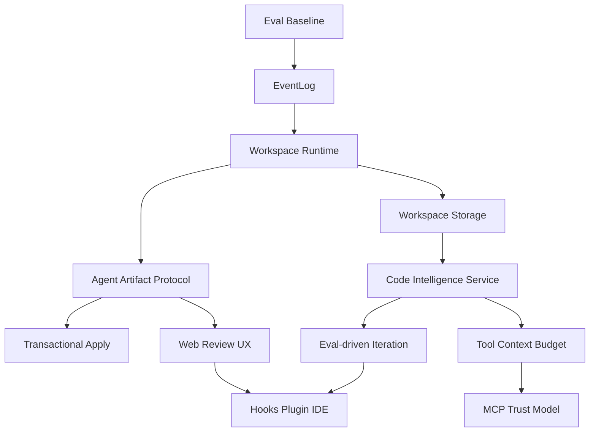
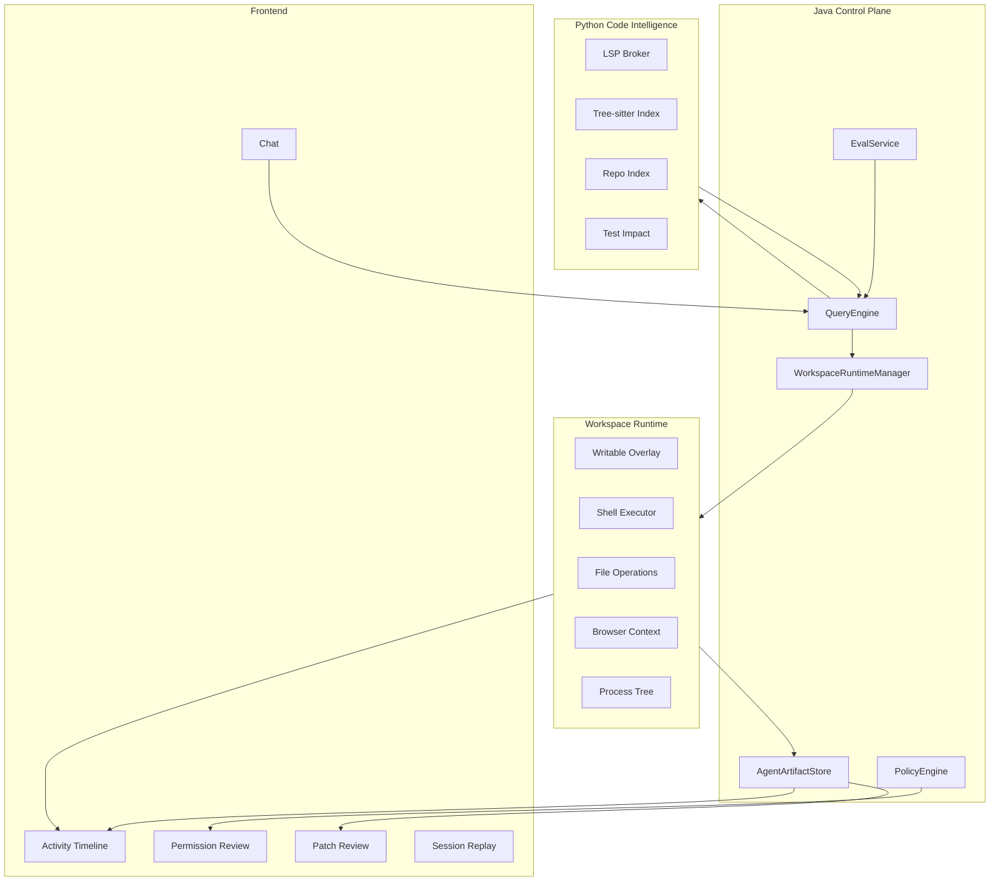

# ZhikunCode 架构升级可实施操作指南

> 版本：2026-06-03  
> 适用范围：`zhikuncode` 当前 Java 后端、React 前端、Python 服务三端架构。  
> 目标：把 ZhikunCode 从“Web 版 AI 编程助手”升级为 **Web-native remote coding agent platform**。  
> 约束：本指南不以历史兼容和短期工作量为优先，但每一步必须可落地、可拆 PR、可测试、可回滚。

## 0. 最终判断

ZhikunCode 最适合的发展方向不是复制 Claude Code，而是利用自身优势做成浏览器原生、远程工作区、自托管、多模型、可视化审计的 Agent 编程平台。

因此升级优先级不是“补齐 Claude Code 功能表”，而是按以下底座推进：

1. **Eval Baseline 先行**：先建立评测和失败归因，否则无法证明后续架构升级有效。
2. **EventLog 作为事实来源**：会话回放、审计、分享、调试都基于 append-only 事件流。
3. **Workspace Runtime**：所有有副作用动作统一进入受控运行时；Host Runtime 只是兼容 adapter，不是安全边界。
4. **Agent Artifact Protocol**：Agent 产出 patch、diff、测试证据和风险说明，并通过事务化 apply 进入主工作区。
5. **Workspace Storage Strategy**：根据仓库规模选择 copy、git worktree、snapshot/cache 或远程 volume。
6. **Code Intelligence Service**：先做 code map + test impact，再做 LSP definition/reference，避免第一版过重。
7. **Tool Context Budget 与 MCP Trust**：工具上下文和 MCP 工具都必须按信任级别、风险和 session 激活状态治理。
8. **Web-native Review UX**：权限、活动、diff、浏览器状态、回放、分享成为一等能力。
9. **Extensibility Later**：Hooks、Plugin、IDE Extension 在内部协议稳定后开放。

推荐实施顺序：



## 1. 当前代码事实

这些事实是后续实施的依据。

### 1.1 Bash 执行绕过 Sandbox

当前 `backend/src/main/java/com/aicodeassistant/tool/impl/BashTool.java` 中执行路径仍是本机进程：

```java
ProcessBuilder pb = new ProcessBuilder("bash", "-c", wrappedCommand);
pb.directory(new File(workingDir));
Process process = pb.start();
```

虽然存在：

- `backend/src/main/java/com/aicodeassistant/sandbox/SandboxManager.java`
- `backend/src/main/java/com/aicodeassistant/sandbox/SandboxConfig.java`

但 `BashTool.call()` 没有实际调用 `SandboxManager.execute()`。

### 1.2 Worktree 有能力但默认策略不安全

已存在：

- `backend/src/main/java/com/aicodeassistant/tool/impl/WorktreeTool.java`
- `backend/src/main/java/com/aicodeassistant/tool/agent/WorktreeManager.java`
- `backend/src/main/java/com/aicodeassistant/tool/agent/SubAgentExecutor.java`

但 `WorktreeManager.mergeBack()` 会自动：

```java
git add -A
git commit -m ...
git merge ...
```

更合理的方式是：子代理只产出 patch artifact，主代理或用户审查后再 apply。

### 1.3 LSP 仍是 placeholder

`backend/src/main/java/com/aicodeassistant/lsp/LSPServerInstance.java` 当前返回：

```java
"status", "placeholder",
"message", "LSP server integration pending (requires Python pygls service)"
```

因此真实代码智能能力应重新设计，不应只局部修补这个类。

### 1.4 ToolSearch 已有但未真正降低默认工具上下文

已存在：

- `Tool.shouldDefer()`
- `Tool.alwaysLoad()`
- `backend/src/main/java/com/aicodeassistant/tool/impl/ToolSearchTool.java`

但 `ToolRegistry.getToolDefinitions()` 仍把所有 enabled tools 发给模型：

```java
return getEnabledToolsSorted().stream()
        .map(Tool::toToolDefinition)
        .toList();
```

### 1.5 Hooks 有执行器但没有稳定配置面

已存在：

- `backend/src/main/java/com/aicodeassistant/hook/HookService.java`
- `backend/src/main/java/com/aicodeassistant/hook/HookRegistry.java`
- `backend/src/main/java/com/aicodeassistant/hook/HttpHookExecutor.java`

但用户级配置、项目级配置、稳定事件模型、前端编辑器都未完整落地。

### 1.6 浏览器语义快照是差异化优势，但还不是工具闭环

已存在：

- `backend/src/main/java/com/aicodeassistant/command/impl/BrowserSnapshotCommand.java`
- `backend/src/main/java/com/aicodeassistant/service/browser/DomSnapshotClient.java`
- Python `/api/browser/snapshot-semantic`

但 `WebBrowserTool` 没有 `snapshot_semantic`、`verify_state`、`replay_timeline` action。

## 2. 目标与非目标

### 2.1 目标

- 所有 Bash、文件写入、测试、浏览器、子代理动作都有统一运行时边界。
- 所有 Agent 写操作都能生成可审查 artifact。
- 用户能在 Web UI 中看到完整执行时间线、风险说明、diff、测试证据和浏览器状态。
- 代码理解不再只靠 grep/read，而由 Code Intelligence Service 提供结构化信息。
- SWE-bench 和真实任务失败能被系统归因，驱动后续优化。
- 扩展生态基于稳定事件和 artifact 协议开放。

### 2.2 非目标

- 不追求终端 TUI、Vim 模式、Voice 等 Claude Code 终端体验。
- 不以 slash command 数量作为成熟度指标。
- 不先做 Plugin marketplace。
- 不先开放任意 HTTP Hooks。
- 不让子代理默认自动合并代码。
- 不把单次 Docker wrapper 当成最终沙箱架构。

## 3. 架构决策记录

### ADR-001：执行隔离采用 Workspace Runtime，而不是 BashTool 局部沙箱

决策：新增统一 `WorkspaceRuntime`，让 Bash、文件写、测试、浏览器下载、子代理都进入同一个运行时边界。

理由：

- 命令级 Docker 只能保护 Bash，保护不了文件工具、浏览器、子代理。
- Runtime 能统一资源限制、网络策略、secret、overlay、审计、回放。
- Web UI 可以围绕 runtimeId 组织 Activity Timeline。

实施影响：

- `BashTool` 从直接执行改为调用 `WorkspaceRuntime.execute()`。
- 文件写工具从直接写宿主改为写 Runtime overlay。
- 子代理默认分配独立 Runtime。

### ADR-002：默认写操作进入 overlay/artifact，不直接写主工作区

决策：Agent 的写操作先落到 Runtime overlay，并生成 patch artifact；只有用户或主代理明确 apply 后才进入主工作区。

理由：

- Web 产品需要可视化审查。
- 子代理并行时必须避免互相污染。
- 可回滚、可复盘、可测试。

### ADR-003：Code Intelligence Service 聚合 LSP/AST/索引

决策：不单独修 `LSPServerInstance`，而是新增统一 Code Intelligence Service。

理由：

- Agent 需要的不只是 definition/reference，还需要 code map、调用图、测试影响分析、搜索策略。
- Python 服务更适合承载 Tree-sitter、语言服务进程和索引。

### ADR-004：Eval Baseline 必须先于大规模重构

决策：第一批 PR 先建立失败归因和基线指标。

理由：

- 没有 baseline，无法证明 Runtime、Artifact、CodeIntel 的收益。
- SWE-bench 和真实任务都需要防回归。

### ADR-005：Hooks/Plugin 后置

决策：先稳定 RuntimeAction、AgentArtifact、PolicyDecision、ActivityEvent，再开放 Hooks/Plugin。

理由：

- 过早开放会固化不成熟内部结构。
- HTTP Hooks 风险高，应该先有内部 policy hook 和稳定事件模型。

### ADR-006：EventLog 是系统事实来源

决策：新增 append-only `EventLog`，所有关键行为先写事件，再驱动 UI、审计、分享、回放和调试。

理由：

- Activity Timeline 不能只是前端展示结构，它必须来自后端事实日志。
- 会话恢复、权限追责、artifact apply、分享脱敏都需要可重放事件。
- Runtime、Artifact、Eval、MCP、Hook 都应统一写事件，避免多套审计模型。

实施影响：

- `ToolExecutionPipeline`、`PermissionPipeline`、`WorkspaceRuntime`、`AgentArtifactStore` 都写入 `EventLog`。
- 前端 Activity Timeline 从事件流订阅，不再拼接零散 WebSocket 消息。

### ADR-007：Host Runtime 不是安全边界

决策：PR-2 中的 `HostWorkspaceRuntime` 只用于迁移和开发，不作为安全能力宣传。任何高风险 action 在 Host Runtime 下必须 `ASK` 或 `DENY`。

理由：

- Host Runtime 本质仍在宿主执行，只解决接口统一，不解决隔离。
- 如果文档不明确，容易把“统一入口”误解成“已经安全”。

### ADR-008：CodeIntel MVP 先做 code map + test impact，再做 LSP

决策：第一版 Code Intelligence 不把 LSP 放在最前。先做 Tree-sitter file symbols、code map、test impact，再逐步接 LSP definition/reference。

理由：

- LSP 进程稳定性、启动成本、语言配置复杂度更高。
- `code_map` 与 `test_impact` 对 Agent 定位、验证的收益更直接，且更容易稳定落地。

### ADR-009：MCP 是现有攻击面，安全治理不能后置

决策：虽然 Plugin/Hooks 后置，但 MCP 已经是现有能力，必须与 Tool Context Budget 同步治理。

理由：

- MCP server 可能暴露高风险工具、OAuth token、大输出、外部网络访问。
- MCP 工具进入默认工具集会放大上下文成本和 prompt injection 风险。

### ADR-010：模型路由是平台能力，不是配置细节

决策：建立 `ModelRoutingPolicy`，区分主模型、快模型、分类器模型、摘要模型、代码模型和视觉/浏览器验证模型。

理由：

- ZhikunCode 的核心优势之一是多模型和国产模型直连。
- 评测、成本、延迟、上下文长度、thinking 能力都依赖模型路由策略。

## 4. 总体目标架构



### 4.1 Control Plane / Data Plane 边界

专业架构必须明确控制面和数据面，否则后续 Runtime、CodeIntel、Artifact 很容易互相侵入。

| 层 | 职责 | 不应该做 |
|---|---|---|
| Java Control Plane | 会话、权限、编排、事件、artifact 元数据、模型路由、审计 | 直接执行高风险命令；直接管理语言服务器细节 |
| Workspace Runtime Data Plane | 命令执行、文件 overlay、测试、后台进程、浏览器上下文、资源限制 | 决定业务权限；绕过 EventLog 写状态 |
| Python CodeIntel Data Plane | Tree-sitter、repo index、test impact、LSP broker | 修改工作区；保存用户 secret |
| Artifact Store | patch、diff、测试证据、浏览器快照、审计引用 | 直接 apply patch；做权限决策 |
| Frontend | 展示、审批、审查、回放 | 自行推断系统事实；绕过后端 apply |

接口原则：

- Control Plane 调 Data Plane 必须带 `sessionId`、`runtimeId`、`actor`、`policyContext`。
- Data Plane 只返回结果和证据，不返回权限结论。
- 所有状态变化先写 `EventLog`，再更新派生视图。

### 4.2 Threat Model

| 攻击面 | 示例 | 必须的防护 |
|---|---|---|
| Prompt injection | 网页/MCP 输出诱导读取 `.env` | Tool permission、secret path policy、MCP trust level |
| Bash 逃逸 | `rm -rf /`、fork bomb、后台进程滞留 | Runtime resource limits、process tree cleanup、policy ask/deny |
| 容器逃逸 | 特权容器、挂载 docker socket | no-new-privileges、禁止 docker socket、rootless 优先 |
| Secret 泄露 | 输出 API key、分享链接含 token | secret scanner、output redaction、share redaction |
| MCP 工具投毒 | 不可信 MCP 暴露高危工具 | MCP trust model、默认 deferred、OAuth token isolation |
| Artifact apply 投毒 | patch 修改 CI、hook、启动脚本 | protected path review、apply transaction、risk annotation |
| 多用户越权 | 普通成员 approve/apply | RBAC、project/session roles、approval policy |
| 分享链接泄露 | 外部访问完整日志 | expiring token、scope、默认脱敏、可撤销 |
| Plugin/Hooks 供应链 | 插件执行外部代码 | 后置开放、签名、权限声明、沙箱 |

### 4.3 多用户 RBAC

即使当前主要是个人自托管，也应按多用户模型设计数据结构，避免后续重构。

角色建议：

| 角色 | 权限 |
|---|---|
| Owner | 管理项目、secret、runtime 策略、成员、分享 |
| Maintainer | approve 高风险 action、apply artifact、管理 session |
| Developer | 发起 session、运行低风险工具、创建 artifact |
| Reviewer | 查看 artifact、评论、只读运行验证 |
| Viewer | 只读查看分享或回放 |

关键权限点：

- 谁能 approve RuntimeAction。
- 谁能 apply Artifact。
- 谁能查看 secret-redacted 前的日志：默认无人可看。
- 谁能启用 MCP server。
- 谁能创建分享链接。

### 4.4 Observability And Operations

生产级平台必须从第一版 Runtime 开始记录指标。

Metrics：

- `runtime_create_total`
- `runtime_create_duration_ms`
- `runtime_active_count`
- `runtime_cleanup_failures_total`
- `runtime_disk_bytes`
- `command_duration_ms`
- `command_timeout_total`
- `artifact_created_total`
- `artifact_apply_success_total`
- `artifact_apply_failure_total`
- `codeintel_request_total`
- `codeintel_error_total`
- `mcp_tool_call_total`
- `permission_ask_total`
- `permission_deny_total`

后台任务：

- Runtime cleanup job。
- Artifact retention job。
- Stuck process detector。
- Disk quota enforcer。
- Share token expiry job。
- CodeIntel index refresh job。

日志要求：

- 所有日志带 `sessionId` / `runtimeId` / `agentId` / `toolUseId`。
- secret 默认脱敏。
- 大输出写 artifact，不直接塞日志。

## 5. MVP-0：Eval Baseline 与失败归因

### 5.1 目标

先建立可量化基线，确保后续每次架构升级都有评价依据。

### 5.2 修改文件

- `docs/swe-bench/scripts/swe_bench.py`
- 新增 `docs/swe-bench/scripts/failure_analyzer.py`
- 新增 `docs/swe-bench/scripts/report_failure_matrix.py`
- 新增 `docs/swe-bench/README-eval-loop.md`

### 5.3 新增输出

每个实例输出 `failure_analysis.jsonl`：

```json
{
  "instance_id": "django__django-11133",
  "repo": "django/django",
  "resolved": false,
  "patch_generated": true,
  "edited_files": ["django/db/models/base.py"],
  "failure_stage": "analyze|locate|edit|verify|timeout|runtime|context",
  "root_cause": "wrong_file|incomplete_patch|syntax_error|test_not_run|over_edit|tool_misuse|context_loss|runtime_error",
  "turns": 48,
  "first_edit_turn": 16,
  "bash_count": 9,
  "failed_bash_count": 3,
  "test_commands": ["pytest tests/..."],
  "notes": "Patch touched correct file but missed edge case."
}
```

### 5.4 实施步骤

1. 在 `swe_bench.py` 中保存完整 conversation 和 tool call trace。
2. 新增 `FailureAnalyzer`：
   - 无 patch：`root_cause=no_edit`
   - 有 patch 但没测试：`root_cause=test_not_run`
   - patch 修改测试文件：`root_cause=invalid_test_edit`
   - eval 输出语法错误：`root_cause=syntax_error`
   - 超时：`failure_stage=timeout`
   - 工具名不存在：`root_cause=tool_misuse`
3. 新增聚合报告：
   - 按 repo 聚合。
   - 按 root_cause 聚合。
   - 按 first_edit_turn 分桶。
   - 按 failed_bash_count 分桶。
4. 在 README 中记录 baseline 命令。

### 5.5 验收

- 任意一次 SWE-bench run 都生成 `failure_analysis.jsonl`。
- `report_failure_matrix.py` 能输出 root cause 分布。
- 后续 PR 必须引用 baseline 对比。

## 6. MVP-1：EventLog 与审计事实模型

### 6.1 目标

在 Runtime 重构前先建立 append-only 事件流。后续 Runtime、Artifact、Permission、MCP、CodeIntel 都写同一套事件。

### 6.2 新增文件

```text
backend/src/main/java/com/aicodeassistant/event/EventLog.java
backend/src/main/java/com/aicodeassistant/event/EventRecord.java
backend/src/main/java/com/aicodeassistant/event/EventType.java
backend/src/main/java/com/aicodeassistant/event/EventPayload.java
backend/src/main/java/com/aicodeassistant/event/EventLogRepository.java
backend/src/main/java/com/aicodeassistant/event/InMemoryEventLogRepository.java
backend/src/main/java/com/aicodeassistant/event/FileEventLogRepository.java
backend/src/main/java/com/aicodeassistant/controller/EventLogController.java
```

### 6.3 事件模型

```java
public record EventRecord(
        String eventId,
        String sessionId,
        String runtimeId,
        String agentId,
        String toolUseId,
        EventType type,
        Map<String, Object> payload,
        Instant createdAt
) {}
```

```java
public enum EventType {
    SESSION_STARTED,
    TOOL_REQUESTED,
    POLICY_DECIDED,
    RUNTIME_ACTION_STARTED,
    RUNTIME_ACTION_COMPLETED,
    FILE_CHANGED,
    ARTIFACT_CREATED,
    ARTIFACT_APPLY_REQUESTED,
    ARTIFACT_APPLIED,
    TEST_EVIDENCE_RECORDED,
    BROWSER_SNAPSHOT_CREATED,
    MCP_TOOL_CALLED,
    EVAL_COMPLETED
}
```

### 6.4 存储

第一版使用 JSONL：

```text
.zhikun/events/{sessionId}.jsonl
```

后续可迁移 SQLite。不要第一版就引入复杂事件数据库。

### 6.5 接入点

- `ToolExecutionPipeline`：写 `TOOL_REQUESTED`。
- `PermissionPipeline`：写 `POLICY_DECIDED`。
- `WorkspaceRuntime`：写 `RUNTIME_ACTION_STARTED` / `RUNTIME_ACTION_COMPLETED`。
- `AgentArtifactStore`：写 `ARTIFACT_CREATED`。
- `ArtifactApplyTool`：写 `ARTIFACT_APPLY_REQUESTED` / `ARTIFACT_APPLIED`。
- `WebBrowserTool`：写 `BROWSER_SNAPSHOT_CREATED`。

### 6.6 验收

- 同一 session 的关键行为能按时间重放。
- Activity Timeline 可只从 EventLog 构建。
- 分享页面可基于 EventLog 做脱敏投影。
- EventLog 写失败不应让主流程静默成功，至少要降级告警。

## 7. MVP-2：Workspace Runtime 骨架

### 7.1 目标

先不做完整 Docker overlay，先建立统一接口和 Host 实现，把执行入口从工具中抽离出来。

注意：`HostWorkspaceRuntime` 不是安全边界，只是迁移 adapter。所有高风险 action 在 Host Runtime 下必须进入 `ASK` 或 `DENY`。

### 7.2 新增文件

```text
backend/src/main/java/com/aicodeassistant/runtime/WorkspaceRuntime.java
backend/src/main/java/com/aicodeassistant/runtime/WorkspaceRuntimeManager.java
backend/src/main/java/com/aicodeassistant/runtime/RuntimeSpec.java
backend/src/main/java/com/aicodeassistant/runtime/RuntimeIsolation.java
backend/src/main/java/com/aicodeassistant/runtime/RuntimeCommandRequest.java
backend/src/main/java/com/aicodeassistant/runtime/RuntimeCommandResult.java
backend/src/main/java/com/aicodeassistant/runtime/RuntimeFileWriteRequest.java
backend/src/main/java/com/aicodeassistant/runtime/RuntimeFileResult.java
backend/src/main/java/com/aicodeassistant/runtime/RuntimeArtifact.java
backend/src/main/java/com/aicodeassistant/runtime/HostWorkspaceRuntime.java
backend/src/main/java/com/aicodeassistant/runtime/CommandRiskAnalyzer.java
backend/src/main/java/com/aicodeassistant/runtime/RuntimeProperties.java
```

### 7.3 核心接口

```java
public interface WorkspaceRuntime {
    String runtimeId();
    String sessionId();
    Path workspaceRoot();

    RuntimeCommandResult execute(RuntimeCommandRequest request);
    RuntimeFileResult writeFile(RuntimeFileWriteRequest request);
    RuntimeSnapshot snapshot();
    void stop(RuntimeStopReason reason);
}
```

```java
public record RuntimeCommandRequest(
        String command,
        Path workingDirectory,
        Map<String, String> environment,
        Duration timeout,
        boolean background,
        CommandRisk risk,
        OutputPolicy outputPolicy
) {}
```

```java
public record RuntimeCommandResult(
        int exitCode,
        String stdout,
        String stderr,
        boolean timedOut,
        boolean truncated,
        boolean background,
        String processId,
        List<RuntimeArtifact> artifacts
) {}
```

### 7.4 接入 BashTool

修改：

- `backend/src/main/java/com/aicodeassistant/tool/impl/BashTool.java`

替换执行部分：

```java
WorkspaceRuntime runtime = runtimeManager.getOrCreate(RuntimeSpec.from(context));
RuntimeCommandResult result = runtime.execute(new RuntimeCommandRequest(
        wrappedCommand,
        Path.of(workingDir),
        Map.of(),
        Duration.ofMillis(timeout),
        isBackground,
        commandRiskAnalyzer.analyze(command),
        OutputPolicy.defaultPolicy()
));
return bashResultMapper.toToolResult(result);
```

新增：

```text
backend/src/main/java/com/aicodeassistant/runtime/BashResultMapper.java
```

### 7.5 配置

```yaml
runtime:
  default-isolation: host
  command:
    default-timeout-ms: 120000
    max-timeout-ms: 600000
    max-output-chars: 30000
  policy:
    high-risk-without-isolation: ask
```

### 7.6 测试

新增：

```text
backend/src/test/java/com/aicodeassistant/runtime/HostWorkspaceRuntimeTest.java
backend/src/test/java/com/aicodeassistant/tool/impl/BashToolRuntimeTest.java
```

测试点：

- `BashTool` 调用 `WorkspaceRuntime.execute()`。
- Runtime command timeout 生效。
- stdout 截断 metadata 保留。
- background process 返回 processId。
- 高危命令 risk 被识别。

### 7.7 验收

- `BashTool` 不再直接创建 `ProcessBuilder`。
- 所有 Bash 输出经过 `RuntimeCommandResult`。
- Activity 事件能记录 runtimeId。
- 现有 Bash 行为基本保持可用。
- Host Runtime 下执行高风险命令必须触发权限询问或拒绝。

## 8. MVP-3：Workspace Storage Strategy 与 Docker Runtime

### 8.1 目标

实现可根据仓库规模选择的 workspace 存储策略，并落地第一版 Docker Runtime。

### 8.2 存储策略矩阵

| 场景 | 策略 | 说明 |
|---|---|---|
| 小仓库 / MVP | copy workspace | 简单可靠，创建慢但可接受 |
| Git 仓库中等规模 | git worktree | 创建快，天然 diff，但要禁止自动 merge |
| 大仓库 | snapshot + sparse checkout | 按任务相关路径 materialize |
| 依赖重 | bind cache volume | node_modules、m2、pip cache 单独挂载 |
| 远程部署 | remote container volume | runtime worker 与 control plane 分离 |

第一版允许 copy workspace，但必须在文档和代码注释中标明它不是长期最佳方案。

### 8.3 新增文件

```text
backend/src/main/java/com/aicodeassistant/runtime/docker/DockerWorkspaceRuntime.java
backend/src/main/java/com/aicodeassistant/runtime/docker/DockerRuntimeFactory.java
backend/src/main/java/com/aicodeassistant/runtime/docker/DockerCommandBuilder.java
backend/src/main/java/com/aicodeassistant/runtime/docker/DockerAvailabilityProbe.java
backend/src/main/java/com/aicodeassistant/runtime/docker/OverlayWorkspaceService.java
backend/src/main/java/com/aicodeassistant/runtime/storage/WorkspaceStorageStrategy.java
backend/src/main/java/com/aicodeassistant/runtime/storage/CopyWorkspaceStrategy.java
backend/src/main/java/com/aicodeassistant/runtime/storage/GitWorktreeWorkspaceStrategy.java
backend/src/main/java/com/aicodeassistant/runtime/storage/WorkspaceCacheService.java
```

### 8.4 文件系统策略

每个 runtime 创建独立目录：

```text
.zhikun/runtime/{runtimeId}/
  workspace/
  artifacts/
  logs/
  tmp/
```

第一版实现可直接复制项目到 `workspace/`，不做复杂 overlayfs。后续再优化为 copy-on-write。

### 8.5 Docker 命令策略

容器参数：

```bash
docker run --rm \
  --network=none \
  --memory=512m \
  --cpus=2 \
  --pids-limit=512 \
  --security-opt=no-new-privileges \
  -v .zhikun/runtime/{runtimeId}/workspace:/workspace:rw \
  -w /workspace \
  ai-code-assistant-sandbox:latest \
  bash -lc "<command>"
```

网络策略：

```java
public enum NetworkPolicy {
    NONE,
    PACKAGE_MANAGERS_ONLY,
    FULL
}
```

第一版只实现 `NONE` 与 `FULL`。

### 8.6 Secret 策略

默认不把宿主环境变量透传进 Runtime。允许白名单：

```yaml
runtime:
  secrets:
    allowed-env:
      - NPM_TOKEN
      - PIP_INDEX_URL
```

注入前记录审计事件，但不记录值。

### 8.7 写回主工作区

Docker Runtime 不直接写主工作区。结束后生成：

```text
artifacts/diff.patch
artifacts/diff.stat
artifacts/changed-files.json
```

由 Artifact Apply 流程写回。

### 8.8 测试

新增：

```text
backend/src/test/java/com/aicodeassistant/runtime/docker/DockerCommandBuilderTest.java
backend/src/test/java/com/aicodeassistant/runtime/docker/OverlayWorkspaceServiceTest.java
backend/src/test/java/com/aicodeassistant/runtime/storage/WorkspaceStorageStrategyTest.java
```

可选 integration test：

```text
backend/src/test/java/com/aicodeassistant/runtime/docker/DockerWorkspaceRuntimeIT.java
```

### 8.9 验收

- Docker 可用时，高危命令进入 Docker Runtime。
- Runtime workspace 可写，但主工作区不变。
- Runtime 结束生成 patch。
- 网络 none 时 curl 失败。
- stop 后容器和临时目录可清理。
- 大仓库可切换到 git worktree strategy，不强制 copy。

## 9. MVP-4：Agent Artifact Protocol 与 Apply 事务

### 9.1 目标

所有 Agent 输出结构化产物，支持 Web UI 审查、测试证据展示、事务化 apply、失败回滚和冲突处理。

### 9.2 新增文件

```text
backend/src/main/java/com/aicodeassistant/agent/artifact/AgentArtifact.java
backend/src/main/java/com/aicodeassistant/agent/artifact/AgentArtifactStore.java
backend/src/main/java/com/aicodeassistant/agent/artifact/ChangedFile.java
backend/src/main/java/com/aicodeassistant/agent/artifact/TestEvidence.java
backend/src/main/java/com/aicodeassistant/agent/artifact/RiskNote.java
backend/src/main/java/com/aicodeassistant/agent/artifact/ArtifactKind.java
backend/src/main/java/com/aicodeassistant/tool/artifact/ArtifactListTool.java
backend/src/main/java/com/aicodeassistant/tool/artifact/ArtifactReadTool.java
backend/src/main/java/com/aicodeassistant/tool/artifact/ArtifactApplyTool.java
backend/src/main/java/com/aicodeassistant/agent/artifact/ArtifactApplyTransaction.java
backend/src/main/java/com/aicodeassistant/agent/artifact/ArtifactConflictDetector.java
backend/src/main/java/com/aicodeassistant/agent/artifact/WorkspaceCheckpointService.java
backend/src/main/java/com/aicodeassistant/controller/ArtifactController.java
```

### 9.3 数据模型

```java
public record AgentArtifact(
        String artifactId,
        String sessionId,
        String agentId,
        ArtifactKind kind,
        String summary,
        List<ChangedFile> changedFiles,
        String patchPath,
        String diffStat,
        List<TestEvidence> testEvidence,
        List<RiskNote> risks,
        List<String> openQuestions,
        Instant createdAt
) {}
```

```java
public record TestEvidence(
        String command,
        int exitCode,
        boolean passed,
        String outputExcerpt,
        Duration duration
) {}
```

Artifact 依赖关系：

```java
public record ArtifactDependency(
        String artifactId,
        String dependsOnArtifactId,
        DependencyType type
) {}
```

### 9.4 存储格式

```text
.zhikun/artifacts/{sessionId}/{artifactId}/
  artifact.json
  patch.diff
  diff.stat
  commands.log
  test-output.log
```

### 9.5 Apply 事务语义

`ArtifactApplyTool` 不能简单 `git apply`。必须是事务：

1. 读取 artifact。
2. 检查当前工作区 dirty 状态。
3. 创建 checkpoint：
   - Git 仓库：记录 HEAD + diff。
   - 非 Git：复制 touched files 到 checkpoint。
4. 检测冲突：
   - touched file 是否已变化。
   - protected path 是否被修改。
   - 多 artifact 之间是否重叠。
5. 触发权限审批，展示 diffstat 和风险。
6. apply patch。
7. 运行可选验证命令。
8. 写 `ARTIFACT_APPLIED` 或 `ARTIFACT_APPLY_FAILED` 事件。
9. apply 失败时自动 rollback checkpoint。

事务模型：

```java
public record ArtifactApplyTransaction(
        String transactionId,
        String artifactId,
        String sessionId,
        String checkpointId,
        ApplyStatus status,
        List<String> touchedFiles,
        Instant startedAt,
        Instant finishedAt
) {}
```

### 9.6 接入 SubAgentExecutor

修改：

- `backend/src/main/java/com/aicodeassistant/tool/agent/SubAgentExecutor.java`

原则：

- 子代理使用独立 Runtime。
- 子代理完成后生成 `AgentArtifact`。
- 不自动 merge。
- 返回文本中包含 artifactId。

伪代码：

```java
AgentArtifact artifact = artifactBuilder
        .fromRuntime(runtime.snapshot())
        .agentId(request.agentId())
        .sessionId(parentContext.sessionId())
        .summary(answer)
        .build();
artifactStore.save(artifact);
return new AgentResult("completed", answer + "\nArtifact: " + artifact.artifactId(), ...);
```

### 9.7 ArtifactApplyTool

`ArtifactApplyTool` 必须：

- `PermissionRequirement.ALWAYS_ASK`
- apply 前检查主工作区 dirty 状态。
- apply 前显示 diffstat。
- apply 失败保留 reject 文件。
- apply 全程写 EventLog。
- 支持 `check` 只做冲突检测，不修改工作区。

输入：

```json
{
  "artifact_id": "artifact-123",
  "strategy": "apply|check|reject"
}
```

### 9.8 前端

新增：

```text
frontend/src/components/artifacts/ArtifactPanel.tsx
frontend/src/components/artifacts/PatchReview.tsx
frontend/src/components/artifacts/TestEvidenceList.tsx
frontend/src/store/artifactStore.ts
```

### 9.9 验收

- 子代理修改不会自动写回主工作区。
- 每个写入型子代理生成 patch artifact。
- UI 可查看 diff 和测试证据。
- `ArtifactApplyTool` 可应用 patch。
- apply 需要权限确认。
- apply 失败能回滚。
- 多 artifact 冲突能检测并提示。

## 10. MVP-5：Code Intelligence Service

### 10.1 目标

用统一代码智能服务替代孤立 LSP placeholder，第一版聚焦可落地 MVP。

### 10.2 MVP 切线

不要第一版同时做完整 LSP。建议分四段：

| 阶段 | 能力 | 原因 |
|---|---|---|
| A | `code_map` + file symbols | 最稳定，能立刻帮助 Agent 定位 |
| B | `test_impact` | 直接提升验证与自纠错 |
| C | LSP `definition` / `references` | 收益高但进程管理复杂 |
| D | incremental repo index | 解决大仓库性能 |

第一版必须做：

- `symbols`：文件符号。
- `code_map`：文件级结构摘要。
- `test_impact`：根据变更文件推荐测试命令。

第一版可选做：

- `definition`：定义跳转。
- `references`：引用查找。

暂不做：

- 全量语义检索。
- 复杂调用图。
- 跨语言深度类型推断。

### 10.3 Python 新增文件

```text
python-service/src/routers/code_intelligence.py
python-service/src/services/code_intelligence/lsp_broker.py
python-service/src/services/code_intelligence/tree_sitter_index.py
python-service/src/services/code_intelligence/repo_index.py
python-service/src/services/code_intelligence/test_impact.py
python-service/src/models/code_intelligence.py
```

### 10.4 API

`POST /api/code-intelligence/symbols`

```json
{
  "workspace_root": "/repo",
  "file_path": "/repo/src/App.tsx"
}
```

`POST /api/code-intelligence/definition`

```json
{
  "workspace_root": "/repo",
  "file_path": "/repo/src/App.tsx",
  "line": 12,
  "character": 8
}
```

`POST /api/code-intelligence/test-impact`

```json
{
  "workspace_root": "/repo",
  "changed_files": ["backend/src/main/java/.../BashTool.java"]
}
```

### 10.5 Java 工具

新增：

```text
backend/src/main/java/com/aicodeassistant/tool/code/CodeIntelTool.java
backend/src/main/java/com/aicodeassistant/service/code/CodeIntelligenceClient.java
```

工具输入：

```json
{
  "operation": "symbols|definition|references|code_map|test_impact",
  "filePath": "...",
  "line": 10,
  "character": 5,
  "changedFiles": ["..."]
}
```

`LSPTool` 后续改为 `CodeIntelTool` alias 或 wrapper。

### 10.6 测试

Python：

```text
python-service/tests/test_code_intelligence.py
```

Java：

```text
backend/src/test/java/com/aicodeassistant/tool/code/CodeIntelToolTest.java
```

### 10.7 验收

- 对 Java/Python/TypeScript 至少两种语言返回 `symbols` 和 `code_map`。
- `test_impact` 能推荐当前仓库相关测试命令。
- 如果启用 LSP，`definition` 不再返回 placeholder。
- `CodeIntelTool` 失败时清晰降级，不阻塞主循环。

## 11. MVP-6：Model Routing And Cost Budget

### 11.1 目标

把多模型能力从配置项升级为平台策略。不同任务使用不同模型，并能被 eval 验证成本、延迟和成功率。

### 11.2 新增文件

```text
backend/src/main/java/com/aicodeassistant/modelrouting/ModelRoutingPolicy.java
backend/src/main/java/com/aicodeassistant/modelrouting/ModelRole.java
backend/src/main/java/com/aicodeassistant/modelrouting/ModelRouteDecision.java
backend/src/main/java/com/aicodeassistant/modelrouting/ModelCostTracker.java
backend/src/main/java/com/aicodeassistant/modelrouting/ModelCapabilityMatrix.java
backend/src/main/java/com/aicodeassistant/controller/ModelRoutingController.java
```

### 11.3 模型角色

```java
public enum ModelRole {
    MAIN_LOOP,
    FAST_CLASSIFIER,
    SUMMARIZER,
    CODE_INTELLIGENCE,
    BROWSER_VERIFIER,
    MEMORY_EXTRACTOR,
    EVAL_JUDGE
}
```

### 11.4 路由决策

```java
public record ModelRouteDecision(
        ModelRole role,
        String provider,
        String model,
        int maxInputTokens,
        int maxOutputTokens,
        boolean supportsThinking,
        String reason
) {}
```

### 11.5 配置

```yaml
model-routing:
  roles:
    main-loop: premium
    fast-classifier: light
    summarizer: standard
    memory-extractor: light
  budget:
    session-token-soft-limit: 180000
    session-cost-soft-limit-usd: 2.0
```

### 11.6 验收

- QueryEngine 不直接猜模型，统一通过 `ModelRoutingPolicy`。
- Eval report 能按 model/provider 聚合成功率、成本和延迟。
- 前端能展示当前 session 的模型角色与消耗。

## 12. MVP-7：Web-native Review UX

### 12.1 目标

让 Web UI 成为 ZhikunCode 的核心差异化，不只是聊天窗口。

### 12.2 Activity Timeline 事件模型

新增统一事件：

```ts
export type ActivityEvent = {
  id: string
  sessionId: string
  runtimeId?: string
  agentId?: string
  artifactId?: string
  type: 'runtime' | 'tool' | 'file' | 'browser' | 'permission' | 'artifact' | 'test'
  status: 'running' | 'success' | 'error' | 'blocked' | 'waiting'
  title: string
  summary: string
  risk?: RiskSummary
  startedAt: string
  endedAt?: string
}
```

前端新增：

```text
frontend/src/components/activity/ActivityTimeline.tsx
frontend/src/components/activity/ActivityEventDetails.tsx
frontend/src/components/activity/RiskSummaryCard.tsx
```

### 12.3 权限审批升级

审批对象从 Tool 升级为 RuntimeAction。

展示字段：

- 命令/文件路径/URL。
- runtimeId。
- 风险等级。
- 影响文件。
- 是否网络访问。
- 是否 secret 访问。
- 是否 protected path。
- 推荐决策。

### 12.4 浏览器工具闭环

修改：

- `backend/src/main/java/com/aicodeassistant/tool/impl/WebBrowserTool.java`
- `backend/src/main/java/com/aicodeassistant/service/browser/DomSnapshotClient.java`
- `backend/src/main/java/com/aicodeassistant/service/browser/BrowserReplayService.java`

新增 action：

```text
snapshot_semantic
verify_state
replay_timeline
```

`verify_state` 输入：

```json
{
  "action": "verify_state",
  "session_id": "browser-session",
  "expected_text": "Login successful",
  "expected_selector": "#dashboard",
  "include_screenshot": true
}
```

### 12.5 分享与回放

新增：

```text
backend/src/main/java/com/aicodeassistant/share/ShareController.java
backend/src/main/java/com/aicodeassistant/share/ShareTokenService.java
frontend/src/pages/SharedSessionPage.tsx
frontend/src/components/share/ShareDialog.tsx
```

默认只读分享内容：

- messages。
- activity timeline。
- artifacts。
- browser snapshots。
- test evidence。

必须脱敏：

- 环境变量值。
- API key 形态字符串。
- secret 文件内容。

### 12.6 验收

- UI 能按 session 展示 Runtime、Artifact、Test、Browser 时间线。
- 权限审批卡片有风险证据。
- 浏览器任务可以自动 `verify_state`。
- artifact patch 可在 UI review。
- 分享链接只读且脱敏。

## 13. Tool Context Budget 与 MCP Trust

### 13.1 目标

让工具上下文按需加载，而不是把所有工具 schema 都塞给模型。

MCP 已经是现有能力，不能等 Plugin/Hooks 后置才治理。MCP 工具也必须进入工具预算和信任模型。

### 13.2 Tool Context 修改

`ToolRegistry` 新增：

```java
public List<Tool> getDefaultPromptTools(String sessionId) {
    return getEnabledToolsSorted().stream()
            .filter(t -> t.alwaysLoad() || !t.shouldDefer() || activationService.isActivated(sessionId, t))
            .toList();
}
```

新增：

```text
backend/src/main/java/com/aicodeassistant/tool/DeferredToolActivationService.java
```

`ToolSearchTool.call()` 命中 deferred tool 后：

```java
activationService.activate(context.sessionId(), matchedToolNames);
```

`QueryEngine` 每轮重新获取 session tool definitions。

### 13.3 MCP Trust Model

新增：

```text
backend/src/main/java/com/aicodeassistant/mcp/McpTrustLevel.java
backend/src/main/java/com/aicodeassistant/mcp/McpToolPolicy.java
backend/src/main/java/com/aicodeassistant/mcp/McpOutputPolicy.java
```

信任级别：

```java
public enum McpTrustLevel {
    BUILTIN,
    USER_APPROVED,
    PROJECT_APPROVED,
    UNTRUSTED
}
```

策略：

- `UNTRUSTED` MCP 工具默认 `shouldDefer=true`。
- open-world MCP 工具默认 `ALWAYS_ASK`。
- MCP OAuth token 必须单独存储，不能进入 prompt、EventLog 明文或分享内容。
- MCP 大输出写 artifact，并做 truncation/redaction。
- MCP 工具 schema 必须带 server/source/trust metadata。

### 13.4 验收

- 默认 prompt 不包含 deferred 工具 schema。
- `ToolSearch` 命中后下一轮可调用对应工具。
- 不同 session 激活状态互不影响。
- MCP 动态工具仍可被检索。
- 不可信 MCP 工具默认不进主 prompt。
- MCP token 不出现在 EventLog 和分享内容中。

## 14. 稳定扩展模型

### 14.1 稳定事件

新增：

```java
public enum AgentEvent {
    RUNTIME_ACTION_REQUESTED,
    RUNTIME_ACTION_COMPLETED,
    ARTIFACT_CREATED,
    ARTIFACT_APPLY_REQUESTED,
    PERMISSION_REQUESTED,
    BROWSER_SNAPSHOT_CREATED,
    EVAL_COMPLETED
}
```

### 14.2 内置 Policy Hook 先行

先实现内部 hook：

```java
public interface AgentEventHandler {
    AgentEvent event();
    HookDecision handle(AgentEventPayload payload);
}
```

等 RuntimeAction、AgentArtifact、ActivityEvent 稳定后，再开放：

- 项目级 hooks。
- HTTP hooks。
- Plugin hooks。
- Marketplace。

### 14.3 验收

- 内置 policy hook 能阻断高风险 RuntimeAction。
- hook payload 不暴露不稳定内部类。
- HTTP hook 不在第一阶段开放。

## 15. PR 拆分与执行顺序

### PR-0：Eval Baseline

修改：

- `docs/swe-bench/scripts/swe_bench.py`
- 新增 failure analyzer 和 report。

验收：

- 生成 `failure_analysis.jsonl`。
- 输出 root cause matrix。

### PR-1：EventLog Foundation

修改：

- 新增 `EventLog`、`EventRecord`、`EventType`。
- `ToolExecutionPipeline` / `PermissionPipeline` 写基础事件。
- 前端 Activity 可从 EventLog 读取。

验收：

- 同一 session 可重放基础事件。
- 分享/回放不依赖零散 WebSocket 消息。

### PR-2：Workspace Runtime Skeleton

修改：

- 新增 runtime 包。
- `BashTool` 改走 Runtime。
- Activity 记录 runtimeId。

验收：

- Bash 不直接 `ProcessBuilder`。
- Host Runtime 测试通过。
- Host Runtime 明确不是安全边界，高风险 action 必须 ASK/DENY。

### PR-3：Workspace Storage Strategy

修改：

- 新增 `WorkspaceStorageStrategy`。
- 实现 copy strategy 和 git worktree strategy。
- 生成 runtime diff artifact。

验收：

- 小仓库可 copy。
- Git 仓库可 worktree。
- 主工作区不被 runtime 写入。

### PR-4：Docker Runtime

修改：

- 新增 Docker runtime。
- 新增 network/resource/secret policy。
- 接入 storage strategy。

验收：

- 高危命令隔离执行。
- 网络策略生效。
- stop 后容器和进程清理。

### PR-5：Agent Artifact Protocol

修改：

- 新增 artifact 模型和 store。
- 子代理生成 artifact。
- 写 EventLog。

验收：

- 子代理 patch 可查询。

### PR-6：Artifact Apply Transaction

修改：

- 新增 ArtifactApplyTool。
- 新增 checkpoint / conflict detector。
- 前端 PatchReview MVP。

验收：

- patch 审查后可应用。
- apply 需要权限确认。
- apply 失败可回滚。

### PR-7：Tool Context Budget + MCP Trust

修改：

- DeferredToolActivationService。
- QueryEngine 每轮动态 tool defs。
- MCP trust level / output policy。

验收：

- deferred 工具按需激活。
- 不可信 MCP 默认不进 prompt。
- MCP token 不进入 EventLog/分享。

### PR-8：CodeIntel Code Map + Test Impact

修改：

- Python code-intelligence router。
- Java CodeIntelTool。
- 先实现 symbols/code_map/test_impact。

验收：

- symbols/code_map/test_impact 可用。

### PR-9：Model Routing Policy

修改：

- ModelRoutingPolicy。
- ModelCostTracker。
- ModelCapabilityMatrix。

验收：

- 不同模型角色可配置。
- Eval 可按模型统计成本/延迟/成功率。

### PR-10：Web Review UX

修改：

- ActivityTimeline。
- RiskSummaryCard。
- ArtifactPanel。

验收：

- UI 可审计 Runtime 和 Artifact。

### PR-11：Browser Verify Loop

修改：

- WebBrowserTool 新增 snapshot/verify/replay。

验收：

- 浏览器状态可自动验证。

### PR-12：Stable Agent Events

修改：

- AgentEvent。
- 内置 policy hook。

验收：

- 扩展事件模型稳定，暂不开放 marketplace。

## 16. 风险矩阵

| 风险 | 严重度 | 触发点 | 缓解措施 |
|---|---|---|---|
| 没有 baseline 导致无法证明收益 | 高 | 所有 PR | PR-0 必须先做，后续 PR 引用对比 |
| EventLog 成为性能瓶颈 | 中 | PR-1 | JSONL append 批量 flush，后续迁 SQLite |
| Runtime 重构导致 Bash 行为回归 | 高 | PR-2 | HostRuntime 先保持现状语义，补 BashToolRuntimeTest |
| HostRuntime 被误认为安全边界 | 高 | PR-2 | 文档、配置、权限策略明确 high-risk ASK/DENY |
| workspace copy 在大仓库上过慢 | 中 | PR-3 | storage strategy 支持 git worktree/cache，记录创建耗时 |
| Docker Runtime 性能慢 | 中 | PR-4 | 接入 storage cache；记录 runtime 创建耗时 |
| overlay 与主工作区 diff 不准确 | 高 | PR-3/4/5 | 所有写操作生成 before/after sha；patch apply 前校验 |
| Artifact apply 破坏用户未提交修改 | 高 | PR-6 | checkpoint、dirty check、conflict detector、rollback |
| 子代理 artifact 过多导致 UI 噪声 | 中 | PR-5/10 | artifact 分 kind，默认折叠低价值事件 |
| Code Intelligence 服务不稳定 | 中 | PR-8 | 所有 CodeIntelTool 错误必须优雅降级 |
| MCP server 泄露 token 或注入工具 | 高 | PR-7 | trust level、token redaction、默认 deferred、open-world ask |
| 模型路由错误导致成本暴涨 | 中 | PR-9 | session cost budget、role policy、eval cost report |
| 权限审批过于频繁 | 中 | PR-2/10 | policy 支持 allow once / allow pattern |
| 分享泄露敏感信息 | 高 | PR-10 | 默认脱敏，默认关闭分享，分享 token 过期 |
| Hooks 过早开放固化接口 | 高 | PR-12 | 只做内置事件，不开放 HTTP hooks |

## 17. 验收指标

### 17.1 安全指标

- 高危命令不再无隔离执行。
- 所有写操作有 artifact 或 diff 记录。
- 子代理默认不自动 merge。
- 分享内容默认脱敏。
- MCP token 不进入 EventLog、prompt 和分享内容。
- Artifact apply 失败可回滚。

### 17.2 Agent 能力指标

- SWE-bench 每次 run 有 root cause matrix。
- `test_not_run` 类失败下降。
- `wrong_file` 类失败在 CodeIntel 上线后下降。
- first edit turn 过晚的样本减少。

### 17.3 工程指标

- EventLog append 成功率。
- Runtime 创建成功率。
- Runtime 清理成功率。
- Artifact apply 成功率。
- CodeIntel 请求成功率。
- Tool prompt schema token 数下降。
- MCP trusted/untrusted 工具调用统计。
- 模型角色成本与延迟统计。

### 17.4 产品指标

- 用户能看懂 Agent 做了什么。
- 用户能审查 patch 后应用。
- 浏览器任务能给出状态验证证据。
- 会话可安全只读分享。

## 18. 立即可执行的下一步

按专业实施顺序，下一步不要直接写 Runtime。先做 PR-0 和 PR-1：

1. 在 `docs/swe-bench/scripts/swe_bench.py` 保存 conversation/tool trace。
2. 新增 `failure_analyzer.py`。
3. 新增 `report_failure_matrix.py`。
4. 跑一个小样本 baseline。
5. 把结果写入 `docs/swe-bench/README-eval-loop.md`。
6. 新增 `EventLog` JSONL 基础实现。
7. 让 `ToolExecutionPipeline` 和 `PermissionPipeline` 写基础事件。

完成 PR-0/PR-1 后，再做 Runtime skeleton。这样后续每个架构升级都有量化依据和审计事实来源。

## 19. 最终建议

这份方案的关键不是“做更多功能”，而是重建三个核心边界：

- **Runtime 边界**：所有副作用都受控。
- **Artifact 边界**：所有修改都可审查。
- **Evaluation 边界**：所有提升都可证明。
- **Event 边界**：所有事实都可追溯和回放。
- **Trust 边界**：MCP、模型、用户、分享、插件都有明确权限和信任级别。

只要这三个边界建立起来，ZhikunCode 才能真正区别于 Claude Code：不是一个 Web 外壳，而是一个可审计、可分享、可自托管、适合团队使用的远程 Agent 编程平台。
