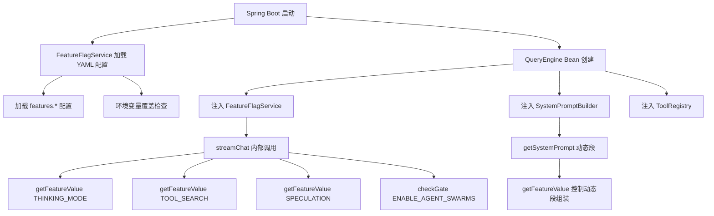
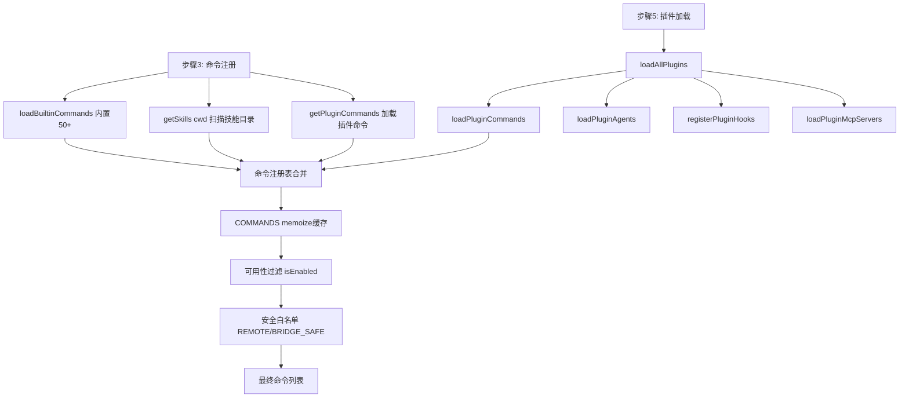
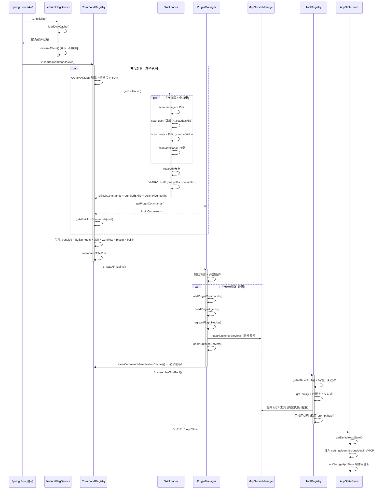

### 2.3 启动与初始化流程

> **v1.38.0 重写**：将原版 CLI 入口启动流程转换为 Java + Python + 前端三层架构的启动时序。
> 原版参考: `src/entrypoints/cli.tsx` + `src/main.tsx` + `src/commands.ts` + `src/tools.ts`

```
启动流程 (Java + Python + 前端三层架构):

1. Spring Boot 应用启动 (Java 后端)
   ├── 加载 application.yml 配置
   ├── DataSource + JdbcTemplate 自动配置 (SQLite 双库)
   ├── Spring Security 过滤链初始化
   ├── WebSocket + STOMP MessageBroker 配置
   └── Bean 实例化开始 (见步骤 2-5)

2. Python 子进程启动 (PythonProcessManager — SmartLifecycle @Order(1) 最早期)
   ├── 解析 venv 路径 + Python 解释器
   ├── 动态分配端口 (port:0 → findAvailablePort())
   ├── uvicorn 子进程启动 (--host 127.0.0.1 --port {assignedPort})
   ├── 健康检查轮询 (/api/health, 最多 30 次, 间隔 1s)
   ├── Python 就绪 → PythonServiceClient Bean 可用
   └── ⚠️ Python 启动失败降级策略:
       ├── 记录错误日志 (WARN 级别)
       ├── PythonServiceClient 标记为 unavailable
       ├── P0 核心工具不依赖 Python → 继续启动 (降级运行)
       └── 依赖 Python 的 P1 工具 (LSPTool/代码分析等) 返回 "Python service unavailable" 错误

3. MCP 服务器预初始化 (McpClientManager — SmartLifecycle @Order(2))
   ├── 从配置加载 MCP 服务器列表
   ├── 异步初始化各服务器连接 (单个失败不阻塞)
   └── 工具发现并注册到 ToolRegistry

4. 特性标志初始化 (FeatureFlagService — SmartLifecycle @Order(3))
   ├── 从 application.yml 加载 features.* 配置
   ├── 环境变量覆盖检查 (FEATURE_<KEY> 前缀)
   └── Bean 就绪 → 其他组件可注入使用

5. 核心 Bean 装配 (CoreAppConfig — @Order(4))
   ├── ToolRegistry — 内置工具注册 + MCP 工具合并
   ├── CommandRegistry — 命令加载 (内置 + 技能 + 插件)
   ├── PermissionPipeline — 权限管线 (沙箱 + 分类器)
   ├── LlmProviderRegistry — LLM Provider 注册 (OpenAI 兼容为默认 P0)
   ├── SystemPromptBuilder — 系统提示组装
   └── QueryEngine — 查询引擎 (依赖以上所有 Bean)

6. 应用就绪事件 (ApplicationReadyEvent)
   ├── MCP 服务器预热 (异步)
   ├── LSP 配置预加载 (异步)
   └── 日志输出: "AI Code Assistant backend ready on port 8080"

7. 前端服务
   ├── 开发模式: Vite dev server (npm run dev, port 5173, 代理 → 8080)
   └── 生产模式: Nginx 静态文件服务 (前端 dist/ + API/WS 反代 → 8080)

8. 客户端访问
   ├── 浏览器打开 http://localhost:5173 (开发) 或 http://localhost:8080 (生产)
   ├── React 应用加载 → 建立 STOMP WebSocket 连接
   ├── 前端 Store 初始化 (Zustand — 见 §8.3)
   └── 用户可以开始对话

原版 CLI 对照 (仅供参考，不在新系统中实现):
  cli.tsx → 无等价物 (新系统通过浏览器访问)
  main.tsx → Spring Boot Application.main() + CoreAppConfig
  commands.ts → CommandRegistry.loadAllCommands()
  tools.ts → ToolRegistry.assembleToolPool()
  AppStateStore → 11 个 Zustand Store (§8.3)
```

#### 2.3.1 关键依赖注入与加载时序 (v1.27.0 R1+R2 补全)

> **R1 补全**：QueryEngine 初始化时对 FeatureFlagService 的依赖注入路径。
> **R2 补全**：插件 → 技能 → 命令的加载时序和互相依赖。

**R1: QueryEngine → FeatureFlagService 依赖注入链**



**关键依赖注入点：**

| 调用方 | 注入的服务 | 使用的特性标志 | 调用时机 |
|--------|-----------|---------------|---------|
| `QueryEngine.streamChat()` | `FeatureFlagService` | `THINKING_MODE`, `TOOL_SEARCH`, `SPECULATION` | 每次 LLM 调用前 |
| `SystemPromptBuilder` | `FeatureFlagService` | `FRONTIER_MODEL_NAME`, `VERIFICATION_AGENT` | 系统提示组装时 |
| `ToolRegistry.getTools()` | `FeatureFlagService` | `ENABLE_BAGEL`, `ENABLE_TUNGSTEN`, `MCP_SKILLS` | 工具池装配时 |
| `PermissionSystem` | `FeatureFlagService` | `SANDBOX_DEFAULT_ON`, `CLASSIFIER_V2` | 权限检查时 |

**R2: 插件/技能/命令加载时序图**

> **v1.29.0 补全**：将流程图升级为完整的 Mermaid 时序图，涵盖 §3.3(命令系统)/§4.6(插件)/§4.7(技能) 三者的初始化时序和互相依赖。
> 对齐源码 `commands.ts` L449-469 `loadAllCommands()` 和 `loadSkillsDir.ts` L638-804 `getSkillDirCommands()`。

**综合流程图：**



**详细时序图（含并行/串行约束）：**



**加载时序约束（必须遵守的顺序）：**

1. **GrowthBook 初始化** (步骤1) 必须在命令注册 (步骤2) 之前完成磁盘缓存加载，因为命令的 `isEnabled` 可能依赖特性标志
2. **内置命令** (步骤2) 先于插件命令加载，确保内置命令优先级更高（同名冲突时内置胜出）
3. **技能扫描** (`getSkills(cwd)`) 是 I/O 密集操作，与内置命令加载并行执行，4 个目录也并行扫描
4. **插件命令** (步骤3) 加载完成后，**必须**调用 `clearCommandMemoizationCaches()` 刷新 COMMANDS 缓存
5. **MCP 服务器预热** (步骤3) 异步执行，不阻塞命令注册
6. **工具池装配** (步骤4) 依赖命令和插件加载完成，合并 MCP 工具时内置优先去重
7. **命令合并优先级** (当命令同名): bundledSkills > builtinPluginSkills > skillDirCommands > workflowCommands > pluginCommands > COMMANDS()

#### 2.3.2 Spring Boot 核心配置类与 Bean 定义 (v1.29.0 补全)

> **v1.29.0 补全**：明确 Spring Boot 自动配置的边界和手动 @Bean 定义的范围。
> 以下配置类是启动流程中各子系统的 DI 连接线。

**自动配置 vs 手动 Bean 边界：**

| 类别 | 组件 | 配置方式 | 说明 |
|------|--------|----------|------|
| 自动 | DataSource, JdbcTemplate | Spring Boot auto-config | `spring.datasource.*` 配置 |
| 自动 | Jackson ObjectMapper | Spring Boot auto-config | 全局 JSON 序列化 |
| 自动 | WebSocket (STOMP) | `@EnableWebSocketMessageBroker` | 见 §8.5 |
| 手动 | FeatureFlagService | `@Bean` | 特性标志服务，YAML 配置 + 环境变量覆盖 |
| 手动 | QueryEngine | `@Bean` | 依赖 FeatureFlagService + SystemPrompt + ToolRegistry |
| 手动 | ToolRegistry | `@Bean` | 工具池装配，依赖插件和 MCP |
| 手动 | CommandRegistry | `@Bean` | 命令注册，依赖技能和插件加载 |
| 手动 | PermissionPipeline | `@Bean` | 权限管线，依赖沙箱和分类器 |
| 手动 | OAuthClient | `@Bean` | OAuth 流程，依赖 OAuthConfig |
| 手动 | PythonServiceClient | `@Bean` | Java→Python HTTP 客户端 |

```java
/**
 * 核心应用配置类 — 将启动流程中的各子系统连接为 Spring Bean 图。
 * 
 * 设计原则:
 *   - 每个 Bean 的依赖通过方法参数注入，Spring 自动解析顺序
 *   - @DependsOn 仅用于非显式依赖（如 GrowthBook 磁盘缓存必须先于命令注册）
 *   - 异步初始化用 @EventListener(ApplicationReadyEvent) 触发
 */
@Configuration
public class CoreAppConfig {

    // ===== 特性标志服务 =====
    
    // v1.41.0 修复: 移除 @Bean featureFlagService() 工厂方法。
    // FeatureFlagService 已标注 @Service + @ConfigurationProperties(prefix = "features")，
    // Spring Boot 通过组件扫描自动注册为 Bean。
    // ⚠️ 之前同时存在 @Bean 方法和 @Service 注解会导致 BeanDefinitionOverrideException 启动失败。
    // 如需在 CoreAppConfig 中引用，通过构造函数注入:
    //   private final FeatureFlagService featureFlagService;
    //   public CoreAppConfig(FeatureFlagService featureFlagService) { ... }

    // ===== 特性标志服务 — P0 简化版 (v1.40.0 重写) =====

    /**
     * v1.40.0 重写: 移除 GrowthBook SDK 420 行复杂实现，替换为简单的 YAML 配置方案。
     * 
     * ★ 变更原因:
     * 1. GrowthBook Java SDK (io.growthbook.sdk-java) 的 API 与 SPEC 中的代码不匹配
     *    — init(5000), getPayload(), refreshFeatures(), .createGrowthBook() 等方法不存在
     * 2. P0 为本地单用户部署，5 级优先级降级链（环境变量→本地配置→内存缓存→磁盘缓存→默认值）过度复杂
     * 3. 远程特性标志服务（remoteEval）连接外部 GrowthBook 实例，P0 不需要
     * 
     * ★ P0 方案: Spring @ConfigurationProperties + application.yml
     * ★ P1 预留: 如需远程特性标志，可引入 GrowthBook Java SDK 扩展此服务
     * 
     * Maven 依赖变更:
     *   <!-- v1.40.0: GrowthBook SDK 移至 P1 可选依赖 -->
     *   <!-- <dependency>
     *       <groupId>io.growthbook.sdk-java</groupId>
     *       <artifactId>GrowthBook</artifactId>
     *       <version>0.9.0+</version>
     *   </dependency> -->
     * 
     * application.yml 配置 (与 v1.39.0 兼容，仅更改命名空间):
     * ```yaml
     * features:
     *   flags:
     *     THINKING_MODE: "enabled"
     *     TOOL_SEARCH: "auto"
     *     SPECULATION: true
     *     FRONTIER_MODEL_NAME: "gpt-4o"
     *     VERIFICATION_AGENT: false
     *     ENABLE_BAGEL: false
     *     ENABLE_TUNGSTEN: false
     *     MCP_SKILLS: true
     *     SANDBOX_DEFAULT_ON: true
     *     CLASSIFIER_V2: false
     *     ENABLE_AGENT_SWARMS: false
     * ```
     * 
     * 环境变量覆盖 (最高优先级):
     * ```bash
     * export FEATURE_SPECULATION=false
     * export FEATURE_FRONTIER_MODEL_NAME=qwen-turbo
     * ```
     * 
     * 特性标志类型与读取方式对照表 (v1.40.0 简化版):
     * 
     * | 标志键                  | 值类型      | 读取方法                              | 调用方                | P0 默认值         |
     * |------------------------|------------|---------------------------------------|----------------------|-------------------|
     * | `THINKING_MODE`        | `String`   | `getFeatureValue(key, "enabled")`     | `QueryEngine`        | `"enabled"`       |
     * | `TOOL_SEARCH`          | `String`   | `getFeatureValue(key, "auto")`        | `QueryEngine`        | `"auto"`          |
     * | `SPECULATION`          | `boolean`  | `getFeatureValue(key, true)`          | `QueryEngine`        | `true`            |
     * | `FRONTIER_MODEL_NAME`  | `String`   | `getFeatureValue(key, "gpt-4o")`      | `SystemPromptBuilder`| `"gpt-4o"`        |
     * | `VERIFICATION_AGENT`   | `boolean`  | `getFeatureValue(key, false)`         | `SystemPromptBuilder`| `false`           |
     * | `ENABLE_BAGEL`         | `boolean`  | `getFeatureValue(key, false)`         | `ToolRegistry`       | `false`           |
     * | `ENABLE_TUNGSTEN`      | `boolean`  | `getFeatureValue(key, false)`         | `ToolRegistry`       | `false`           |
     * | `MCP_SKILLS`           | `boolean`  | `getFeatureValue(key, true)`          | `ToolRegistry`       | `true`            |
     * | `SANDBOX_DEFAULT_ON`   | `boolean`  | `getFeatureValue(key, true)`          | `PermissionSystem`   | `true`            |
     * | `CLASSIFIER_V2`        | `boolean`  | `getFeatureValue(key, false)`         | `PermissionSystem`   | `false`           |
     * | `ENABLE_AGENT_SWARMS`  | `boolean`  | `checkGate(key)`                      | `QueryEngine`        | `false`           |
     */
    @Service
    @ConfigurationProperties(prefix = "features")
    public class FeatureFlagService {

        /**
         * 从 application.yml 的 features.flags 节自动绑定。
         * Spring Boot 在启动时自动将 YAML 配置注入此 Map。
         */
        private Map<String, Object> flags = new ConcurrentHashMap<>();

        public Map<String, Object> getFlags() { return flags; }
        public void setFlags(Map<String, Object> flags) { this.flags = new ConcurrentHashMap<>(flags); }

        // ═══════════════════════════════════════════════════════════════
        // 核心访问方法 — 3 级优先级链 (从 v1.39.0 的 5 级简化)
        // ═══════════════════════════════════════════════════════════════

        /**
         * 获取特性值 — 非阻塞，同步返回。
         * 
         * 优先级链:
         *   1. 环境变量覆盖 (FEATURE_<KEY> 格式，最高优先级)
         *   2. application.yml 配置 (features.flags.<key>)
         *   3. 默认值 (调用方提供)
         * 
         * 兼容 v1.39.0 调用方签名: getFeatureValue(key, defaultValue)
         */
        @SuppressWarnings("unchecked")
        public <T> T getFeatureValue(String featureKey, T defaultValue) {
            // 1. 环境变量覆盖 — FEATURE_ 前缀 + key 大写
            String envKey = "FEATURE_" + featureKey.toUpperCase();
            String envVal = System.getenv(envKey);
            if (envVal != null) {
                return (T) convertEnvValue(envVal, defaultValue);
            }

            // 2. YAML 配置
            Object yamlVal = flags.get(featureKey);
            if (yamlVal != null) {
                return (T) yamlVal;
            }

            // 3. 默认值
            return defaultValue;
        }

        /**
         * 门控检查 — 快速路径，布尔值特化。
         * 兼容 v1.39.0 签名: checkGate(key)
         */
        public boolean checkGate(String gateKey) {
            return getFeatureValue(gateKey, false);
        }

        /**
         * 特性是否启用 — 布尔值快捷方法。
         */
        public boolean isEnabled(String featureKey) {
            return getFeatureValue(featureKey, false);
        }

        /**
         * 运行时更新特性标志 — 供 /config API 使用。
         */
        public void setFeatureValue(String key, Object value) {
            flags.put(key, value);
        }

        /**
         * 环境变量字符串 → 目标类型转换。
         */
        private Object convertEnvValue(String envVal, Object defaultValue) {
            if (defaultValue instanceof Boolean) {
                return Boolean.parseBoolean(envVal);
            } else if (defaultValue instanceof Integer) {
                return Integer.parseInt(envVal);
            } else if (defaultValue instanceof Long) {
                return Long.parseLong(envVal);
            } else if (defaultValue instanceof Double) {
                return Double.parseDouble(envVal);
            }
            return envVal;  // String 类型直接返回
        }
    }

    /**
     * FeatureFlagService 离线行为保证 (v1.40.0 简化版):
     * 
     * ┌─────────────────────────┬─────────────────────────────────────┐
     * │ 场景                     │ 行为                                │
     * ├─────────────────────────┼─────────────────────────────────────┤
     * │ application.yml 完整     │ 从 YAML 读取所有特性标志值           │
     * │ application.yml 缺失键   │ 返回调用方提供的 defaultValue        │
     * │ application.yml 为空     │ 全部返回 defaultValue (安全启动)     │
     * │ 环境变量覆盖             │ 最高优先级，覆盖 YAML 和默认值       │
     * │ 运行时 /config 修改      │ 更新内存 Map，不持久化到 YAML        │
     * └─────────────────────────┴─────────────────────────────────────┘
     * 
     * 结论: 所有特性标志均有硬编码默认值，即使 application.yml 完全为空，
     * 应用也能以安全的默认配置正常启动和运行。
     */

    // ===== 命令与技能注册 =====
    
    @Bean
    @DependsOn("featureFlagService")  // isEnabled 可能依赖特性标志
    public CommandRegistry commandRegistry(
            FeatureFlagService featureFlags,
            SkillLoader skillLoader,
            PluginManager pluginManager) {
        return new CommandRegistry(featureFlags, skillLoader, pluginManager);
    }

    @Bean
    public SkillLoader skillLoader() {
        return new SkillLoader();  // 4 目录并行扫描，realpath 去重
    }

    // ===== 查询引擎 =====
    
    @Bean
    public QueryEngine queryEngine(
            FeatureFlagService featureFlags,
            SystemPromptBuilder systemPrompt,
            ToolRegistry toolRegistry,
            PermissionPipeline permissionPipeline,
            LlmProviderRegistry llmProviderRegistry) {  // v1.36.0: Provider 无关化
        return new QueryEngine(featureFlags, systemPrompt, toolRegistry,
            permissionPipeline, llmProviderRegistry);
    }
    // > v1.36.0 修正: 原 @Value("${anthropic.api-key}") 替换为 LlmProviderRegistry 注入。
    // > API Key 由各 Provider 实现内部通过 @Value("${llm.providers.*.api-key}") 读取，
    // > QueryEngine 不直接持有任何 API Key，仅通过 Registry 获取当前活跃 Provider。

    // ===== 工具池 =====
    
    @Bean
    public ToolRegistry toolRegistry(
            PluginManager pluginManager,
            McpServerManager mcpManager,
            FeatureFlagService featureFlags) {
        return new ToolRegistry(pluginManager, mcpManager, featureFlags);
    }

    // ===== 权限系统 =====
    
    @Bean
    public PermissionPipeline permissionPipeline(
            SandboxManager sandboxManager,
            FeatureFlagService featureFlags) {
        return new PermissionPipeline(sandboxManager,
            new YoloClassifier(featureFlags));
    }

    @Bean
    public SandboxManager sandboxManager() {
        return new SandboxManager();  // 合并 settings layers + CLI flags
    }

    // ===== 插件系统 =====
    
    @Bean
    public PluginManager pluginManager() {
        return new PluginManager();  // 内置 + 外部插件加载器
    }

    // ===== 异步初始化 =====
    
    @EventListener(ApplicationReadyEvent.class)
    public void onApplicationReady(ApplicationReadyEvent event) {
        // v1.40.0 修复: 移除 growthBookService.initializeClientAsync() 重复调用
        // FeatureFlagService 通过 @ConfigurationProperties 在 Bean 创建时已自动加载配置
        // MCP 服务器预热 (异步)
        mcpServerManager.warmupAsync();
    }
}
```

**补充配置类（已在其他章节定义）：**

| 配置类 | 章节 | 职责 |
|--------|------|------|
| `WebSocketConfig` | §8.5 | STOMP WebSocket 配置 + 消息代理 |
| `SecurityConfig` | §10.1 | Spring Security 过滤链 + CORS + CSP |
| `OAuthConfig` | §9.1.1 | OAuth 端点 + 客户端 ID + 作用域 |
| `PythonServiceConfig` | §6.3 | Java→Python HTTP 客户端 |
| `LoggingConfig` | §10.3 | 5 级日志 + MCP 日志分离 |

