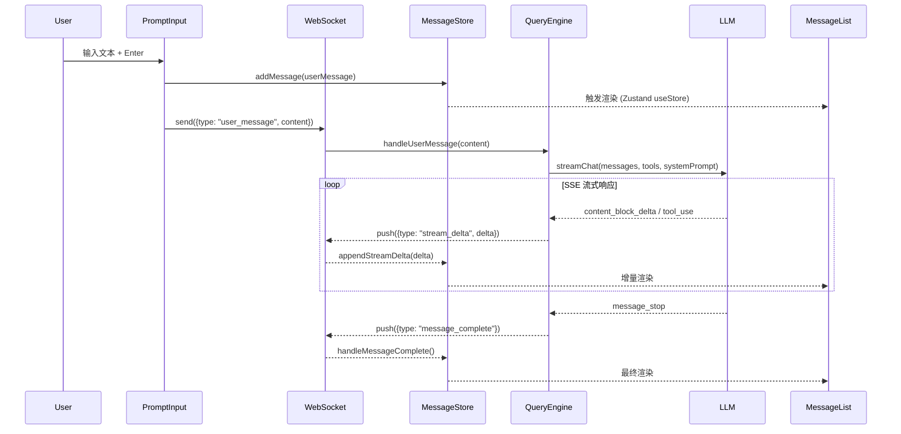
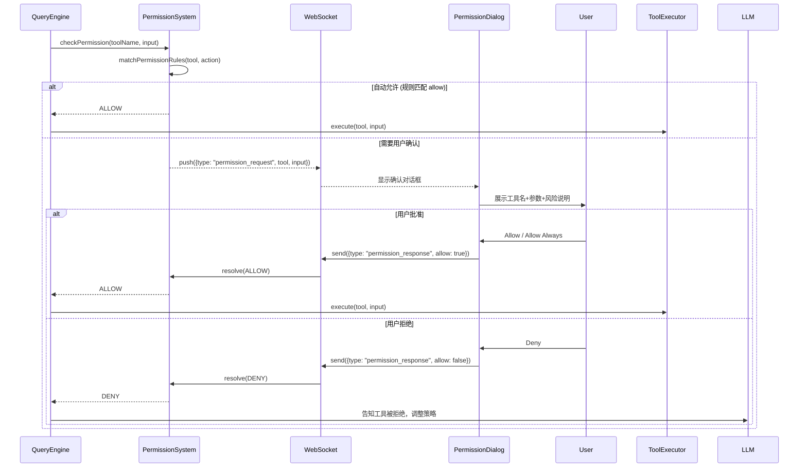
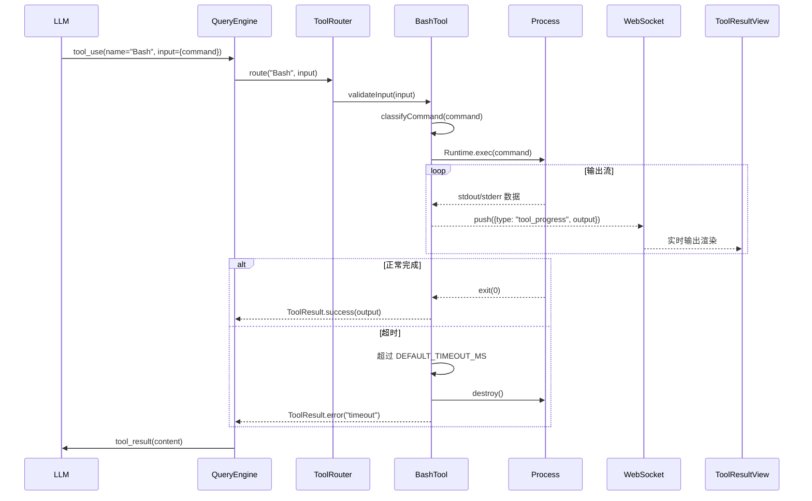
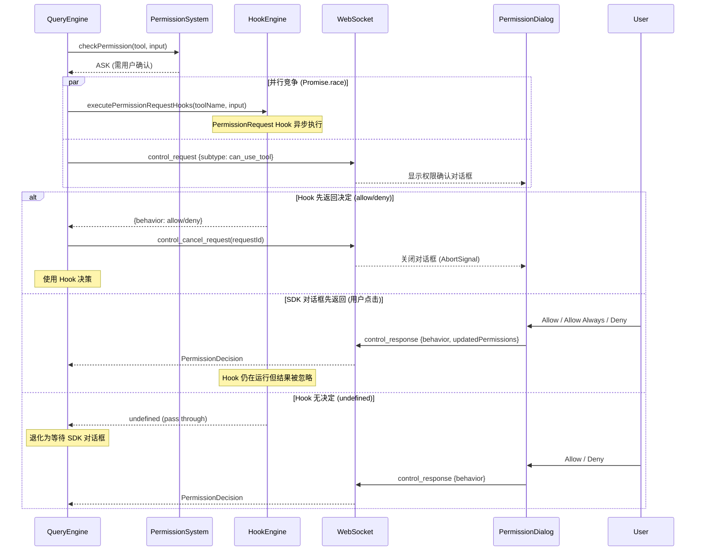
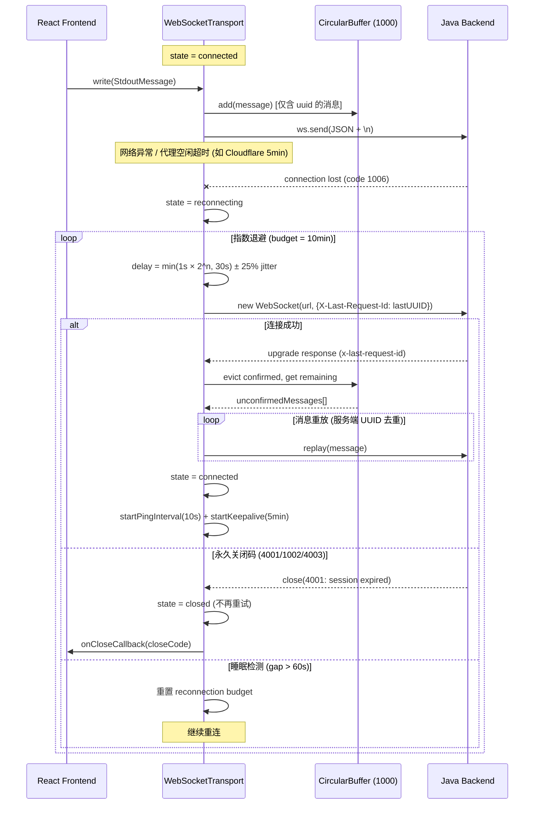

#### 8.2.4 UI 组件系统完整实现规范

> **v1.35.0 重写**: Web 原生组件规范。以下内容已清除 Ink 终端 UI 概念
> （AlternateScreen、ScrollBox、Yoga Flexbox、raw mode 等），
> 所有组件规范使用 TypeScript React 描述（非 Java class）。
> 
> **源码参考**: REPL.tsx(5006行) — 仅作功能对照，不翻译其终端 UI 模式。

**A. Web UI 主界面组件树 (v1.35.0 — Web 原生)**

> **⚠️ 以下为 Web 版本的组件树**，非原版 Ink 终端组件树的翻译。
> Web 版本不使用 AlternateScreen、ScrollBox 等终端概念，
> 使用标准 React DOM + CSS Flexbox 布局。

```
ChatPage (src/pages/ChatPage.tsx — Web 主界面)
├── 条件加载层 (React.lazy + Suspense)
│   ├── featureFlags.VOICE_MODE → VoiceKeybindingHandler
│   ├── featureFlags.COORDINATOR_MODE → CoordinatorPanel
│   └── featureFlags.BUILTIN_EXPLORE_PLAN_AGENTS → AgentSidebar
├── AppLayout (CSS Grid 三栏布局)
│   ├── Header (固定顶栏, position: sticky)
│   ├── Sidebar (可折叠, CSS transition)
│   │   ├── SessionList (游标分页)
│   │   ├── TaskPanel (P1: 后台任务)
│   │   ├── FileTracker (P1: 修改文件追踪)
│   │   └── AgentPanel (P1: 子代理面板)
│   ├── MainContent (flex: 1, overflow: hidden)
│   │   ├── MessageList (react-virtuoso 虚拟滚动)
│   │   │   ├── UserTextMessage
│   │   │   ├── AssistantTextMessage (StreamingText + ThinkingBlock)
│   │   │   ├── ToolCallBlock (14 种结果渲染器)
│   │   │   ├── SystemMessage                               // v1.65.0 M-04: 按 subtype 分发渲染
│   │   │   │   ├── subtype='compact_boundary' → CompactBoundaryMessage  (分割线+摘要)
│   │   │   │   ├── subtype='microcompact_boundary' → 同上 (微压缩)
│   │   │   │   ├── subtype='snip_boundary'/'snip_marker' → SnipBoundaryMessage (上下文截断)
│   │   │   │   ├── subtype='local_command' → LocalCommandMessage (本地命令结果)
│   │   │   │   └── default → SystemTextMessage (普通系统文本)
│   │   │   ├── AttachmentMessage (v1.65.0 M-03)
│   │   │   ├── GroupedToolUseBlock (v1.65.0 H-05)
│   │   │   ├── CollapsedReadSearchBlock (v1.65.0 H-05)
│   │   │   └── ProgressMessage
│   │   └── PromptInput (底部固定, position: sticky)
│   │       ├── textarea (自动扩展高度)
│   │       ├── CommandPalette (/ 命令自动完成)
│   │       ├── AttachmentBar (拖拽上传)
│   │       └── InputToolbar (Send + VoiceButton)
│   └── StatusBar (固定底栏)
│       ├── PermissionModeIndicator
│       ├── ModelName + TokenCounter
│       └── CostDisplay
├── PermissionDialog (模态, z-index overlay)
├── ElicitationDialog (模态)
├── SettingsPanel (抽屉, slide-in)
└── Toast (通知, position: fixed bottom-right)
```

```typescript
/**
 * ChatPage 核心状态分组 — Web 版本通过 Zustand store 管理。
 * (v1.35.0: 从 Java class 改为 TypeScript 接口，因为这是前端逻辑)
 * 
 * ⚠️ 本分组为源码对照参考，权威字段定义见 §8.3 各 Store 接口。
 *   字段名与 §8.3 保持一致。
 */

// === 会话状态 (sessionStore — 见 §8.3 SessionStore) ===
interface SessionState {
    sessionId: string | null;             // 会话 ID (null = 未创建, 对齐 §8.3)
    status: 'idle' | 'streaming' | 'waiting_permission' | 'compacting';
    model: string;                    // 当前模型
}

// === 流式/工具状态 (messageStore — 见 §8.3 MessageStore) ===
interface StreamingState {
    streamingContent: string;         // 流式文本内容 (对应 §8.3 MessageStore.streamingContent)
    thinkingContent: string;          // 流式思考内容 (对应 §8.3 MessageStore.thinkingContent)
    activeToolCalls: Map<string, ToolCallState>;  // 进行中工具调用 (对应 §8.3 MessageStore.activeToolCalls)
}

// === 输入状态 (local component state) ===
interface InputState {
    isMessageSelectorVisible: boolean;  // 消息选择器可见
    inputBuffer: string;                // 当前输入缓冲
}

// === 代理/队友状态 (taskStore — 见 §8.3 TaskStore) ===
interface AgentState {
    tasks: Map<string, TaskState>;
    foregroundedTaskId: string | null;
    viewingAgentTaskId: string | null;
}

// === UI 模式 (local component state — 非 Store 字段，按需在组件内管理) ===
interface UIMode {
    transcriptMode: boolean;    // 转录模式 (Ctrl+O)
    briefMode: boolean;         // 简洁模式 (Brief tool)
}
```

**B. PromptInput 子系统 (21 文件)**

```
src/components/PromptInput/
├── PromptInput.tsx (2339行) — 主输入组件
│   ├── 核心 Hooks:
│   │   ├── useInputBuffer()      — 输入缓冲管理
│   │   ├── useArrowKeyHistory()  — 历史命令导航 (Up/Down)
│   │   ├── useHistorySearch()    — Ctrl+R 历史搜索
│   │   ├── useTypeahead()        — Tab 自动完成
│   │   ├── usePromptSuggestion() — AI 提示建议
│   │   ├── useDoublePress()      — 双击 Esc 检测
│   │   └── useWindowSize()        — 窗口尺寸响应 (ResizeObserver)
│   ├── 输入触发器检测:
│   │   ├── findSlashCommandPositions()     — / 命令
│   │   ├── findThinkingTriggerPositions()  — 思考模式触发
│   │   ├── findBtwTriggerPositions()       — 侧问触发
│   │   ├── findTokenBudgetPositions()      — Token 预算
│   │   ├── findUltraplanTriggerPositions() — 超级计划
│   │   └── findBuddyTriggerPositions()     — 伙伴触发
│   └── 输入模式: 'normal' | 'vim-normal' | 'vim-insert' | 'search'
├── PromptInputFooter.tsx — 底部状态栏
│   ├── 权限模式指示 (plan/auto/default)
│   ├── 模型显示 + Token 计数
│   ├── IDE 连接状态
│   └── 快捷键提示
├── Notifications.tsx (332行) — 通知栏
│   ├── API 密钥状态
│   ├── 自动更新状态
│   ├── Token 使用量警告
│   ├── IDE 选择指示
│   ├── 语音模式指示
│   ├── Claude.ai 限制警告
│   ├── 内存使用量指示
│   └── 沙盒提示
├── SlashCommandAutocomplete — / 命令自动完成
│   └── FuzzyPicker (设计系统, 模糊匹配)
├── PromptInputFooterSuggestions.tsx — AI 建议提示
├── VoiceIndicator.tsx — 语音录制指示器
├── IssueFlagBanner.tsx — Issue 标志横幅
└── SandboxPromptFooterHint.tsx — 沙盒提示
```

```typescript
/**
 * PromptInput Props 接口 — 对应原版 PromptInput.tsx 的 50+ Props。
 * (v1.35.0: 从 Java interface 改为 TypeScript，因为这是前端组件)
 */
interface PromptInputProps {
    // === 回调 ===
    onSubmit: (event: SubmitEvent) => void;
    onSlashCommand: (command: string) => void;
    onInterrupt: () => void;
    
    // === 状态 ===
    disabled: boolean;
    isLoading: boolean;
    permissionMode: 'default' | 'plan' | 'auto' | 'bypassPermissions';
    messages: Message[];                    // 消息历史 (用于 Token 计数)
    
    // === 环境 ===
    commands: Command[];                    // 可用命令列表
    mcpClients: MCPServerConnection[];      // MCP 连接
    apiKeyStatus: VerificationStatus;       // API 密钥验证
    autoUpdaterResult?: AutoUpdaterResult;  // 自动更新结果
    
    // === 可选功能 ===
    ideSelection?: IDESelection;            // IDE 选中内容 (@mention)
    agentDefinitions?: AgentDefinition[];   // 可用代理定义
}

/**
 * 输入提交事件。
 */
interface SubmitEvent {
    text: string;                           // 用户输入文本
    attachments: Attachment[];              // 附件 (图片/文件)
    references: Map<string, string>;        // @ 引用
    effortLevel?: 'low' | 'medium' | 'high'; // 推理努力等级
    isFastMode: boolean;                    // 快速模式
}
```

**C. 权限 UI 路由系统**

```typescript
/**
 * 权限组件路由 — 对应原版 permissionComponentForTool() 路由函数。
 * (v1.35.0: 从 Java class 改为 TypeScript，因为这是前端路由逻辑)
 * 每个工具类型映射到专用的权限确认 UI 组件。
 */
const PERMISSION_COMPONENTS: Record<string, React.ComponentType<PermissionRequestProps>> = {
    'FileEditTool':        FileEditPermissionRequest,
    'FileWriteTool':       FileWritePermissionRequest,
    'BashTool':            BashPermissionRequest,
    'PowerShellTool':      PowerShellPermissionRequest,
    'WebFetchTool':        WebFetchPermissionRequest,
    'NotebookEditTool':    NotebookEditPermissionRequest,
    'ExitPlanModeV2Tool':  ExitPlanModePermissionRequest,
    'EnterPlanModeTool':   EnterPlanModePermissionRequest,
    'SkillTool':           SkillPermissionRequest,
    'AskUserQuestionTool': AskUserQuestionPermissionRequest,
    'ReviewArtifactTool':  ReviewArtifactPermissionRequest,   // 特性门控
    'WorkflowTool':        WorkflowPermissionRequest,         // 特性门控
    'MonitorTool':         MonitorPermissionRequest,           // 特性门控
    'GlobTool':            FilesystemPermissionRequest,        // 共享
    'GrepTool':            FilesystemPermissionRequest,        // 共享
    'FileReadTool':        FilesystemPermissionRequest,        // 共享
    // 其他工具 → FallbackPermissionRequest
};

function getPermissionComponent(toolName: string): React.ComponentType<PermissionRequestProps> {
    return PERMISSION_COMPONENTS[toolName] ?? FallbackPermissionRequest;
}

/**
 * 权限请求 Props — 所有 15 种专用权限组件的公共接口。
 */
interface PermissionRequestProps {
    toolUseId: string;                      // 工具调用 ID
    toolName: string;                       // 工具名称
    input: Record<string, unknown>;         // 工具输入
    riskLevel: 'low' | 'medium' | 'high';   // 风险级别
    reason: string;                         // 需要权限的原因
    onAllow: (options?: { remember?: boolean; scope?: string }) => void;
    onDeny: () => void;
}
```

**D. 消息渲染管线**

> **v1.35.0 补全**: ToolCallBlock 14 种渲染器与工具类型的映射关系、
> CodeBlock 代码高亮组件、DiffView 差异视图组件的详细规范。

```typescript
/**
 * ToolCallBlock 渲染器映射 — 14 种工具类型对应专用结果渲染器。
 * 与 §8.5.1 tool_use_start 消息的 toolName 字段直接对应。
 */
const TOOL_RESULT_RENDERERS: Record<string, React.ComponentType<ToolResultProps>> = {
    'BashTool':            TerminalOutputRenderer,   // xterm.js 终端模拟
    'FileEditTool':        DiffViewRenderer,         // Monaco Diff Editor (patch 编辑: old_string→new_string 对比)
    'FileWriteTool':       FileCreateRenderer,       // v1.65.0 M-07: 全文创建渲染 (非 diff，显示新文件内容 + 语法高亮)
    'FileReadTool':        CodeBlockRenderer,        // 语法高亮代码块
    'GlobTool':            FileListRenderer,         // 文件列表 (树形展示, 含目录结构)
    'GrepTool':            SearchResultRenderer,     // 搜索结果 (带行号高亮)
    'WebFetchTool':        WebContentRenderer,       // 网页内容渲染
    'NotebookEditTool':    NotebookDiffRenderer,     // Jupyter 单元格 diff
    'SkillTool':           SkillResultRenderer,      // 技能执行结果
    'AgentTool':           AgentTaskRenderer,        // 子代理任务状态
    'ReviewArtifactTool':  ArtifactPreviewRenderer,  // 制品预览
    'WorkflowTool':        WorkflowStepRenderer,     // 工作流步骤
    'ExitPlanModeV2Tool':  PlanTransitionRenderer,   // 计划模式切换提示
    'EnterPlanModeTool':   PlanTransitionRenderer,   // 共用
    // 其他未映射工具 → FallbackToolResultRenderer (JSON 格式化展示)
};

interface ToolResultProps {
    toolUseId: string;              // 对应 §8.5.1 tool_use_start.toolUseId
    toolName: string;               // 对应 §8.5.1 tool_use_start.toolName
    input: Record<string, unknown>; // 工具输入参数
    result?: ToolResult;            // 对应 §8.5.1 tool_result.result
    progress?: string;              // 对应 §8.5.1 tool_use_progress.progress
    status: 'pending' | 'running' | 'completed' | 'error' | 'permission_needed';  // 对齐 §8.3 ToolCallState.status
}

/**
 * CodeBlock — 代码高亮组件。
 * 
 * 高亮策略 (v1.48.0 统一为 PrismJS):
 * - 短代码 (<100行): 前端 PrismJS 实时高亮 (同步, <100行性能可接受)
 * - 长代码 (≥100行): 默认纯 <pre>, 用户可点击手动触发 PrismJS 高亮
 * - 后端降级: POST /api/docs/highlight (pygments, 200+语言, 可选)
 * - 移动端: 延迟高亮 (滚动停止 200ms 后执行, 见 §8.8.5)
 */
interface CodeBlockProps {
    code: string;                   // 代码内容
    language?: string;              // 语言标识 (python, typescript, etc.)
    fileName?: string;              // 文件名 (用于推断语言)
    showLineNumbers?: boolean;      // 是否显示行号 (默认 true)
    highlightLines?: number[];      // 高亮行号
    maxHeight?: number;             // 最大高度 (超出可滚动)
    copyable?: boolean;             // 右上角复制按钮 (默认 true)
}

/**
 * DiffView — 代码差异视图组件。
 * 
 * 技术方案: Monaco Diff Editor
 * 与后端数据对齐: tool_result.result 中包含 diff 或 oldContent/newContent。
 */
interface DiffViewProps {
    oldContent: string;             // 修改前内容
    newContent: string;             // 修改后内容
    fileName: string;               // 文件路径
    language?: string;              // 语言 (用于语法高亮)
    mode: 'side-by-side' | 'inline'; // 并排 / 内联模式
    // 响应式: 桌面默认 side-by-side, 移动端降级为 inline (见 §8.8.2)
}
```

```typescript
/**
 * Messages 组件渲染管线 — 对应原版 Messages.tsx (834 行)。
 * (v1.35.0: 从 Java class 改为 TypeScript，因为这是前端渲染逻辑)
 * 消息从原始列表到最终渲染经过多级过滤和转换。
 */

// === 阶段 1: 过滤 ===
// filterForBriefTool(): Brief 模式过滤
//   - 保留: system 消息(除 api_metrics), Brief 工具调用, 用户输入
//   - 过滤: 助手文本, 非 Brief 工具调用, meta 消息
// dropTextInBriefTurns(): 删除 Brief 轮次的文本重复

// === 阶段 2: 分组与折叠 ===
// collapseHookSummaries(): Hook 结果消息折叠
// collapseAdjacentToolCalls(): 相邻同类工具调用分组
// buildMessageLookups(): 构建 tool_use_id → result 映射

// === 阶段 3: 渲染限制 ===
const MAX_MESSAGES_TO_SHOW_IN_TRANSCRIPT_MODE = 30;
// react-virtuoso 自动管理可见区域，无需硬性 CAP

// === 阶段 4: 差异化渲染 ===
// LogoHeader: React.memo 优化
// 时间戳: 按消息间隔动态显示（>5 分钟间隔时显示）
```

**E. 虚拟滚动与 VirtualMessageList**

```typescript
/**
 * VirtualMessageList — Web 版使用 react-virtuoso 替代原版自研虚拟滚动。
 * (v1.35.0: 明确使用 react-virtuoso，不翻译原版 Ink ScrollBox 方案)
 * 
 * 原版使用 Ink ScrollBox + 自研 useVirtualScroll (1082行)，
 * Web 版本直接使用 react-virtuoso 库，获得:
 * - 动态高度消息项自动测量
 * - followOutput="smooth" 自动滚动到底部
 * - 大量消息场景下的高性能渲染（仅渲染可见区域）
 */

// react-virtuoso 配置
const VIRTUOSO_CONFIG = {
    overscan: 200,              // 预渲染额外 200px
    increaseViewportBy: 400,    // 扩展视口 400px
    defaultItemHeight: 80,      // 默认消息高度估计
};

// === 粘性提示 (StickyPrompt) ===
// 滚动时显示当前用户提示在固定头部 (position: sticky)
// 点击头部跳转到原始消息位置

// === 转录搜索 (JumpHandle) ===
// jumpToIndex(i): 使用 virtuosoRef.scrollToIndex()
// setSearchQuery(q): 设置搜索查询
// nextMatch() / prevMatch(): 前进/后退匹配
// 搜索文本缓存: WeakMap<Message, string>

// === 性能优化 ===
// 流式渲染: requestAnimationFrame 批量合并 stream_delta
// 搜索文本提取: WeakMap 缓存，避免重复计算
```

**F. 应用布局 (AppLayout — Web 原生)**

```typescript
/**
 * AppLayout — Web 版本的主布局。
 * (v1.35.0: 替代原版 FullscreenLayout，使用 CSS Grid 而非终端 AlternateScreen)
 * 
 * 使用 CSS Grid 实现三栏布局，所有区域通过标准 CSS 定位。
 */

// === 布局结构 (CSS Grid) ===
// ┌──────────────────────────────┐
// │ Header (grid-row: 1)        │ ← position: sticky, top: 0
// ├─────────┬────────────────────┤
// │ Sidebar │ MainContent        │ ← grid-template-columns: auto 1fr
// │         │ ┌────────────────┐ │
// │         │ │ MessageList    │ │ ← flex: 1, overflow-y: auto (react-virtuoso)
// │         │ └────────────────┘ │
// │         │ ┌────────────────┐ │
// │         │ │ PromptInput    │ │ ← position: sticky, bottom: 0
// │         │ └────────────────┘ │
// ├─────────┴────────────────────┤
// │ StatusBar (grid-row: 3)     │ ← position: sticky, bottom: 0
// └──────────────────────────────┘
// ┌──────────────────────────────┐
// │ PermissionDialog (overlay)  │ ← position: fixed, z-index: 50
// │ SettingsPanel (slide-in)    │ ← position: fixed, right: 0, z-index: 40
// └──────────────────────────────┘

const AppLayoutCSS = `
  .app-layout {
    display: grid;
    grid-template-rows: auto 1fr auto;   /* header | content | statusbar */
    grid-template-columns: auto 1fr;      /* sidebar | main */
    height: 100vh;
  }
  .header { grid-column: 1 / -1; position: sticky; top: 0; z-index: 10; }
  .sidebar { grid-row: 2; overflow-y: auto; transition: width 0.2s; }
  .main-content { grid-row: 2; display: flex; flex-direction: column; overflow: hidden; }
  .status-bar { grid-column: 1 / -1; position: sticky; bottom: 0; z-index: 10; }
`;
```

**G. 设计系统组件 (16 组件)**

```typescript
/**
 * 设计系统 — 基于 shadcn/ui + Tailwind CSS 的可复用组件。
 * (v1.35.0: 从 Java class 改为 TypeScript，清除终端色彩模型引用)
 * 所有业务组件的构建块。
 */

// === 布局组件 ===
// Pane: 带边框的面板容器 — shadcn/ui Card
// Divider: 分隔线 — <hr> + Tailwind
// ThemedBox: 主题化容器 — 背景色, 圆角, 阴影 (CSS 变量驱动)

// === 文本组件 ===
// ThemedText: 主题化文本 — 语义化颜色: primary, secondary, error, warning, success
// Byline: 署名行 — 模型名称, 时间戳, 代理颜色标识

// === 交互组件 ===
// FuzzyPicker: 模糊搜索选择器 (/ 命令核心组件)
//   - 模糊匹配算法, 分组显示, 键盘导航 (ArrowUp/Down/Enter)
//   - 支持异步加载候选项
// Dialog: 对话框 — shadcn/ui Dialog, ESC 关闭, 焦点陷阱
// ListItem: 列表项 — 键盘(j/k/Enter)和鼠标双模式导航
// Tabs: 选项卡 — shadcn/ui Tabs, 键盘切换

// === 反馈组件 ===
// StatusIcon: 状态图标 — spinner(CSS animate-spin)/success/error/warning/info
// ProgressBar: 进度条 — shadcn/ui Progress
// LoadingState: 加载状态 — StatusIcon + 提示文本
// KeyboardShortcutHint: 快捷键提示 — 渲染 ⌘+K, Ctrl+C 等

// === 主题系统 ===
// ThemeProvider: 主题提供者
//   - light/dark/system 三种模式
//   - CSS 变量驱动 (见 §8.6 ThemeConfig)
//   - prefers-color-scheme 媒体查询自动检测
```

**H. 通知系统 (30+ hooks)**

```typescript
/**
 * 通知系统 — 对应原版 src/hooks/notifs/ 下的 30+ notification hooks。
 * (v1.35.0: 从 Java class 改为 TypeScript)
 * 每个 hook 注入一条通知到 Toast 组件。
 */

// === 系统级通知 ===
// useInstallMessages()                  — 安装/升级消息
// useAutoModeUnavailableNotification()  — Auto 模式不可用
// useSettingsErrors()                   — 配置文件错误
// useRateLimitWarningNotification()     — 速率限制预警
// useModelMigrationNotifications()      — 模型迁移通知

// === IDE 集成通知 ===
// useIDEStatusIndicator()               — IDE 连接状态
// useLspInitializationNotification()    — LSP 初始化状态

// === 插件/MCP 通知 ===
// usePluginInstallationStatus()         — 插件安装状态
// useMcpConnectivityStatus()            — MCP 服务连接状态

// === 通知优先级 ===
type NotificationPriority = 'immediate' | 'normal' | 'low';
// 'immediate': 立即显示, 替换当前通知
// 'normal':    排队显示, FIFO
// 'low':       仅在无其他通知时显示
const FOOTER_TEMPORARY_STATUS_TIMEOUT = 5000; // ms

// === 通知 Context ===
// useNotifications() hook → NotificationContext (包装 §8.3 NotificationStore)
//   addNotification({ key, level, message, priority?, timeout? })
//   removeNotification(key)
```

**I. 关键状态管理 Hooks**

```typescript
/**
 * 核心 Hooks 清单 — 对应原版 src/hooks/ 下 85+ 文件。
 * (v1.35.0: 从 Java class 改为 TypeScript)
 * 按功能分组列出 ChatPage 直接使用的关键 hooks。
 */

// === 权限 ===
// useCanUseTool(): 权限检查主钩子 — 返回 CanUseToolFn

// === 数据合并 ===
// useMergedTools(): 合并内置工具 + MCP 工具 + 插件工具
// useMergedClients(): 合并 MCP 客户端连接
// useMergedCommands(): 合并内置命令 + 插件命令 + 技能命令

// === 输入处理 ===
// useInputBuffer(): 输入缓冲区管理
// useArrowKeyHistory(): 历史命令 Up/Down 导航
// useHistorySearch(): Ctrl+R 历史搜索
// useTypeahead(): Tab 自动完成
// usePromptSuggestion(): AI 提示建议 (GrowthBook 门控)

// === 会话管理 ===
// useSessionBackgrounding(): 会话后台化
// useAwaySummary(): 离开摘要

// === IDE 集成 ===
// useIDEIntegration(): IDE 桥接集成
// useIdeSelection(): IDE 代码选择 (@mention)

// === UI 功能 ===
// useWindowSize(): 窗口尺寸响应 (ResizeObserver)
// useSkillsChange(): 技能变更检测
// useManagePlugins(): 插件管理
// useMessageActions(): 消息操作 (复制/重试/回退)
```

**J. 消息类型与渲染映射**

```typescript
/**
 * 消息类型完整清单 — 对应原版 src/types/message.ts 的消息类型系统。
 * (v1.35.0: 从 Java enum 改为 TypeScript union type，因为这是前端类型)
 * 每种消息类型对应特定的渲染组件和行为。
 */
type MessageType =
    | 'user'            // 用户输入 → UserTextMessage
    | 'assistant'       // 助手回复 → AssistantTextMessage / ToolCallMessage
    | 'system'          // 系统消息 → SystemMessage (子类型: api_metrics, compact_boundary, ...)
    | 'progress'        // 进度消息 → ProgressMessage (工具执行进度)
    | 'attachment'      // 附件消息 → AttachmentMessage (图片/文件)
    | 'hook_result'     // Hook 结果 → HookResultMessage (可折叠)
    | 'command_input'   // 命令输入 → CommandInputMessage (/ 命令回显)
    | 'turn_duration'   // 轮次耗时 → TurnDurationMessage (调试信息)
    | 'agents_killed'   // 代理终止 → AgentsKilledMessage
    | 'api_metrics';    // API 指标 → ApiMetricsMessage (TTFT, 配置写入)

/**
 * 消息渲染组件映射 — 根据 MessageType 选择渲染组件。
 */
const MESSAGE_RENDERERS: Record<MessageType, React.ComponentType<MessageProps>> = {
    user:           UserTextMessage,
    assistant:      AssistantTextMessage,
    system:         SystemMessage,
    progress:       ProgressMessage,
    attachment:     AttachmentMessage,
    hook_result:    HookResultMessage,
    command_input:  CommandInputMessage,
    turn_duration:  TurnDurationMessage,
    agents_killed:  AgentsKilledMessage,
    api_metrics:    ApiMetricsMessage,
};

/**
 * Brief 模式过滤规则 — filterForBriefTool 实现。
 * (v1.35.0: 从 Java class 改为 TypeScript 函数)
 */
function filterForBriefTool(
    messages: Message[],
    briefToolNames: string[]
): Message[] {
    // 保留规则:
    // - system (subtype !== 'api_metrics')
    // - assistant: isApiErrorMessage === true 或 tool_use.name ∈ briefToolNames
    // - user: tool_result 对应 brief tool_use_id, 或非 meta 用户输入
    // - attachment: type === 'queued_command' && commandMode === 'prompt' && !isMeta
    // - 其他: 过滤掉
    return messages.filter(msg => {
        switch (msg.type) {
            case 'system': return msg.subtype !== 'api_metrics';
            case 'assistant': return msg.isApiError || briefToolNames.includes(msg.toolName);
            case 'user': return !msg.isMeta;
            case 'attachment': return msg.commandMode === 'prompt' && !msg.isMeta;
            default: return false;
        }
    });
}
```

##### 8.2.4a 核心交互流程时序图 (v1.27.0 D2 补全)

> **D2 补全**：补充 3 个核心前端交互流程的 Mermaid 时序图，
> 覆盖发消息、权限确认、工具调用的完整数据流。

**流程 1：用户发送消息 → 流式响应 → UI 更新**



**流程 2：权限确认流程 (工具需要用户批准)**



**流程 3：工具调用完整生命周期**



**流程 4：Hook vs SDK 权限决策竞争 (对齐 structuredIO.ts createCanUseTool)**

> **v1.29.0 补全**：权限系统核心并发模式 — Hook 评估与 SDK 权限弹窗同时启动，
> 先完成者胜出（Race Pattern），另一方被取消。Java 实现需保持此语义。



**流程 5：WebSocket 断线重连与消息重放 (对齐 WebSocketTransport.ts)**

> **v1.29.0 补全**：WebSocket 连接生命周期管理，含指数退避重连、
> CircularBuffer 消息缓冲和 UUID 去重重放。Java WebSocket 客户端需实现等价机制。
>
> **v1.33.0 补全**：CircularBuffer 消息大小上限与 OOM 防护。

**CircularBuffer OOM 防护策略：**

| 参数 | 值 | 说明 |
|------|------|------|
| `MAX_BUFFER_SIZE` | 1000 | 最大缓冲消息数 |
| `MAX_MESSAGE_BYTES` | 1 MB (1,048,576) | 单条消息序列化大小上限，超出则截断 `toolResult` 内容 |
| `MAX_BUFFER_TOTAL_BYTES` | 50 MB | 缓冲区总内存上限，达到时淘汰最旧消息 |
| `OVERSIZED_MESSAGE_STRATEGY` | truncate | 超大消息处理：截断而非丢弃，保留消息元数据 |

```java
/**
 * CircularBuffer OOM 防护 — v1.33.0 补全。
 * 
 * 防护层级:
 * 1. 单消息大小限制: 序列化后超过 1MB 的消息，截断 toolResult/content 字段
 * 2. 缓冲区总大小限制: 所有缓冲消息总内存超过 50MB 时，FIFO 淘汰最旧消息
 * 3. 消息数量限制: 固定 1000 条环形缓冲（已有）
 * 4. 周期性内存检查: 每 100 条消息入队时检查 JVM 堆使用率
 */
public class BoundedCircularBuffer<T> {
    private static final int MAX_SIZE = 1000;
    private static final long MAX_MESSAGE_BYTES = 1_048_576L;      // 1MB
    private static final long MAX_TOTAL_BYTES = 50 * 1_048_576L;   // 50MB
    
    private final Deque<BufferEntry<T>> buffer = new ArrayDeque<>(MAX_SIZE);
    private long totalBytes = 0;
    
    record BufferEntry<T>(T message, String uuid, long sizeBytes) {}
    
    /** 入队 — 含大小检查和淘汰 */
    public void add(T message, String uuid) {
        long msgSize = estimateSize(message);
        
        // 单消息超限 → 截断
        if (msgSize > MAX_MESSAGE_BYTES) {
            message = truncateMessage(message, MAX_MESSAGE_BYTES);
            msgSize = MAX_MESSAGE_BYTES;
        }
        
        // 总量超限 → 淘汰最旧
        while (totalBytes + msgSize > MAX_TOTAL_BYTES && !buffer.isEmpty()) {
            BufferEntry<T> evicted = buffer.pollFirst();
            totalBytes -= evicted.sizeBytes();
        }
        
        // 数量超限 → 淘汰最旧
        while (buffer.size() >= MAX_SIZE) {
            BufferEntry<T> evicted = buffer.pollFirst();
            totalBytes -= evicted.sizeBytes();
        }
        
        buffer.addLast(new BufferEntry<>(message, uuid, msgSize));
        totalBytes += msgSize;
    }
    
    /** 根据已确认 UUID 淘汰已送达消息，返回未确认消息列表 */
    public List<T> evictConfirmedAndGetRemaining(String lastConfirmedUuid) {
        if (lastConfirmedUuid == null) return getAll();
        
        // 移除 lastConfirmedUuid 及之前的所有消息
        while (!buffer.isEmpty()) {
            BufferEntry<T> entry = buffer.peekFirst();
            buffer.pollFirst();
            totalBytes -= entry.sizeBytes();
            if (entry.uuid().equals(lastConfirmedUuid)) break;
        }
        return getAll();
    }
    
    private List<T> getAll() {
        return buffer.stream().map(BufferEntry::message).toList();
    }
    
    private long estimateSize(T message) {
        // v1.44.0 修正: 避免每次入队都做完整 JSON 序列化 (性能瓶颈)
        // 策略: 使用字段级近似估算，仅在 cache miss 时回退 JSON 序列化
        if (message instanceof ConversationMessage cm) {
            // 快速路径: 基于已知字段的近似估算
            long size = 200; // 基础对象开销 (headers, role, type 等固定字段)
            if (cm.content() != null) {
                for (var block : cm.content()) {
                    size += switch (block) {
                        case TextBlock tb -> tb.text().length() * 2L;
                        case ToolUseBlock tu -> tu.input().toString().length() * 2L + 100;
                        case ToolResultBlock tr -> tr.output().length() * 2L + 100;
                        case ThinkingBlock th -> th.thinking().length() * 2L;
                        default -> 500L; // 未知类型保守估算
                    };
                }
            }
            return size;
        }
        // 慢路径回退: 缓存序列化结果 (极少触发)
        // v1.46.0 修正: sizeCache 使用 WeakHashMap 避免内存泄漏
        //   问题: 原 identityHashCode 作 key 可能碰撞 (不同对象相同 hash)
        //   + computeIfAbsent 不会自动清理已被 GC 回收的消息引用
        //   修复: 改用 WeakHashMap<T, Long>，消息被 GC 时缓存条目自动清理
        //   若仍需严格限制大小，外层包装 Collections.synchronizedMap()
        return sizeCache.computeIfAbsent(
            message,
            k -> {
                try { return (long) objectMapper.writeValueAsString(k).length() * 2; }
                catch (Exception e) { return 1024L; } // 默认 1KB
            }
        );
    }
    
    // 大小缓存 — 使用 WeakHashMap 避免内存泄漏 (v1.46.0 修正)
    // 旧实现: LinkedHashMap<Integer, Long> 以 identityHashCode 为 key → hash 碰撞 + 条目不释放
    // 新实现: WeakHashMap<T, Long> → 消息被 buffer 淘汰后，缓存条目随 GC 自动回收
    private final Map<T, Long> sizeCache = Collections.synchronizedMap(new WeakHashMap<>());
}
```



