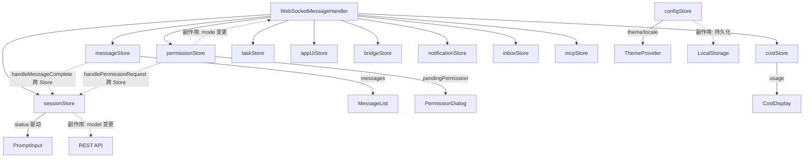

### 8.3 前端状态管理 (Zustand) — 权威定义

> **v1.35.0 权威声明**: §8.3 的 11 个 Zustand Store 是前端状态管理的**唯一权威定义**。
> §8.2.4G 的 AppState 接口仅作为源码功能覆盖范围的参考。
> 实现者以本节 Store 接口为准。
>
> **v1.13.0 扩展**：状态管理从 4 个简单 store 扩展为完整的 store 体系，
> 对齐原版 AppState 的 70+ 字段覆盖。增加 subscribe 中间件实现 onChangeAppState 等效副作用。

```typescript
/**
 * 前端状态管理 — 使用 Zustand 替代原版 useSyncExternalStore + AppStateStore。
 * 
 * 设计原则:
 * 1. 按功能域拆分 store（会话/消息/权限/配置/任务/桥接）
 * 2. 使用 Zustand 的 subscribeWithSelector 实现细粒度订阅
 * 3. 通过 subscribe 中间件实现 onChangeAppState 等效副作用
 * 4. immer 中间件保证不可变更新
 */

// ==================== 前端类型定义 (从 Java 后端 record/enum 对齐) ====================
// 以下类型为 Store 接口的依赖类型，全部从后端 Java 定义翻译为 TypeScript。
// 文件位置: frontend/src/types/index.ts (统一导出)

/** 消息类型 — 对齐 §5.1 Java sealed interface Message */
type Message =
    | { type: 'user';      uuid: string; timestamp: number; content: ContentBlock[]; toolUseResult?: string }
    | { type: 'assistant';  uuid: string; timestamp: number; content: ContentBlock[]; stopReason: string; usage: Usage }
    | { type: 'system';     uuid: string; timestamp: number; content: string; subtype?: string;
        errorCode?: string; retryable?: boolean }   // subtype: 'error' | 'compact_boundary' | 'local_command' | ...
    | { type: 'attachment'; uuid: string; timestamp: number;                        // v1.65.0 M-03: 原版 Message.tsx 独立处理的附件消息类型
        filePath: string; fileName: string; mimeType: string; size: number }
    | { type: 'grouped_tool_use'; uuid: string; timestamp: number;                  // v1.65.0 H-05: 批量工具调用聚合显示
        toolCalls: Array<{ toolUseId: string; toolName: string; status: string }> }
    | { type: 'collapsed_read_search'; uuid: string; timestamp: number;             // v1.65.0 H-05: 折叠的连续读取/搜索操作
        operations: Array<{ type: string; path?: string; query?: string }> };

type ContentBlock =
    | { type: 'text'; text: string }
    | { type: 'tool_use'; toolUseId: string; toolName: string; input: Record<string, unknown> }
    | { type: 'tool_result'; toolUseId: string; content: string; isError: boolean }
    | { type: 'thinking'; thinking: string }
    | { type: 'redacted_thinking' }                                  // v1.65.0 H-04: 原版 Message.tsx 明确处理此类型，折叠显示"已编辑的思考过程"
    | { type: 'server_tool_use'; toolUseId: string; toolName: string } // v1.65.0 H-04: 服务端工具调用 (web_search 等)
    | { type: 'image'; mediaType: string; base64Data: string };

/** Token 用量 — 对齐 §5.1 Java record Usage */
interface Usage {
    inputTokens: number;
    outputTokens: number;
    cacheReadInputTokens: number;
    cacheCreationInputTokens: number;
}

/** STOMP 消息载荷类型 — 前端 WebSocket 通信使用 (v1.44.0 补全) */
/** Server→Client STOMP 消息 — 对齐 §8.5.1 全部 10 种推送类型 */
/**
 * v1.44.0 修正: 删除原不完整的 StompServerMessage 联合类型 (仅 10 种)。
 * 服务端消息类型统一使用 §8.5.1a 中定义的完整 ServerMessage 联合类型 (25 种)。
 *
 * 完整的 25 种 Server→Client 消息类型:
 *   messageStore (5):  stream_delta, thinking_delta, tool_use_start, tool_use_progress,
 *                      tool_result
 *   sessionStore (3):  compact_start, compact_complete, rate_limit
 *   permissionStore (1): permission_request
 *   costStore (1):     cost_update
 *   taskStore (4):     task_update, agent_spawn, agent_update, agent_complete
 *   appUiStore (2):    elicitation, prompt_suggestion
 *   bridgeStore (1):   bridge_status
 *   notificationStore (1): notification
 *   inboxStore (1):    teammate_message
 *   mcpStore (1):      mcp_tool_update
 *   跨Store (1):       session_restored (messageStore + sessionStore + bridgeStore)
 *   无Store (1):       pong
 *   错误 (1):          error (messageStore + sessionStore)
 *   message_complete (1): messageStore + sessionStore 跨 Store (费用由 #15 cost_update 推送)
 *
 * v1.54.0 E-04: 已删除 3 个幽灵类型 (tool_input_delta/tool_use_backfill/session_status)，
 * messageStore 从 7→5, sessionStore 从 4→3; message_complete 不再写入 costStore。
 * dispatch() 函数 (§8.5.3) 已覆盖全部 25 种类型的分发逻辑。
 * 前端 TypeScript 类型定义见 §8.5.1a ServerMessage。
 */
/**
 * v1.45.0 修正: 不再使用模糊占位定义。
 * ServerMessage 直接引用 §8.5.1a 中的完整 25 种联合类型:
 */
// v1.51.0 E-01/E-04 修正:
// 1. 删除 3 个幽灵类型 (tool_input_delta/tool_use_backfill/session_status)，
//    它们不在 §8.5.1 权威协议中，后端不会推送。
// 2. 命名后缀统一为 XxxPayload，与 §8.5.1a 完整接口定义对齐。
type ServerMessage =
    | StreamDeltaPayload         // stream_delta       → messageStore
    | ThinkingDeltaPayload       // thinking_delta     → messageStore
    | ToolUseStartPayload        // tool_use_start     → messageStore
    | ToolUseProgressPayload     // tool_use_progress  → messageStore
    | ToolResultPayload          // tool_result        → messageStore
    | CompactStartPayload        // compact_start      → sessionStore
    | CompactCompletePayload     // compact_complete   → sessionStore
    | RateLimitPayload           // rate_limit         → sessionStore
    | PermissionRequestPayload   // permission_request → permissionStore
    | CostUpdatePayload          // cost_update        → costStore
    | TaskUpdatePayload          // task_update        → taskStore
    | AgentSpawnPayload          // agent_spawn        → taskStore
    | AgentUpdatePayload         // agent_update       → taskStore
    | AgentCompletePayload       // agent_complete     → taskStore
    | ElicitationPayload         // elicitation        → appUiStore
    | PromptSuggestionPayload    // prompt_suggestion  → appUiStore
    | BridgeStatusPayload        // bridge_status      → bridgeStore
    | NotificationPayload        // notification       → notificationStore
    | TeammateMessagePayload     // teammate_message   → inboxStore
    | McpToolUpdatePayload       // mcp_tool_update    → mcpStore
    | SessionRestoredPayload     // session_restored   → 跨Store
    | MessageCompletePayload     // message_complete   → 跨Store
    | PongPayload                // pong               → 无Store
    | ErrorPayload;              // error              → messageStore + sessionStore
// 共 25 种，与 §8.5.1a Payload 接口一一对应。各字段定义见 §8.5.1a。

/** 工具结果 — 对齐 §3.3 Java record ToolResult */
interface ToolResult {
    content: string;
    isError: boolean;
    metadata?: Record<string, unknown>;
}

/** 通知条目 — NotificationStore 内部状态 */
interface NotificationItem {
    key: string;
    level: 'info' | 'success' | 'warning' | 'error';
    message: string | React.ReactNode;
    priority: NotificationPriority;
    timeout: number;
    createdAt: number;
}

/** 收件箱消息 — InboxStore 内部状态 */
interface InboxMessage {
    id: string;
    fromId: string;
    content: string;
    timestamp: number;
    read: boolean;
}

/** MCP 工具 — McpStore 内部状态 */
interface McpTool {
    name: string;
    description: string;
    inputSchema: Record<string, unknown>;
    serverId: string;
}

/** AI 反向提问请求 — AppUiStore 内部状态 */
interface ElicitationRequest {
    requestId: string;
    question: string;
    options: unknown;
}

/** 任务状态 — TaskStore 内部状态 */
interface TaskState {
    taskId: string;
    status: 'pending' | 'running' | 'completed' | 'failed' | 'cancelled';
    progress?: unknown;
    result?: unknown;
    isCoordinator?: boolean;
    agentName?: string;
    agentType?: string;
    parentTaskId?: string;
    createdAt: number;
}

/** 桥接句柄 — BridgeStore 内部状态 (对齐 src/bridge/replBridgeHandle.ts) */
interface BridgeHandle {
    sessionId: string;
    url: string;
    status: 'connected' | 'disconnected' | 'reconnecting';
}

/** 桥接配置 — BridgeStore.connect() 参数 (对齐 src/bridge/bridgeConfig.ts) */
interface BridgeConfig {
    url: string;
    authToken: string;
    reconnectDelay?: number;
}

/** 附件 — sendUserMessage 参数类型 */
interface Attachment {
    type: 'file' | 'image' | 'url';
    name: string;
    content: string;       // base64 或文本
    mimeType?: string;
}

/** 权限模式 — 对齐 §3.4.1 Java enum PermissionMode (仅前端可选的 5 种外部模式) */
type PermissionMode = 'default' | 'plan' | 'accept_edits' | 'dont_ask' | 'bypass_permissions';

/** 权限决策 — 对齐 §3.4 PermissionDecision */
interface PermissionDecision {
    toolUseId: string;
    decision: 'allow' | 'deny';
    remember?: boolean;
    scope?: string;       // 'session' | 'project' | 'global'
}

/** 拒绝追踪状态 — 对齐 §4.9.2 Java record DenialTrackingState */
interface DenialTrackingState {
    consecutiveDenials: number;
    totalDenials: number;
}

// ==================== 会话 Store ====================
interface SessionStore {
    // 状态
    sessionId: string | null;
    model: string;
    status: 'idle' | 'streaming' | 'waiting_permission' | 'compacting';
    turnCount: number;
    effortValue: number;            // 推理努力等级 (1-5)
    isAborted: boolean;

    // Actions
    createSession: (dir: string, model: string) => Promise<void>;
    resumeSession: (sessionId: string) => Promise<void>;
    setModel: (model: string) => void;
    setEffort: (value: number) => void;
    setStatus: (status: SessionStore['status']) => void;
    handleRateLimit: (data: { retryAfterMs: number; limitType: string }) => void;
    abort: () => void;
}

// ==================== 消息 Store ====================
interface MessageStore {
    // 状态
    messages: Message[];
    streamingMessageId: string | null;
    streamingContent: string;
    thinkingContent: string;         // 当前思考内容
    activeToolCalls: Map<string, ToolCallState>;

    // Actions
    addMessage: (msg: Message) => void;
    appendStreamDelta: (delta: string) => void;
    appendThinkingDelta: (delta: string) => void;
    startToolCall: (toolUseId: string, toolName: string, input: unknown) => void;
    updateToolCallProgress: (toolUseId: string, progress: string) => void;
    completeToolCall: (toolUseId: string, result: ToolResult) => void;
    finalizeStream: (usage: Usage) => void;
    clearMessages: () => void;
    rewindToMessage: (messageId: string) => void;
}

interface ToolCallState {
    toolName: string;
    input: unknown;
    status: 'pending' | 'running' | 'completed' | 'error' | 'permission_needed';
    result?: ToolResult;
    progress?: string;
    startTime: number;
    duration?: number;
}

// ==================== 权限请求类型 (§8.5.1 #6 payload 对齐) ====================
interface PermissionRequest {
    toolUseId: string;                   // 工具调用 ID
    toolName: string;                    // 工具名称
    input: Record<string, unknown>;      // 工具输入
    riskLevel: 'low' | 'medium' | 'high'; // 风险级别
    reason: string;                      // 需要权限的原因
}

// ==================== 权限 Store ====================
interface PermissionStore {
    // 状态
    pendingPermission: PermissionRequest | null;
    permissionMode: PermissionMode;
    denialTracking: DenialTrackingState;

    // Actions
    showPermission: (request: PermissionRequest) => void;
    respondPermission: (decision: PermissionDecision) => void;
    setPermissionMode: (mode: PermissionMode) => void;
    clearPendingPermission: () => void;  // v1.37.0: 会话切换/断线恢复时清除待处理权限
}

// ==================== 配置 Store ====================
interface ConfigStore {
    // 状态
    theme: ThemeConfig;            // 主题配置对象 (见 §8.6 ThemeConfig 接口)
    locale: string;
    autoCompact: { enabled: boolean; threshold: number };
    verbose: boolean;
    expandedView: boolean;
    outputStyle: {                 // 输出样式 (见 §8.9 OutputStyleSelector)
        availableStyles: OutputStyleDef[];
        activeStyleName: string | null;
    };

    // Actions
    setTheme: (update: Partial<ThemeConfig>) => void;
    resetTheme: () => void;
    setLocale: (locale: string) => void;
    loadConfig: () => Promise<void>;   // v1.53.0 U-02: 含 3 次指数退避重试 + localStorage 降级缓存
    saveConfig: (updates: Partial<Config>) => Promise<void>;
    setOutputStyles: (styles: OutputStyleDef[]) => void;
    setActiveOutputStyle: (name: string | null) => void;
}

interface OutputStyleDef {
    name: string;
    description: string;
    keepCodingInstructions: boolean;  // 是否保留默认代码指令
    content: string;                  // 样式正文 (注入系统提示)
}

// ConfigStore 可持久化字段的类型别名 (用于 loadConfig / saveConfig 参数约束)
type Config = Pick<ConfigStore, 'theme' | 'locale' | 'autoCompact' | 'verbose' | 'expandedView' | 'outputStyle'>;

/**
 * v1.53.0 U-02: loadConfig 实现规范
 *
 * 问题: 后端未就绪时首屏白屏。
 * 方案: 3 次指数退避重试 (300ms→600ms→1200ms) + localStorage 降级缓存。
 *
 * 伪代码:
 *   async loadConfig() {
 *       const RETRY_COUNT = 3;
 *       const BASE_DELAY = 300; // ms
 *       for (let i = 0; i <= RETRY_COUNT; i++) {
 *           try {
 *               const resp = await fetch('/api/config');
 *               if (!resp.ok) throw new Error(`HTTP ${resp.status}`);
 *               const config: Config = await resp.json();
 *               // 成功 → 写入 Store + 缓存到 localStorage
 *               set(config);
 *               localStorage.setItem('config_cache', JSON.stringify(config));
 *               return;
 *           } catch (err) {
 *               if (i < RETRY_COUNT) {
 *                   await new Promise(r => setTimeout(r, BASE_DELAY * Math.pow(2, i)));
 *               }
 *           }
 *       }
 *       // 所有重试耗尽 → 降级使用 localStorage 缓存
 *       const cached = localStorage.getItem('config_cache');
 *       if (cached) {
 *           try { set(JSON.parse(cached)); return; } catch {}
 *       }
 *       // 无缓存 → 保持默认值，不阻塞首屏渲染
 *       console.warn('[ConfigStore] loadConfig failed, using defaults');
 *   }
 */

// ==================== 任务 Store ====================
interface TaskStore {
    // 状态
    tasks: Map<string, TaskState>;
    foregroundedTaskId: string | null;
    viewingAgentTaskId: string | null;
    agentNameRegistry: Map<string, string>;

    // Actions
    addTask: (task: TaskState) => void;
    updateTask: (taskId: string, update: Partial<TaskState>) => void;
    removeTask: (taskId: string) => void;
    clearTasks: () => void;                // v1.51.0 E-05 补充: 会话切换时清空 (被 SessionSwitchController.clearStores() 引用)
    addAgentTask: (data: { taskId: string; agentName: string; agentType: string }) => void;
    updateAgentTask: (taskId: string, progress: unknown) => void;
    completeAgentTask: (taskId: string, result: unknown) => void;
    setForegroundedTask: (taskId: string | null) => void;
    setViewingAgentTask: (taskId: string | null) => void;
}

// ==================== 桥接 Store ====================
interface BridgeStore {
    // 状态
    bridgeStatus: 'connected' | 'disconnected' | 'reconnecting';
    bridgeHandle: BridgeHandle | null;

    // Actions
    connect: (config: BridgeConfig) => Promise<void>;
    disconnect: () => void;
    updateBridgeStatus: (data: { status: string; url: string }) => void;
}

// ==================== 费用 Store ====================
interface CostStore {
    // 状态
    sessionCost: number;
    totalCost: number;
    usage: Usage;

    // Actions
    updateCost: (data: { sessionCost: number; totalCost: number; usage: Usage }) => void;
    resetSessionCost: () => void;
}

// > **v1.36.0 修正**：CostStore 方法名统一为 `resetSessionCost()`，
// > 修复 §8.3.1 会话切换代码中的 `resetSession()` 错误引用。

// ==================== 通知 Store ====================
interface NotificationStore {
    // 状态
    notifications: NotificationItem[];

    // Actions (字段对齐 §8.2.4H 通知 Context)
    addNotification: (config: { key: string; level: 'info' | 'success' | 'warning' | 'error'; message: string | React.ReactNode; priority?: NotificationPriority; timeout?: number }) => void;
    removeNotification: (key: string) => void;
    clearAll: () => void;
}

// ==================== 收件箱 Store ====================
interface InboxStore {
    // 状态
    messages: InboxMessage[];
    unreadCount: number;

    // Actions
    addInboxMessage: (data: { fromId: string; content: string }) => void;
    markAsRead: (messageId: string) => void;
}

// ==================== MCP Store ====================
interface McpStore {
    // 状态
    mcpTools: Map<string, McpTool[]>;

    // Actions
    updateMcpTools: (data: { serverId: string; tools: McpTool[] }) => void;
    clearServerTools: (serverId: string) => void;
}

// ==================== 应用全局 Store ====================
// 管理 elicitation / prompt_suggestion / bridge_status / speculation 等杂项状态
interface AppUiStore {
    // 状态
    elicitationDialog: ElicitationRequest | null;
    promptSuggestion: PromptSuggestion | null;  // v1.65.0 M-02: 从 string[] 改为完整对象 (对齐原版 AppState.promptSuggestion)
    speculationResults: Map<string, boolean>;

    // Actions
    showElicitationDialog: (data: { requestId: string; question: string; options: unknown }) => void;
    dismissElicitationDialog: () => void;
    setPromptSuggestion: (data: PromptSuggestion | null) => void;  // v1.65.0 M-02: 接受完整对象
    updateSpeculation: (data: { id: string; accepted: boolean }) => void;
}

// v1.65.0 M-02: 对齐原版 AppState.promptSuggestion 完整结构
interface PromptSuggestion {
    text: string;                     // 建议文本
    promptId: string;                 // 关联的提示 ID
    shownAt: number | null;           // 显示时间戳 (毫秒)
    acceptedAt: number | null;        // 接受时间戳 (毫秒)
    generationRequestId: string;      // 生成请求 ID (用于追踪)
}

// > **v1.36.0 修正**：AppUiStore 清理方法统一为 `dismissElicitationDialog()`，
// > 修复 §8.3.1 会话切换代码中的 `clearElicitation()` 错误引用。

// ═══════════════════════════════════════════════════════════════════════════════
// [v1.55.0 F2-09] Zustand Store 工厂 create() 调用 + 初始值 + persist/middleware 配置
// ═══════════════════════════════════════════════════════════════════════════════
//
// [v1.55.0 F4-06] 后端 AppState (Java record) → 前端 Zustand Store 字段映射表
//
// | Java 后端字段 (AppStateService)         | 前端 Store        | 前端字段                    | 同步方式                  |
// |----------------------------------------|-------------------|-----------------------------|--------------------------|
// | session.id                             | sessionStore      | sessionId                   | session_restored 推送     |
// | session.model                          | sessionStore      | model                       | session_restored 推送     |
// | session.status                         | sessionStore      | status                      | STOMP 各消息类型驱动       |
// | session.turnCount                      | sessionStore      | turnCount                   | message_complete 推送     |
// | session.effortLevel                    | sessionStore      | effortValue                 | REST PUT /api/settings    |
// | messages (List<Message>)               | messageStore      | messages                    | session_restored + 增量推送|
// | streamState.activeMessageId            | messageStore      | streamingMessageId          | stream_delta 推送         |
// | streamState.activeDelta                | messageStore      | streamingContent            | stream_delta 推送         |
// | streamState.thinkingDelta              | messageStore      | thinkingContent             | thinking_delta 推送       |
// | streamState.activeToolCalls            | messageStore      | activeToolCalls             | tool_use_* 推送           |
// | permissions.pendingRequest             | permissionStore   | pendingPermission           | permission_request 推送   |
// | permissions.mode                       | permissionStore   | permissionMode              | REST + 前端本地           |
// | permissions.denialTracking             | permissionStore   | denialTracking              | 前端本地计算               |
// | config.theme                           | configStore       | theme                       | REST GET /api/config      |
// | config.locale                          | configStore       | locale                      | REST GET /api/config      |
// | config.autoCompact                     | configStore       | autoCompact                 | REST GET /api/config      |
// | tasks (Map<String,TaskState>)          | taskStore         | tasks                       | task_update/* 推送        |
// | agentTasks                             | taskStore         | agentNameRegistry           | agent_spawn/update 推送   |
// | cost.sessionCost                       | costStore         | sessionCost                 | cost_update (#15) 推送    |
// | cost.totalCost                         | costStore         | totalCost                   | cost_update (#15) 推送    |
// | cost.usage                             | costStore         | usage                       | cost_update (#15) 推送    |
// | bridge.status                          | bridgeStore       | bridgeStatus                | STOMP 连接事件            |
// | notifications                          | notificationStore | notifications               | notification 推送         |
// | inbox                                  | inboxStore        | messages                    | teammate_message 推送     |
// | mcp.tools                              | mcpStore          | mcpTools                    | mcp_tool_update 推送      |
// | ui.elicitation                         | appUiStore        | elicitationDialog           | elicitation 推送          |
// | ui.promptSuggestions                   | appUiStore        | promptSuggestions           | prompt_suggestion 推送    |
//
//
// 设计原则:
//   1. 所有 Store 使用 immer 中间件保证不可变更新
//   2. sessionStore + configStore 使用 persist 中间件持久化到 localStorage
//   3. 跨 Tab 同步通过 BroadcastChannel API 实现 (configStore 全局配置)
//   4. subscribeWithSelector 支持细粒度 selector 订阅，减少不必要的重渲染

import { create } from 'zustand';
import { immer } from 'zustand/middleware/immer';
import { persist, createJSONStorage } from 'zustand/middleware';
import { subscribeWithSelector } from 'zustand/middleware';

// ── 1. SessionStore (persist: sessionId 到 sessionStorage) ──
const useSessionStore = create<SessionStore>()(
    subscribeWithSelector(immer((set) => ({
        // 初始值
        sessionId: null,
        model: null,             // v1.65.0 M-01: 默认 null，由后端 session_restored 推送实际配置模型 (不硬编码供应商模型名)
        status: 'idle',
        turnCount: 0,
        effortValue: 3,          // 默认推理努力等级
        isAborted: false,
        // Actions
        createSession: async (dir, model) => {
            set(d => { d.status = 'streaming'; d.model = model; d.turnCount = 0; d.isAborted = false; });
            const resp = await fetch('/api/sessions', { method: 'POST', body: JSON.stringify({ dir, model }) });
            const { sessionId } = await resp.json();
            set(d => { d.sessionId = sessionId; });
        },
        resumeSession: async (sessionId) => { set(d => { d.sessionId = sessionId; d.status = 'idle'; }); },
        setModel: (model) => set(d => { d.model = model; }),
        setEffort: (value) => set(d => { d.effortValue = value; }),
        setStatus: (status) => set(d => { d.status = status; }),
        handleRateLimit: (data) => set(d => { d.status = 'idle'; /* 通知 notificationStore */ }),
        abort: () => set(d => { d.isAborted = true; d.status = 'idle'; }),
    })))
);

// ── 2. MessageStore (不持久化, 从后端 session_restored 加载) ──
const useMessageStore = create<MessageStore>()(
    subscribeWithSelector(immer((set) => ({
        messages: [],
        streamingMessageId: null,
        streamingContent: '',
        thinkingContent: '',
        activeToolCalls: new Map(),
        // Actions
        addMessage: (msg) => set(d => { d.messages.push(msg); }),
        appendStreamDelta: (delta) => set(d => { d.streamingContent += delta; }),
        appendThinkingDelta: (delta) => set(d => { d.thinkingContent += delta; }),
        startToolCall: (id, name, input) => set(d => { d.activeToolCalls.set(id, { toolName: name, input, status: 'running', startTime: Date.now() }); }),
        updateToolCallProgress: (id, progress) => set(d => { const tc = d.activeToolCalls.get(id); if (tc) tc.progress = progress; }),
        completeToolCall: (id, result) => set(d => { const tc = d.activeToolCalls.get(id); if (tc) { tc.status = result.isError ? 'error' : 'completed'; tc.result = result; tc.duration = Date.now() - tc.startTime; } }),
        finalizeStream: (usage) => set(d => { d.streamingMessageId = null; d.streamingContent = ''; d.thinkingContent = ''; }),
        clearMessages: () => set(d => { d.messages = []; d.activeToolCalls.clear(); }),
        rewindToMessage: (messageId) => set(d => { const idx = d.messages.findIndex(m => m.uuid === messageId); if (idx >= 0) d.messages.splice(idx + 1); }),
    })))
);

// ── 3. PermissionStore (不持久化) ──
const usePermissionStore = create<PermissionStore>()(
    subscribeWithSelector(immer((set) => ({
        pendingPermission: null,
        permissionMode: 'default',
        denialTracking: { consecutiveDenials: 0, totalDenials: 0 },
        showPermission: (req) => set(d => { d.pendingPermission = req; }),
        respondPermission: (decision) => set(d => {
            d.pendingPermission = null;
            if (decision.decision === 'deny') { d.denialTracking.consecutiveDenials++; d.denialTracking.totalDenials++; }
            else { d.denialTracking.consecutiveDenials = 0; }
        }),
        setPermissionMode: (mode) => set(d => { d.permissionMode = mode; }),
        clearPendingPermission: () => set(d => { d.pendingPermission = null; }),
    })))
);

// ── 4. ConfigStore (persist: localStorage, 跨 Tab BroadcastChannel 同步) ──
const useConfigStore = create<ConfigStore>()(
    persist(
        subscribeWithSelector(immer((set) => ({
            theme: { mode: 'system', accentColor: '#6366f1' },
            locale: 'zh-CN',
            autoCompact: { enabled: true, threshold: 80 },  // 80% 上下文窗口触发
            verbose: false,
            expandedView: false,
            outputStyle: { availableStyles: [], activeStyleName: null },
            setTheme: (update) => set(d => { Object.assign(d.theme, update); }),
            resetTheme: () => set(d => { d.theme = { mode: 'system', accentColor: '#6366f1' }; }),
            setLocale: (locale) => set(d => { d.locale = locale; }),
            loadConfig: async () => { /* 见 §8.3 loadConfig 实现规范 (3 次指数退避 + localStorage 降级) */ },
            saveConfig: async (updates) => { await fetch('/api/config', { method: 'PUT', body: JSON.stringify(updates) }); },
            setOutputStyles: (styles) => set(d => { d.outputStyle.availableStyles = styles; }),
            setActiveOutputStyle: (name) => set(d => { d.outputStyle.activeStyleName = name; }),
        }))),
        {
            name: 'ai-coder-config',
            storage: createJSONStorage(() => localStorage),
            partialize: (s) => ({ theme: s.theme, locale: s.locale, autoCompact: s.autoCompact, verbose: s.verbose, expandedView: s.expandedView }),
        }
    )
);
// ConfigStore 跨 Tab 同步 (BroadcastChannel):
// const configChannel = new BroadcastChannel('ai-coder-config-sync');
// useConfigStore.subscribe((s) => s.theme, (theme) => configChannel.postMessage({ type: 'theme', theme }));
// configChannel.onmessage = (e) => { if (e.data.type === 'theme') useConfigStore.getState().setTheme(e.data.theme); };

// ── 5. TaskStore (不持久化) ──
const useTaskStore = create<TaskStore>()(
    subscribeWithSelector(immer((set) => ({
        tasks: new Map(), foregroundedTaskId: null, viewingAgentTaskId: null, agentNameRegistry: new Map(),
        addTask: (task) => set(d => { d.tasks.set(task.taskId, task); }),
        updateTask: (id, upd) => set(d => { const t = d.tasks.get(id); if (t) Object.assign(t, upd); }),
        removeTask: (id) => set(d => { d.tasks.delete(id); }),
        clearTasks: () => set(d => { d.tasks.clear(); d.foregroundedTaskId = null; d.viewingAgentTaskId = null; }),
        addAgentTask: (data) => set(d => { d.tasks.set(data.taskId, { taskId: data.taskId, status: 'running', agentName: data.agentName, agentType: data.agentType, createdAt: Date.now() }); d.agentNameRegistry.set(data.taskId, data.agentName); }),
        updateAgentTask: (id, progress) => set(d => { const t = d.tasks.get(id); if (t) t.progress = progress; }),
        completeAgentTask: (id, result) => set(d => { const t = d.tasks.get(id); if (t) { t.status = 'completed'; t.result = result; } }),
        setForegroundedTask: (id) => set(d => { d.foregroundedTaskId = id; }),
        setViewingAgentTask: (id) => set(d => { d.viewingAgentTaskId = id; }),
    })))
);

// ── 6. BridgeStore (不持久化) ──
const useBridgeStore = create<BridgeStore>()(
    subscribeWithSelector(immer((set) => ({
        bridgeStatus: 'disconnected', bridgeHandle: null,
        connect: async (config) => { /* STOMP 连接逻辑见 §8.5 */ },
        disconnect: () => set(d => { d.bridgeStatus = 'disconnected'; d.bridgeHandle = null; }),
        updateBridgeStatus: (data) => set(d => { d.bridgeStatus = data.status as any; }),
    })))
);

// ── 7. CostStore (不持久化, 由 #15 cost_update 权威推送) ──
const useCostStore = create<CostStore>()(
    subscribeWithSelector(immer((set) => ({
        sessionCost: 0, totalCost: 0, usage: { inputTokens: 0, outputTokens: 0, cacheReadInputTokens: 0, cacheCreationInputTokens: 0 },
        updateCost: (data) => set(d => { d.sessionCost = data.sessionCost; d.totalCost = data.totalCost; d.usage = data.usage; }),
        resetSessionCost: () => set(d => { d.sessionCost = 0; d.usage = { inputTokens: 0, outputTokens: 0, cacheReadInputTokens: 0, cacheCreationInputTokens: 0 }; }),
    })))
);

// ── 8. NotificationStore (不持久化) ──
const useNotificationStore = create<NotificationStore>()(
    subscribeWithSelector(immer((set) => ({
        notifications: [],
        addNotification: (config) => set(d => { d.notifications.push({ key: config.key, level: config.level, message: config.message, priority: config.priority ?? 'normal', timeout: config.timeout ?? 5000, createdAt: Date.now() }); }),
        removeNotification: (key) => set(d => { d.notifications = d.notifications.filter(n => n.key !== key); }),
        clearAll: () => set(d => { d.notifications = []; }),
    })))
);

// ── 9. InboxStore (不持久化) ──
const useInboxStore = create<InboxStore>()(
    subscribeWithSelector(immer((set) => ({
        messages: [], unreadCount: 0,
        addInboxMessage: (data) => set(d => { d.messages.push({ id: crypto.randomUUID(), fromId: data.fromId, content: data.content, timestamp: Date.now(), read: false }); d.unreadCount++; }),
        markAsRead: (id) => set(d => { const m = d.messages.find(m => m.id === id); if (m && !m.read) { m.read = true; d.unreadCount--; } }),
    })))
);

// ── 10. McpStore (不持久化, 从后端 mcp_tool_update 加载) ──
const useMcpStore = create<McpStore>()(
    subscribeWithSelector(immer((set) => ({
        mcpTools: new Map(),
        updateMcpTools: (data) => set(d => { d.mcpTools.set(data.serverId, data.tools); }),
        clearServerTools: (id) => set(d => { d.mcpTools.delete(id); }),
    })))
);

// ── 11. AppUiStore (不持久化) ──
const useAppUiStore = create<AppUiStore>()(
    subscribeWithSelector(immer((set) => ({
        elicitationDialog: null, promptSuggestions: [], speculationResults: new Map(),
        showElicitationDialog: (data) => set(d => { d.elicitationDialog = data; }),
        dismissElicitationDialog: () => set(d => { d.elicitationDialog = null; }),
        setPromptSuggestion: (data) => set(d => { d.promptSuggestions = data.suggestions; }),
        updateSpeculation: (data) => set(d => { d.speculationResults.set(data.id, data.accepted); }),
    })))
);

// ── Store 持久化策略汇总 ──
// | Store              | persist  | 存储位置       | 跨Tab同步       |
// |--------------------|----------|---------------|-----------------|
// | sessionStore       | ✗        | —             | —               |
// | messageStore       | ✗        | —             | —               |
// | permissionStore    | ✗        | —             | —               |
// | configStore        | ✓        | localStorage  | BroadcastChannel|
// | taskStore          | ✗        | —             | —               |
// | bridgeStore        | ✗        | —             | —               |
// | costStore          | ✗        | —             | —               |
// | notificationStore  | ✗        | —             | —               |
// | inboxStore         | ✗        | —             | —               |
// | mcpStore           | ✗        | —             | —               |
// | appUiStore         | ✗        | —             | —               |
```

#### 8.3.1 Store 间依赖关系图与同步规则（v1.35.0 新增）

> **v1.35.0 新增**：明确 11 个 Zustand Store 之间的数据流向和依赖关系，
> 以及会话切换、断线重连、错误恢复等场景下各 Store 的 reset/reload 策略。
> 实现者必须严格遵循此依赖图，避免 Store 间循环依赖。

**Store 依赖关系图（数据流向）：**



**Store 间依赖矩阵（谁写入谁）：**

| 写入源 | 被写入的 Store | 触发场景 | 方式 |
|--------|---------------|---------|------|
| `WebSocketMessageHandler` | messageStore, sessionStore, costStore, permissionStore, taskStore, appUiStore, bridgeStore, notificationStore, inboxStore, mcpStore | 收到 S→C 消息 | `dispatch()` 分发 |
| `handleMessageComplete()` | messageStore + sessionStore | 收到 `message_complete` | 跨 Store 私有方法 (v1.53.0: 不再写入 costStore，费用由 #15 cost_update 权威推送) |
| `handlePermissionRequest()` | permissionStore + sessionStore | 收到 `permission_request` | 跨 Store 私有方法 |
| `handleError()` | messageStore + sessionStore | 收到 `error` | 跨 Store 私有方法 |
| `handleCompactComplete()` | messageStore + sessionStore | 收到 `compact_complete` | 跨 Store 私有方法 |
| `handleSessionRestore()` | messageStore + sessionStore + bridgeStore + notificationStore | 断线重连 | 全量同步 |
| `setupSideEffects()` | REST API / WebSocket / localStorage | permissionMode/model/config 变更 | Zustand subscribe |
| `configStore.persist` | localStorage | 配置变更 | persist 中间件 |

**会话切换时 Store Reset/Reload 规则矩阵：**

| Store | 会话切换 (A→B) | 断线重连 | 错误恢复 | 刷新页面 |
|-------|---------------|---------|---------|---------|
| `sessionStore` | `setStatus('switching')` → 新会话 `resumeSession()` | 保持，等 `session_restored` 更新 | `setStatus('idle')` | 从 sessionStorage 恢复 sessionId |
| `messageStore` | **`clearMessages()`** → 等 `session_restored` 加载 | **`clearMessages()`** → 等 `session_restored` 加载 | 不清除 | 从后端重新加载 |
| `permissionStore` | **`clearPendingPermission()`** | **清除 pending** (后端 30s 超时 deny) | 不清除 | 初始 null |
| `costStore` | **`resetSessionCost()`** | 保持 (后端推送新值) | 不变 | 初始 0 |
| `taskStore` | **`clearTasks()`** | 保持 (后端推送新值) | 不变 | 初始空 |
| `appUiStore` | **`dismissElicitationDialog()`** | 保持 | 不变 | 初始 null |
| `bridgeStore` | 新 STOMP 实例 `updateBridgeStatus({status:'connected'})` | `'disconnected'` → `'reconnecting'` → `'connected'` | 不变 | 初始 `'disconnected'` |
| `configStore` | **不清除** (全局配置，跨会话共享) | **不清除** | **不清除** | 从 localStorage 恢复 |
| `notificationStore` | **不清除** (可能有跨会话通知) | **不清除** | 追加错误通知 | 初始空 |
| `inboxStore` | **不清除** (Swarm 消息跨会话) | **不清除** | 不变 | 初始空 |
| `mcpStore` | **不清除** (MCP 连接跨会话) | **不清除** | 不变 | 从后端重新加载 |

**会话切换时 Store 清理完整代码：**

```typescript
/**
 * clearStores() — 会话切换时清理所有会话相关状态。
 * 
 * 清理原则:
 * - 会话相关 Store (message/permission/cost/task/appUi): 全部 reset
 * - 全局 Store (config/notification/inbox/mcp): 不清除
 * - bridgeStore: 由新连接覆盖
 * - sessionStore: 由新连接的 resumeSession() 覆盖
 */
function clearStores() {
    // ===== 必须清除的 (会话绑定) =====
    useMessageStore.getState().clearMessages();
    usePermissionStore.getState().clearPendingPermission();
    useTaskStore.setState({ tasks: new Map(), foregroundedTaskId: null, viewingAgentTaskId: null });
    useCostStore.getState().resetSessionCost();
    useAppUiStore.getState().dismissElicitationDialog();  // v1.36.0: 统一方法名

    // ===== 不清除的 (全局/跨会话) =====
    // configStore    — 全局配置，persist 到 localStorage
    // notificationStore — 跨会话通知
    // inboxStore     — Swarm 消息跨会话
    // mcpStore       — MCP 连接跨会话
}
```

**断线重连时 Store 恢复时序：**

```
T0: WebSocket onClose
    → bridgeStore.updateBridgeStatus({ status: 'disconnected', url: '' })
    → notificationStore.addNotification({ key: 'disconnect-warning', level: 'warning', message: '连接已断开...' })

T1: STOMP 自动重连尝试
    → bridgeStore.updateBridgeStatus({ status: 'reconnecting', url: '' })

T2: WebSocket onConnect (重连成功)
    → 订阅 /user/queue/messages
    → 等待后端推送 session_restored

T3: 收到 session_restored
    → messageStore.clearMessages()           // 先清再加载
    → data.messages.forEach(msg => messageStore.addMessage(msg))
    → sessionStore.resumeSession(data.metadata.sessionId)
    → sessionStore.setModel(data.metadata.model)
    → sessionStore.setStatus(data.metadata.status === 'interrupted' ? 'idle' : 'idle')
    → bridgeStore.updateBridgeStatus({ status: 'connected', url: '' })
    → notificationStore.removeNotification('disconnect-warning')
```

**大会话恢复分页策略** (v1.45.0 补充):

```
问题: 恢复大型会话 (10000+ 消息) 时，全量 session_restored 推送会导致:
  1. 后端序列化耗时过长 (>5s)
  2. WebSocket 帧过大 (>10MB) 可能被代理截断
  3. 前端一次性渲染大量消息导致 UI 卡顿

分页恢复策略:

1. session_restored 仅推送最近 100 条消息 + 压缩边界摘要:
   {
     "type": "session_restored",
     "messages": Message[],          // 最近 100 条完整消息
     "totalCount": 12345,            // 会话总消息数
     "hasMore": true,                // 是否有更多历史消息
     "compactSummary": string | null, // 如有压缩段，提供摘要文本
     "oldestLoadedUuid": string      // 已加载的最旧消息 UUID (分页游标)
   }

2. 前端按需加载历史消息 (上滑触发):
   Client→Server: { type: "load_history", payload: {
     beforeUuid: string,    // 加载此 UUID 之前的消息
     limit: 50              // 每页 50 条
   }}
   Server→Client: { type: "history_page", payload: {
     messages: Message[],   // 按时间倒序
     hasMore: boolean       // 是否还有更早的消息
   }}

3. react-virtuoso 虚拟滚动配置:
   - firstItemIndex = totalCount - messages.length (倒序虚拟列表)
   - startReached → 触发 load_history
   - 新加载的消息 prepend 到 messageStore (不触发滚动跳变)

4. 传输优化:
   - 后端对 messages 数组启用 STOMP 消息压缩 (SockJS 传输层 gzip)
   - 超过 1MB 的 tool_result.content 截断为摘要 + "完整内容需重新执行工具"
```

**Zustand 副作用中间件 — 等效 onChangeAppState**：

```typescript
/**
 * 通过 Zustand subscribe 实现 onChangeAppState 等效副作用。
 * 
 * 在应用初始化时调用，各 store 独立订阅（非交叉类型合并）。
 * 对应原版 src/state/onChangeAppState.ts 的 5 类副作用。
 */
function setupSideEffects() {
    // 副作用 1: 权限模式 → 通知后端 (PermissionStore)
    usePermissionStore.subscribe(
        (s) => s.permissionMode,
        (mode, prevMode) => {
            if (mode !== prevMode) {
                wsClient.send('/app/permission-mode', { mode });  // 对齐 §8.5.2 #5
            }
        }
    );

    // 副作用 2: 模型切换 → 持久化到用户设置 (SessionStore)
    useSessionStore.subscribe(
        (s) => s.model,
        (model) => {
            apiClient.updateSettings({ env: { model } });
        }
    );

    // 副作用 3: 视图偏好 → 保存全局配置 (ConfigStore)
    useConfigStore.subscribe(
        (s) => ({ verbose: s.verbose, expandedView: s.expandedView }),
        (prefs) => {
            apiClient.saveGlobalConfig(prefs);
        },
        { equalityFn: shallow }
    );

    // 注意: 主题副作用由 §8.6 ThemeProvider 组件统一管理，
    //       不在此处重复定义，避免 CSS 变量设置冲突。
}
```

**Zustand 选择器与派生状态 — 等效 src/state/selectors.ts**：

> **v1.24.0 扩展**：从源码 `selectors.ts` (77行) 提取纯函数选择器模式，
> 保持引用稳定性、零副作用、类型安全的输入路由。

```typescript
/**
 * 选择器 — 纯函数从 store 派生计算状态。
 * 
 * 关键原则:
 * 1. 纯函数: 相同输入 → 相同输出, 无副作用
 * 2. 引用稳定: 返回现有对象引用, 避免创建新对象导致重渲染
 * 3. 联合类型: 通过区别联合实现类型安全的分支路由
 */

// 选择器 1: 获取当前查看的同伴任务
function getViewedTeammateTask(state: TaskStore): TaskState | null {
    if (!state.viewingAgentTaskId) return null;
    return state.tasks.get(state.viewingAgentTaskId) ?? null;
}

// 选择器 2: 确定输入路由目标 — 区别联合类型
type InputTarget =
    | { type: 'main' }                              // 主对话
    | { type: 'agent'; taskId: string }              // 代理任务
    | { type: 'coordinator'; taskId: string };       // 协调器

function getActiveAgentForInput(state: TaskStore & SessionStore): InputTarget {
    if (state.viewingAgentTaskId) {
        const task = state.tasks.get(state.viewingAgentTaskId);
        if (task?.status === 'running') {
            return task.isCoordinator
                ? { type: 'coordinator', taskId: state.viewingAgentTaskId }
                : { type: 'agent', taskId: state.viewingAgentTaskId };
        }
    }
    return { type: 'main' };
}

// 在组件中使用选择器 — subscribeWithSelector 保证细粒度更新
function useViewedTask() {
    return useTaskStore(getViewedTeammateTask);
    // 仅在 viewingAgentTaskId 或对应 task 变化时重渲染
}
```

**Zustand 状态持久化层 — 等效 §3.9 的前端侧**：

```typescript
/**
 * Zustand persist 中间件 — 将关键状态持久化到 localStorage/IndexedDB。
 * 
 * 持久化策略:
 * - ConfigStore: 全量持久化 (主题/语言/偏好) → localStorage
 * - SessionStore: 仅 sessionId 和 model → sessionStorage
 * - MessageStore: 不持久化 (从后端恢复)
 * - PermissionStore: 不持久化 (从后端同步)
 */
import { persist, createJSONStorage } from 'zustand/middleware';

const useConfigStore = create<ConfigStore>()(
    subscribeWithSelector(
        persist(
            immer((set) => ({
                // 状态默认值
                theme: {
                    mode: 'system',
                    accentColor: '#3b82f6',
                    fontSize: 'medium',
                    fontFamily: 'monospace',
                    borderRadius: 'md',
                } as ThemeConfig,
                locale: 'zh-CN',
                autoCompact: { enabled: true, threshold: 80 },
                verbose: false,
                expandedView: false,
                outputStyle: {
                    availableStyles: [] as OutputStyleDef[],
                    activeStyleName: null as string | null,
                },

                // Actions
                setTheme: (update: Partial<ThemeConfig>) =>
                    set((state) => ({ theme: { ...state.theme, ...update } })),
                resetTheme: () =>
                    set({ theme: { mode: 'system', accentColor: '#3b82f6', fontSize: 'medium', fontFamily: 'monospace', borderRadius: 'md' } }),
                setLocale: (locale: string) => set({ locale }),
                loadConfig: async () => {
                    const raw = await apiClient.getConfig();
                    // 仅提取 Config 字段，避免后端返回的非 Store 字段污染状态
                    set({
                        theme: raw.theme,
                        locale: raw.locale,
                        autoCompact: raw.autoCompact,
                        verbose: raw.verbose,
                        expandedView: raw.expandedView,
                        outputStyle: raw.outputStyle,
                    });
                },
                saveConfig: async (updates: Partial<Config>) => {
                    set(updates);
                    await apiClient.saveConfig(updates);
                },
                setOutputStyles: (styles: OutputStyleDef[]) =>
                    set((state) => ({ outputStyle: { ...state.outputStyle, availableStyles: styles } })),
                setActiveOutputStyle: (name: string | null) =>
                    set((state) => ({ outputStyle: { ...state.outputStyle, activeStyleName: name } })),
            })),
            {
                name: 'ai-coder-config',
                storage: createJSONStorage(() => localStorage),
                partialize: (state) => ({
                    theme: state.theme,
                    locale: state.locale,
                    autoCompact: state.autoCompact,
                    verbose: state.verbose,
                    expandedView: state.expandedView,
                    outputStyle: state.outputStyle,
                }),
                version: 2,  // v2: theme 从 string 升级为 ThemeConfig 对象
                migrate: (persisted: any, version: number) => {
                    if (version <= 1) {
                        // v0/v1 → v2: theme 字符串迁移为 ThemeConfig 对象
                        const oldTheme = typeof persisted.theme === 'string' ? persisted.theme : 'system';
                        return {
                            ...persisted,
                            theme: { mode: oldTheme, accentColor: '#3b82f6', fontSize: 'medium', fontFamily: 'monospace', borderRadius: 'md' },
                            autoCompact: persisted.autoCompact ?? { enabled: true, threshold: 80 },
                            expandedView: persisted.expandedView ?? false,
                            outputStyle: persisted.outputStyle ?? { availableStyles: [], activeStyleName: null },
                        };
                    }
                    return persisted;
                },
            }
        )
    )
);
```

**前端查询状态 — 通过 SessionStore.status 驱动**：

```typescript
/**
 * 前端查询状态控制 — 直接复用 SessionStore.status。
 * 
 * SessionStore.status 已覆盖 QueryGuard 的语义:
 *   'idle'               → 可输入
 *   'streaming'           → AI 正在思考/输出
 *   'waiting_permission'  → 等待用户权限确认
 *   'compacting'          → 上下文压缩中
 * 
 * 无需额外 QueryGuardSlice，避免引入幽灵消息类型。
 */

// UI 使用: 根据 SessionStore.status 控制输入框状态
function PromptInput() {
    const status = useSessionStore(s => s.status);
    const isDisabled = status !== 'idle';
    const placeholder = status === 'streaming'
        ? 'AI 正在思考...'
        : status === 'compacting'
            ? '正在压缩上下文...'
            : status === 'waiting_permission'
                ? '等待权限确认...'
                : '输入消息或 / 命令...';
    // ...
}
```

